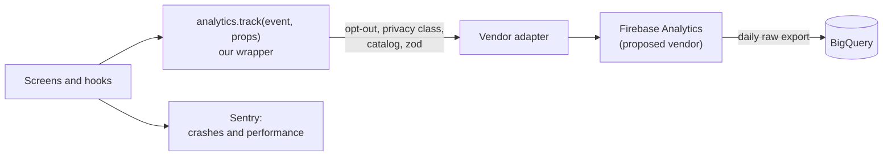

# Analytics tracking plan

- **Status:** Proposed. The owner's direction (2026-09-29) is to track broadly from the start: record anything that could be useful for future analysis, even before every report is built. The vendor is still a proposal ([OQ-8](../../specs/open-questions.md#oq-8-analytics-tool)).
- **Last updated:** 2026-09-29
- **Related:** [PRD](../../specs/PRD.md) (requirement APP-2 and the [success metrics](../../specs/PRD.md#7-success-metrics)) · [architecture overview](../architecture/overview.md) · [data model](../architecture/data-model.md) (the opt-out and install ID) · [device layouts](../architecture/device-layouts.md) · [ADR-0003](../decisions/ADR-0003-backend-and-auth.md) (Firebase)

This plan lists every analytics event the app sends, what each one carries, and the rules they all follow. Code sends only the events listed here.

## Contents

1. [Principles](#1-principles)
2. [Pipeline](#2-pipeline)
3. [Naming](#3-naming)
4. [Common properties](#4-common-properties)
5. [Privacy classes](#5-privacy-classes)
6. [Event catalog](#6-event-catalog)
7. [Governance](#7-governance)
8. [Open questions](#8-open-questions)

---

## 1. Principles

- **Anonymous by default.** Events say what happened in the app, never who did it. No event carries an account ID, even when the user is signed in; `signed_in` is only a true-or-false property.
- **No personal data in events.** Properties are enums, counts, booleans, and IDs of public game data (species keys, card IDs, format IDs). Never sent:
  - names, email addresses, Firebase `uid`s, and display names
  - free text of any kind: search text, team and binder names, nicknames, notes, tags, pastes, PokéPaste URLs, and Replica codes
  - precise location, contacts, photos, and advertising IDs
- **An anonymous install ID.** A random UUID created on first launch and kept only on the device ([data model §3.1](../architecture/data-model.md#31-what-lives-where)).
  - It identifies an install, not a person, and it's never linked to the account.
  - It resets on opt-out, on "clear this device", and on account deletion.
  - The vendor keeps its own instance ID for the same purpose (verify how it resets).
- **An opt-out in Settings.** One switch stops every analytics event on the device at once, including queued ones (verify that the vendor drops its queue). Turning it off sends nothing, not even an event about the switch. When signed in, the choice syncs, and "off" wins ([data model: preferences](../architecture/data-model.md#users)).
- **Minimal, essential measurement for under-13 guests.** They send only the `essential` class ([§5](#5-privacy-classes)).
  - This relies on COPPA's exception for persistent identifiers used only to support internal operations, such as maintaining or analyzing how the app works, and never to contact or profile a child (verify against the FTC's current rule and FAQ before launch).
  - The 2025 amendments to the COPPA Rule may also require the privacy policy to name those internal operations (verify).
- **No ad identifiers and no cross-app tracking.** Advertising-ID collection stays off on Android, there's no tracking prompt or AdSupport on iOS, and Google Signals and ad personalization stay off in the property (verify each setting). Nothing goes to ad networks.
- **Privacy labels and the policy move in step.** A change that adds a new kind of data updates the privacy policy, the App Store privacy details, and Google Play's Data safety form before it ships ([§7](#7-governance)).
- **Track broadly, report later.** An event can ship before any report uses it, as long as it follows these rules.

## 2. Pipeline

- **The wrapper is vendor-neutral.** Screens call `analytics.track(event, props)` and never a vendor SDK, so the vendor can change without touching features. For each event, the wrapper:
  1. looks the event up in a typed catalog that mirrors [§6](#6-event-catalog), so an unknown event fails the typecheck
  2. drops it after opt-out, and drops `standard` events for under-13 guests
  3. validates the properties with zod and drops any property the catalog doesn't declare
  4. adds the [common properties](#4-common-properties)
  5. hands the event to the vendor adapter
- **The vendor (proposed): Firebase Analytics,** in the same Firebase project as the backend ([ADR-0003](../decisions/ADR-0003-backend-and-auth.md)).
  - **iOS and Android:** React Native Firebase (`@react-native-firebase/analytics`), a native module, so it needs a development build. The Firebase JS SDK's Analytics runs only on web (verify both).
  - **Web:** the Firebase JS SDK, which is Google Analytics 4 underneath and sets cookies. Check where that needs a consent prompt ([§8](#8-open-questions)).
  - **Screen views:** turn off automatic screen reporting and log `screen_view` from the router, because native screen classes don't map to our routes (verify the setting on each platform).
  - **Offline:** the SDK queues events and sends them later (verify its limits).
- **The raw export to BigQuery** keeps every event and property, including the ones no report uses yet, for analysis later in SQL.
  - Link the Firebase project to BigQuery and turn on the daily export. Streaming export needs billing (verify).
  - Quotas (verify all before relying on them): the BigQuery sandbox, without billing, limits storage and queries, and its tables expire after 60 days by default. The daily export also caps events per day on standard properties.
- **Sentry, separately,** takes crashes and performance ([§6.7](#67-performance-sentry)), with `sendDefaultPii` off ([data model §6](../architecture/data-model.md#6-security-rules-principles)).
- **Development and test builds** log events to the console instead of sending them. Tests assert on the typed calls.
- **The store consoles and cookieless web analytics still complement this** ([OQ-8](../../specs/open-questions.md#oq-8-analytics-tool)).

## 3. Naming

- **Events are snake_case `object_action`:** the object first, then a present-tense verb. For example, `binder_create`, `dex_search`, and `team_member_edit`.
- **Objects by area:** `app`, `screen`, `tab`, `preference` · `dex` · `binder`, `deck`, `card`, `marketplace_link` · `battle_section`, `team`, `paste`, `pokepaste`, `calc`, `regulation`, `meta`, `replica_code` · `sign_in`, `sync`, `account` · `error`, `offline_mode`.
- **Properties are snake_case too.** Booleans read as facts (`signed_in`, `favorited`). A list is a comma-joined string, such as `fire,flying`, because event parameters can't be arrays (verify). IDs are ours: species keys, not Showdown IDs.
- **Vendor limits** (Firebase; verify):
  - event names up to 40 characters, and up to 500 distinct events per app; this catalog has 40
  - up to 25 parameters per event, with values up to 100 characters
  - no reserved prefixes (`firebase_`, `google_`, `ga_`) and no reserved names such as `error`, which is why errors use `error_shown`
- **Reports need custom definitions** in the Firebase console, and their number is limited (verify). The BigQuery export keeps every parameter regardless.

## 4. Common properties

The wrapper adds these to every event.

| Property | Values | Notes |
|---|---|---|
| `platform` | `ios`, `android`, `web` | |
| `app_version` | For example `1.4.0` | |
| `build` | The build number, plus the EAS Update ID when an update is running | Ties events to a release |
| `window_class` | `compact`, `medium`, `expanded`, `large` | From `useWindowClass()` ([device layouts §3.1](../architecture/device-layouts.md#31-usewindowclass)) |
| `posture` | `flat`, `book`, `tabletop`, `closed` | From `usePosture()` ([device layouts §3.2](../architecture/device-layouts.md#32-useposture)) |
| `locale` | For example `en-US` | Language and region only |
| `theme` | `light`, `dark` | The theme in effect |
| `signed_in` | `true`, `false` | Never the account itself |
| `first_launch` | `true`, `false` | `true` for events in the first session after install |

## 5. Privacy classes

| Class | What it covers | Sent for |
|---|---|---|
| `essential` | The minimum needed to keep the app working and to count its use: launches, screens, errors, going offline, and performance. The vendor's automatic session events (`first_open`, `session_start`, `user_engagement`) count as essential too (verify the list). | Everyone who hasn't opted out, including under-13 guests (verify against COPPA's internal-operations exception) |
| `standard` | Anonymous feature use: what people search, build, and collect, as enums, counts, and public game IDs | Everyone who hasn't opted out, except under-13 guests |
| never | The personal data and free text listed in [§1](#1-principles) | Nobody. The wrapper only passes declared properties, and tests check that no property accepts free text. |

## 6. Event catalog

Each event lists when it fires, its properties (on top of the common ones), and its privacy class. Tab IDs are `dex`, `tcg`, `battle`, and `profile`. Values in parentheses are the allowed values or an example.

### 6.1 App

| Event | Fires when | Properties | Class |
|---|---|---|---|
| `app_open` | The app starts or comes back to the foreground; on web, a page load | `launch_kind` (`cold`, `resume`), `launch_tab` (the first tab in the user's order), `via_link` (opened from a deep link or a share link), `data_build` (the data bundle's build ID) | essential |
| `screen_view` | A route comes into view | `screen_name` (the route pattern, such as `/dex/[key]`, never a filled-in ID), `tab`, `previous_screen` | essential |
| `tab_reorder` | The user saves a new tab order in Settings → Preferences, or restores the default | `order` (for example `tcg,dex,battle`), `first_tab`, `restored_default` | standard |
| `preference_change` | A preference that has no event of its own changes | `preference` (the key, such as `motion` or `enable_haptics`), `value` and `previous_value` (enum values only), `source` (`settings`, `inline`) | standard |

- `tab_reorder`, `battle_section_switch`, `dex_sprite_style_change`, and `binder_view_change` cover their own preferences, so each change is counted once.
- `preference_change` never fires for the analytics switch.

### 6.2 Pokédex

| Event | Fires when | Properties | Class |
|---|---|---|---|
| `dex_search` | A search settles: typing pauses for 1 s, or the user submits | `query_kind` (`number`, `name`), `query_length`, `result_count`, `top_result_key` (the first result's species key, if any) | standard |
| `dex_filter_apply` | The filters change and the list updates | `types` (for example `fire,flying`), `generations` (for example `1,9`), `favorites_only`, `result_count` | standard |
| `dex_detail_view` | A Pokémon's detail opens | `species_key` (as opened, such as `6` or `6-mega-x`), `source` (`list`, `search`, `link`, `evolution`, `favorites`) | standard |
| `dex_form_switch` | The user picks another form on a detail page | `base_key` (such as `6`), `from_key`, `to_key`, `form_kind` (`battle`, `cosmetic`) | standard |
| `dex_sprite_style_change` | The sprite style changes, from the Pokédex or from Settings | `from_style` and `to_style` (`party`, `animated`, `home`, `gen9`), `source` (`dex`, `settings`) | standard |
| `dex_favorite_toggle` | A species is favorited or unfavorited | `species_key`, `favorited`, `favorite_count` (after the change) | standard |

The search text itself is never sent; `top_result_key` is a public game ID, and it's empty when nothing matches.

### 6.3 TCG

| Event | Fires when | Properties | Class |
|---|---|---|---|
| `binder_create` | A new binder is saved | `grid_size` (`2x2`, `3x3`, `3x4`, `4x4`), `page_count`, `color` (a `BINDER_COLORS` ID), `tag_count` | standard |
| `binder_delete` | A binder is deleted | `grid_size`, `page_count`, `card_count`, `age_days` | standard |
| `binder_page_add` | A page is added | `grid_size`, `page_count` (after), `at_end` (`false` when it's inserted between pages) | standard |
| `binder_page_remove` | A page is removed | `grid_size`, `page_count` (after), `card_count` (cards that were on the page), `cards_action` (`moved`, `removed`, `none`) | standard |
| `binder_card_place` | A card goes into a slot | `card_id`, `grid_size`, `view` (`page`, `binder`, `continuous`), `method` (`picker`, `drag`, `move`) | standard |
| `binder_card_remove` | A card leaves a slot | `card_id`, `view` | standard |
| `binder_view_change` | The user switches views | `from_view` and `to_view` (`page`, `binder`, `continuous`), `grid_size` | standard |
| `deck_create` | A new deck is saved | `card_count`, `source` (`new`, `duplicate`) | standard |
| `card_search` | A card search settles | `context` (`search`, `binder`, `deck`), `query_kind` (`name`, `set`, `number`), `query_length`, `result_count` | standard |
| `marketplace_link_open` | The user opens a "View on …" or "Search eBay" link for a card | `card_id`, `source` (`tcgplayer`, `cardmarket`, `ebay`), `link_kind` (`product` for a direct product page, `search` for a search link), `placement` (`primary` for the main button, `more` for the "More" menu) | standard |

- Binder names, tags, purchase prices, and collection values are never sent.
- No event carries a price. The current direction is link-outs only for TCGplayer and Cardmarket, with eBay's current listings later ([PRD TCG-6](../../specs/PRD.md#53-tcg), [OQ-14](../../specs/open-questions.md#oq-14-card-price-sources-and-logos)).
- With `window_class` and `posture` on every event, `binder_view_change` also shows which views people pick on foldables.

### 6.4 Battle: Champions and Showdown

Every event here also carries `section` (`champions`, `showdown`). Events about a team, a calc, or a format's usage also carry `ruleset` (`champions`, `sv`) and `format` (our format ID, such as `champions-vgc-reg-mc` or `gen9ou`).

| Event | Fires when | Properties | Class |
|---|---|---|---|
| `battle_section_switch` | The user switches sections from the Battle header's menu | `from_section` (the section left; `section` is the one opened) | standard |
| `team_create` | A new team is saved | `source` (`blank`, `duplicate`, `paste`, `pokepaste`, `replica`) | standard |
| `team_delete` | A team is deleted | `member_count`, `age_days` | standard |
| `team_member_edit` | Edits to a member are committed: when the editor closes or pauses, not on every keystroke | `species_key`, `fields` (the changed fields, such as `moves,item`), `legal` (after the edit), `issue_count` | standard |
| `paste_import` | A Showdown paste import finishes | `layout` (`regular`, `beta`), `member_count`, `error_line_count`, `success` | standard |
| `paste_export` | A team is exported | `target` (`clipboard`, `share`, `pokepaste`, `showdown`), `converted` (Stat Points turned into EVs), `trimmed` (a spread cut to fit 510 EVs) | standard |
| `pokepaste_import` | A PokéPaste import finishes | `member_count`, `success`, `error_kind` (`not_found`, `network`, `parse`) | standard |
| `calc_run` | A damage calc result settles, once per matchup rather than per keystroke | `attacker_key`, `defender_key`, `move_id` | standard |
| `regulation_view` | The regulation hub opens (Champions) | `regulation` (such as `M-C`), `status` (`current`, `ended`, `upcoming`), `data_age_days` | standard |
| `meta_view` | A usage or meta page opens | `species_key` (on a per-Pokémon page), `source` (`smogon`, `tournaments`), `period` (such as `2026-09`) | standard |
| `replica_code_view` | A Replica Team code's detail opens (Champions) | `regulation`, `code_source` (`curated`, `user`), `code_status` (`active`, `dead`) | standard |
| `replica_code_submit` | A signed-in user submits a code (from P4) | `regulation`, `has_paste`, `result` (`queued`, `rejected`, `rate_limited`) | standard |

- "Test on Showdown" (SD-4) is `paste_export` with `target` set to `showdown`.
- Pastes, PokéPaste URLs, team names, nicknames, notes, and the codes themselves are never sent.
- `move_id` stays Showdown-style until moves get keys of our own ([data model §7](../architecture/data-model.md#7-open-questions)).

### 6.5 Accounts

| Event | Fires when | Properties | Class |
|---|---|---|---|
| `sign_in_start` | The user picks a sign-in method | `method` (`apple`, `google`, `email_link`), `entry` (`profile`, `prompt`) | standard |
| `sign_in_complete` | Sign-in succeeds | `method`, `new_account`, `local_data_uploaded` | standard |
| `sign_in_fail` | Sign-in fails or is cancelled | `method`, `error_kind` (`cancelled`, `network`, `provider`, `link_expired`) | standard |
| `sync_complete` | A sync run finishes: on launch, on resume, on reconnect, or by hand, not on every live update | `trigger` (`launch`, `resume`, `reconnect`, `manual`), `pushed_count`, `pulled_count`, `duration_ms` | standard |
| `sync_conflict` | A pull finds that both copies changed since their shared base | `collection` (`profile`, `teams`, `binders`, `dex`, `favorites`), `resolution` (`remote_won`, `local_won`, `conflict_copy`) | standard |
| `account_delete` | Account deletion finishes | `result` (`deleted`, `failed`), `account_age_days` | standard |

- No event carries a `uid`, an email address, or a display name.
- When the age question says a user is under 13, nothing fires, and the device switches to essential events only.
- Account deletion resets the install ID. Events were never linked to the account, so there's nothing to look up.

### 6.6 Errors and offline

| Event | Fires when | Properties | Class |
|---|---|---|---|
| `error_shown` | The UI shows an error state: once per error screen or banner, not per caught exception | `screen_name`, `error_kind` (`network`, `data`, `storage`, `validation`, `unknown`), `error_code` (ours, such as `bundle_load_failed`), `retryable` | essential |
| `offline_mode_change` | The app goes offline or comes back online | `state` (`offline`, `online`), `offline_s` (on `online`: how long it was offline), `queued_writes` (sync outbox entries waiting) | essential |

Exceptions and stack traces go to Sentry, not to analytics.

### 6.7 Performance (Sentry)

These go to Sentry, not to the analytics vendor. Sentry's own names for them may differ (verify), and performance data is sampled at a rate set in P1. Each one feeds a [success metric](../../specs/PRD.md#7-success-metrics).

| Measurement | Captured when | Data | Class |
|---|---|---|---|
| Cold start | Every cold start, until the first screen is drawn | The app-start span's duration, with the release | essential |
| Slow and frozen frames | Throughout a session, on native | Counts per screen, from Sentry's mobile vitals | essential |
| Pokédex search time | Each settled search | A custom span, checked against the 50 ms budget | essential |
| Web LCP | Each page load on web | Largest Contentful Paint, from Sentry's browser tracing | essential |

## 7. Governance

- **Changes are reviewed in PRs.** The PR that adds, changes, or removes an event updates this plan too, and the maintainer reviews it like code. No build sends an event that isn't listed here.
- **The code catalog mirrors this file.** Event names and property types live in one typed catalog that the wrapper enforces, and a test fails if the catalog and this file drift apart (proposed: generate one from the other).
- **Each change names its privacy class.** A new kind of data also updates the privacy policy and the store privacy labels before release.
- **Versioning:**
  - Adding an optional property is safe.
  - Renaming an event, or changing a property's meaning, type, or allowed values, is a breaking change. Add a new event or property instead (for example `dex_search_v2`), keep the old one firing for one release, and record both in the changelog.
  - Never reuse a retired name. The changelog records when each event starts and stops firing, so the raw history in BigQuery stays readable.

## 8. Open questions

- **Knowing who's under 13.** Guests answer the age question only when they try to create an account (ACC-6), so most guests' ages are unknown. The options: ask the neutral age question at first launch and keep only the band on the device, or send essential events only until an age band is known. For the owner to decide (verify against COPPA guidance).
- **Store audience.** If the declared audience includes children, Google Play's Families policy and Apple's Kids category rules limit third-party analytics SDKs (verify before choosing the audience).
- **Crash reports and the opt-out.** Does the opt-out stop Sentry too? Proposed: a separate "Send crash reports" switch next to it.
- **Consent on web.** Google Analytics on web sets cookies. Options: a consent prompt where one is required, the vendor's consent mode, or a cookieless web vendor behind the same wrapper (verify the rules where the app is offered).
- **How long to keep raw events** in BigQuery, and whether to aggregate older data.
- **Not in the catalog yet:** dex progress marks (DEX-5) and deck edits (TCG-3). Add them when those screens are built.

## Changelog

- **2026-09-29:** Created, with the starter catalog of 40 events and 4 Sentry measurements, following the owner's direction to track broadly from the start.
