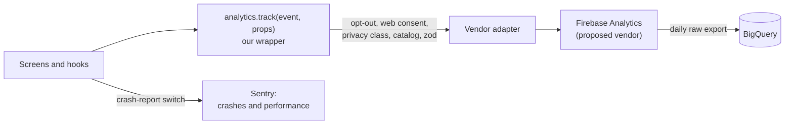

# Analytics tracking plan

- **Status:** Proposed. The owner's direction (2026-09-29) is to track broadly from the start: record anything that could be useful for future analysis, even before every report is built. The vendor is still a proposal ([OQ-8](../../specs/open-questions.md#oq-8-analytics-tool)).
- **Last updated:** 2026-09-29
- **Related:** [PRD](../../specs/PRD.md) (requirement APP-2 and the [success metrics](../../specs/PRD.md#7-success-metrics)) · [architecture overview](../architecture/overview.md) · [data model](../architecture/data-model.md) (the opt-out and install ID) · [device layouts](../architecture/device-layouts.md) · [ADR-0003](../decisions/ADR-0003-backend-and-auth.md) (Firebase)

This plan lists every analytics event the app sends, what each one carries, and the rules they all follow. Code sends only the events listed here.

## Contents

1. [Principles](#1-principles)
2. [Pipeline](#2-pipeline)
3. [Naming](#3-naming)
4. [Common properties](#4-common-properties)
5. [Privacy classes](#5-privacy-classes)
6. [Event catalog](#6-event-catalog)
7. [Governance](#7-governance)
8. [Open questions](#8-open-questions)

---

## 1. Principles

- **Anonymous by default.** Events say what happened in the app, never who did it. No event carries an account ID, even when the user is signed in; `signed_in` is only a true-or-false property.
- **No personal data in events.** Properties are enums, counts, booleans, and IDs of public game data (species keys, card IDs, set IDs, format IDs). Never sent:
  - names, email addresses, Firebase `uid`s, and display names
  - free text of any kind: search text, team, binder, and saved-search names, nicknames, notes, tags, pastes, PokéPaste URLs, Replica codes, and CSV file names and contents
  - money: purchase, sale, and target prices, Your valuation, and eBay listing prices
  - grading cert numbers, and the age band
  - precise location, contacts, photos (including camera frames and recognized text from card scanning), and advertising IDs
- **An anonymous install ID.** A random UUID created on first launch and kept only on the device ([data model §3.1](../architecture/data-model.md#31-what-lives-where)).
  - It identifies an install, not a person, and it's never linked to the account.
  - It resets on opt-out, on "clear this device", and on account deletion.
  - The vendor keeps its own instance ID for the same purpose (verify how it resets).
- **An opt-out in Settings.** One switch stops every analytics event on the device at once, including queued ones (verify that the vendor drops its queue). Turning it off sends nothing, not even an event about the switch. When signed in, the choice syncs, and "off" wins (decided 2026-09-29; [data model: preferences](../architecture/data-model.md#users)).
- **Crash reports have a switch of their own** (decided 2026-09-29): "Send crash reports", separate from the analytics opt-out, on by default, and anonymous ([§6.7](#67-performance-sentry)).
- **Consent on the web only where the law requires it** (decided 2026-09-29). In the EU and the UK, a cookie-consent prompt comes first, and analytics stay off until the visitor agrees ([§2](#2-pipeline)).
- **Minimal, essential measurement for under-13 guests.** They send only the `essential` class ([§5](#5-privacy-classes)).
  - **How we know** (decided 2026-09-29): each install asks one neutral age-band question at first launch, in production builds, and never again. Only the band is kept, on the device, and it's never sent. Until it's answered, only essential events go out. Development builds skip the question with a flag (decided 2026-09-29).
  - This relies on COPPA's exception for persistent identifiers used only to support internal operations, such as maintaining or analyzing how the app works, and never to contact or profile a child (verify against the FTC's current rule and FAQ before launch).
  - The 2025 amendments to the COPPA Rule may also require the privacy policy to name those internal operations (verify).
- **No ad identifiers and no cross-app tracking.** Advertising-ID collection stays off on Android, there's no tracking prompt or AdSupport on iOS, and Google Signals and ad personalization stay off in the property (verify each setting). Nothing goes to ad networks.
- **Privacy labels and the policy move in step.** A change that adds a new kind of data updates the privacy policy, the App Store privacy details, and Google Play's Data safety form before it ships ([§7](#7-governance)).
- **Track broadly, report later.** An event can ship before any report uses it, as long as it follows these rules.

## 2. Pipeline

- **The wrapper is vendor-neutral.** Screens call `analytics.track(event, props)` and never a vendor SDK, so the vendor can change without touching features. For each event, the wrapper:
  1. looks the event up in a typed catalog that mirrors [§6](#6-event-catalog), so an unknown event fails the typecheck
  2. drops it after opt-out; drops `standard` events for under-13 guests, and until the age question is answered; and, on the web where consent is required, drops everything until the visitor consents
  3. validates the properties with zod and drops any property the catalog doesn't declare
  4. adds the [common properties](#4-common-properties)
  5. hands the event to the vendor adapter
- **The vendor (proposed): Firebase Analytics,** in the same Firebase project as the backend ([ADR-0003](../decisions/ADR-0003-backend-and-auth.md)).
  - **iOS and Android:** React Native Firebase (`@react-native-firebase/analytics`), a native module, so it needs a development build. The Firebase JS SDK's Analytics runs only on web (verify both).
  - **Web:** the Firebase JS SDK, which is Google Analytics 4 underneath and sets cookies. A consent prompt appears only where the law requires it, in the EU and the UK, and analytics stay off there until the visitor agrees (decided 2026-09-29). Use the vendor's consent mode, with analytics storage denied until then (verify). Tell the region apart without location data, and ask when unsure (proposed; verify how).
  - **Screen views:** turn off automatic screen reporting and log `screen_view` from the router, because native screen classes don't map to our routes (verify the setting on each platform).
  - **Offline:** the SDK queues events and sends them later (verify its limits).
- **The raw export to BigQuery** keeps every event and property, including the ones no report uses yet, for analysis later in SQL.
  - Link the Firebase project to BigQuery and turn on the daily export. Streaming export needs billing (verify).
  - Quotas (verify all before relying on them): the BigQuery sandbox, without billing, limits storage and queries, and its tables expire after 60 days by default. The daily export also caps events per day on standard properties.
- **Sentry, separately,** takes crashes and performance ([§6.7](#67-performance-sentry)), with `sendDefaultPii` off ([data model §6](../architecture/data-model.md#6-security-rules-principles)), behind its own "Send crash reports" switch.
- **Development and test builds** log events to the console instead of sending them. Tests assert on the typed calls.
- **The store consoles and cookieless web analytics still complement this** ([OQ-8](../../specs/open-questions.md#oq-8-analytics-tool)).

## 3. Naming

- **Events are snake_case `object_action`:** the object first, then a present-tense verb. For example, `binder_create`, `dex_search`, and `team_member_edit`.
- **Objects by area:** `app`, `screen`, `tab`, `preference` · `dex`, `dex_progress` · `collection_item`, `wishlist`, `set_completion`, `binder`, `deck`, `card`, `card_filter`, `saved_search`, `csv`, `share`, `marketplace_link`, `ebay_panel`, `ebay_filter`, `scan` · `battle_section`, `team`, `paste`, `pokepaste`, `calc`, `regulation`, `meta`, `replica_code` · `sign_in`, `sync`, `account` · `error`, `offline_mode`.
- **Properties are snake_case too.** Booleans read as facts (`signed_in`, `favorited`). A list is a comma-joined string, such as `fire,flying`, because event parameters can't be arrays (verify). IDs are ours: species keys, and our own slugs and IDs for moves, formats, and regulations, not Showdown IDs ([data model §2.2](../architecture/data-model.md#22-identifiers)). Cards use TCGdex IDs.
- **Vendor limits** (Firebase; verify):
  - event names up to 40 characters, and up to 500 distinct events per app; this catalog has 58
  - up to 25 parameters per event, with values up to 100 characters
  - no reserved prefixes (`firebase_`, `google_`, `ga_`) and no reserved names such as `error`, which is why errors use `error_shown`
- **Reports need custom definitions** in the Firebase console, and their number is limited (verify). The BigQuery export keeps every parameter regardless.

## 4. Common properties

The wrapper adds these to every event.

| Property | Values | Notes |
|---|---|---|
| `platform` | `ios`, `android`, `web` | |
| `app_version` | For example `1.4.0` | |
| `build` | The build number, plus the EAS Update ID when an update is running | Ties events to a release |
| `window_class` | `compact`, `medium`, `expanded`, `large` | From `useWindowClass()` ([device layouts §3.1](../architecture/device-layouts.md#31-usewindowclass)) |
| `posture` | `flat`, `book`, `tabletop`, `closed` | From `usePosture()` ([device layouts §3.2](../architecture/device-layouts.md#32-useposture)) |
| `locale` | For example `en-US` | Language and region only |
| `theme` | `light`, `dark` | The theme in effect |
| `signed_in` | `true`, `false` | Never the account itself |
| `first_launch` | `true`, `false` | `true` for events in the first session after install |

## 5. Privacy classes

| Class | What it covers | Sent for |
|---|---|---|
| `essential` | The minimum needed to keep the app working and to count its use: launches, screens, errors, going offline, and performance. The vendor's automatic session events (`first_open`, `session_start`, `user_engagement`) count as essential too (verify the list). | Everyone who hasn't opted out, including under-13 guests (verify against COPPA's internal-operations exception). On the web in the EU and the UK, only after consent. |
| `standard` | Anonymous feature use: what people search, build, and collect, as enums, counts, and public game IDs | Everyone who hasn't opted out and has answered the age question, except under-13 guests. On the web in the EU and the UK, only after consent. |
| never | The personal data and free text listed in [§1](#1-principles) | Nobody. The wrapper only passes declared properties, and tests check that no property accepts free text. |

## 6. Event catalog

Each event lists when it fires, its properties (on top of the common ones), and its privacy class. Tab IDs are `dex`, `tcg`, `battle`, and `profile`. Values in parentheses are the allowed values or an example.

### 6.1 App

| Event | Fires when | Properties | Class |
|---|---|---|---|
| `app_open` | The app starts or comes back to the foreground; on web, a page load | `launch_kind` (`cold`, `resume`), `launch_tab` (the first tab in the user's order), `via_link` (opened from a deep link or a share link), `data_build` (the data bundle's build ID) | essential |
| `screen_view` | A route comes into view | `screen_name` (the route pattern, such as `/dex/[key]`, never a filled-in ID), `tab`, `previous_screen` | essential |
| `tab_reorder` | The user saves a new tab order in Settings → Preferences, or restores the default | `order` (for example `tcg,dex,battle`), `first_tab`, `restored_default` | standard |
| `preference_change` | A preference that has no event of its own changes | `preference` (the key, such as `motion` or `enable_haptics`), `value` and `previous_value` (enum values only), `source` (`settings`, `inline`) | standard |

- `tab_reorder`, `battle_section_switch`, `dex_sprite_style_change`, and `binder_view_change` cover their own preferences, so each change is counted once.
- `preference_change` never fires for the analytics switch.

### 6.2 Pokédex

| Event | Fires when | Properties | Class |
|---|---|---|---|
| `dex_search` | A search settles: typing pauses for 1 s, or the user submits | `query_kind` (`number`, `name`), `query_length`, `result_count`, `top_result_key` (the first result's species key, if any) | standard |
| `dex_filter_apply` | The filters change and the list updates | `types` (for example `fire,flying`), `generations` (for example `1,9`), `favorites_only`, `result_count` | standard |
| `dex_detail_view` | A Pokémon's detail opens | `species_key` (as opened, such as `6` or `6-mega-x`), `source` (`list`, `search`, `link`, `evolution`, `favorites`) | standard |
| `dex_form_switch` | The user picks another form on a detail page | `base_key` (such as `6`), `from_key`, `to_key`, `form_kind` (`battle`, `cosmetic`) | standard |
| `dex_sprite_style_change` | The sprite style changes, from the Pokédex or from Settings | `from_style` and `to_style` (`party`, `animated`, `home`, `gen9`), `source` (`dex`, `settings`) | standard |
| `dex_favorite_toggle` | A species is favorited or unfavorited | `species_key`, `favorited`, `favorite_count` (after the change) | standard |
| `dex_progress_view` | A dex progress view opens, or its list or sources change (from P3) | `scope` (`national`, `region`, `regional_forms`, `mega`; `shiny` later), `list_id` (the dex list, such as `national`, `kanto`, `regional-forms`, or `mega`), `sources` (the sources counted: `all`, `tcg`, `caught`; games later), `owned_count`, `total_count` | standard |

The search text itself is never sent; `top_result_key` is a public game ID, and it's empty when nothing matches.

### 6.3 TCG

Most of these events arrive with TCG v2 in P3. Rows marked v1.1, v2, or later arrive with those releases ([PRD §5.3](../../specs/PRD.md#53-tcg)).

#### Collection and wishlist

| Event | Fires when | Properties | Class |
|---|---|---|---|
| `collection_item_add` | A copy is added by hand. A CSV import fires one `csv_import` instead. | `card_id`, `source` (`search`, `card_page`, `set`, `binder`, `wishlist`; `scan` later), `variant` (a variant key, such as `reverse`), `condition_kind` (`raw`, `graded`, `none`), `grader` (when graded: `psa`, `bgs`, `cgc`, `sgc`, `tag`, `ace`, `other`), `acquisition` (`bought`, `traded`, `pulled`, `gift`, `none`), `has_price`, `has_value`, `quantity`, `card_copy_count` (copies of this card after), `collection_size` (copies after) | standard |
| `collection_item_edit` | Edits to a copy are committed, when its editor closes, not per keystroke | `card_id`, `fields` (the changed fields, such as `condition,tags`, never their values), `disposal` (`sold`, `traded`, when this edit records one), `favorite` (after the edit) | standard |
| `collection_item_remove` | A copy is deleted. Recording a sale or trade is an edit, not a removal. | `card_id`, `was_placed` (it was in a binder), `was_disposed`, `card_copy_count` (after), `collection_size` (after) | standard |
| `wishlist_add` | A card is added to the wishlist | `card_id`, `source` (`search`, `card_page`, `set`, `binder_ghost`, `dex_progress`), `has_target_price`, `priority` (`low`, `medium`, `high`), `placed` (it went into a binder slot), `wishlist_size` (after) | standard |
| `wishlist_remove` | A wishlist entry is removed | `card_id`, `reason` (`acquired` when a copy replaced it, `removed`), `age_days`, `wishlist_size` (after) | standard |
| `set_completion_view` (proposed) | A set's completion view opens | `set_id`, `master_set`, `owned_count`, `total_count` | standard |

#### Binders and decks

| Event | Fires when | Properties | Class |
|---|---|---|---|
| `binder_create` | A new, empty binder is saved. Auto-built binders fire `binder_autobuild` instead. | `grid_size` (`2x2`, `3x3`, `3x4`, `4x4`), `page_count`, `color` (a `BINDER_COLORS` ID), `tag_count` | standard |
| `binder_autobuild` | A binder is built automatically, from a set or a dex list | `source` (`set`, `living_dex`; `saved_search` if smart collections ship, proposed), `set_id` and `master_set` (for `set`), `list_id` (for `living_dex`, such as `national` or `kanto`), `grid_size`, `page_count`, `slot_count`, `filled_count` (slots filled with owned copies), `ghost_count`, `volume_count` (1 unless a Living Dex is split into volumes) | standard |
| `binder_delete` | A binder is deleted | `grid_size`, `page_count`, `card_count`, `age_days` | standard |
| `binder_page_add` | A page is added | `grid_size`, `page_count` (after), `at_end` (`false` when it's inserted between pages) | standard |
| `binder_page_remove` | A page is removed | `grid_size`, `page_count` (after), `card_count` (cards that were on the page), `cards_action` (`moved`, `removed`, `none`) | standard |
| `binder_card_place` | A card goes into a slot | `card_id`, `grid_size`, `view` (`page`, `binder`, `continuous`), `method` (`picker`; `drag` from a side panel; `suggestion` for a Living Dex pick; `autofill` when a new copy fills a ghost), `ref_kind` (`copy`, `wish`), `filled_ghost` | standard |
| `binder_card_move` | A card or a ghost moves, by drag and drop or a move action | `action` (`move`, `swap`), `method` (`drag`, or `action` for the keyboard and screen-reader actions), `scope` (`same_page`, `other_page`, `other_binder`), `ref_kind` (`copy`, `wish`, `ghost`), `view`, `grid_size` | standard |
| `binder_card_remove` | A card leaves a slot | `card_id`, `view`, `ref_kind`, `left_ghost` (the slot keeps a ghost) | standard |
| `binder_view_change` | The user switches views | `from_view` and `to_view` (`page`, `binder`, `continuous`), `grid_size` | standard |
| `deck_create` | A new deck is saved | `card_count`, `source` (`new`, `duplicate`) | standard |

#### Search and filters

| Event | Fires when | Properties | Class |
|---|---|---|---|
| `card_search` | A card search settles | `scope` (`collection`, `wishlist`, `catalog`), `context` (`search`, `binder`, `deck`), `query_kind` (`name`, `set`, `number`, or `text` for attack and ability text), `query_length`, `result_count` | standard |
| `card_filter_apply` | The filters or the sort change and the results update | `scope`, `fields` (the filter fields in use, such as `rarity,release_date,species,owned`), `filter_count`, `sort` (a field and a direction, such as `release_date_desc`), `from_saved_search`, `result_count` | standard |
| `saved_search_save` (proposed) | A saved search is created or updated | `scope`, `fields`, `filter_count`, `is_new` | standard |

`fields` and `sort` use these filter IDs: `species`, `name`, `evolution_family`, `set`, `series`, `release_date`, `number`, `rarity`, `supertype`, `subtype`, `type`, `stage`, `hp`, `regulation_mark`, `legality`, `illustrator`, `language`, `variant`, `condition`, `grader`, `grade`, `owned`, `wanted`, `extras`, `favorite`, `binder`, `tag`, `price`, `value`, `date_added`, `date_acquired`, and `text`. They name fields, never values, so tags, binder names, and search text never leave the device.

#### CSV and sharing

| Event | Fires when | Properties | Class |
|---|---|---|---|
| `csv_import` | A CSV import finishes | `target` (`collection`, `wishlist`), `format` (`pokeverse`, `other`), `row_count`, `imported_count`, `unmatched_count`, `duplicate_count` (rows skipped as already imported), `error_count`, `duration_ms` | standard |
| `csv_export` | A CSV export is saved or shared | `target` (`collection`, `wishlist`, `trade_list`), `row_count` | standard |
| `share_create` (v1.1) | A read-only share is created | `object` (`binder`, `wishlist`, `trade_list`), `format` (`link`, `image`), `includes_prices`, `item_count` | standard |

#### Marketplace links and eBay

| Event | Fires when | Properties | Class |
|---|---|---|---|
| `marketplace_link_open` | The user opens a marketplace link for a card: "View on …", "View listings on eBay", "View recently sold on eBay", or a listing in the eBay panel (v2) | `card_id`, `source` (`tcgplayer`, `cardmarket`, `ebay_listings`, `ebay_sold`), `link_kind` (`product` for a direct product page, `search` for a search link, `item` for one eBay listing), `placement` (`primary` for the main button, `more` for the "More" menu, `ebay_panel`) | standard |
| `ebay_panel_open` (v2) | The eBay panel opens on a card and its results settle | `card_id`, `site` (the region's eBay site, such as `us` or `gb`), `result_count`, `cache_age_s` (how old the served results are), `state` (`ok`, `empty`, `unavailable`) | standard |
| `ebay_filter_change` (v2) | A filter or the sort changes in the eBay panel | `card_id`, `filter` (`graded`, `grader`, `grade`, `buying_option`, `sort`), `value` (`graded`, `raw`, or `any`; a grader, such as `psa`; a grade, such as `10`; `auction`, `buy_it_now`, or `any`; `ending_soonest`, `newly_listed`, `price_low`, or `price_high`), `result_count` | standard |

#### Scanning (later)

| Event | Fires when | Properties | Class |
|---|---|---|---|
| `scan_start` | The card scanner opens | `entry` (`camera_control`, `button`) | standard |
| `scan_result` | A scan settles | `result` (`matched`, `picked` from several candidates, `no_match`, `cancelled`), `method` (`text`, `image`), `card_id` (on a match), `candidate_count`, `duration_ms` | standard |

- Binder and saved-search names, notes, tags, cert numbers, prices and values of any kind, CSV file names and contents, search text, and camera frames or recognized text are never sent.
- No event carries a price. Your valuation stays on the device, TCGplayer and Cardmarket are link-outs only, and eBay's listings (v2) are shown, never measured ([PRD TCG-6](../../specs/PRD.md#53-tcg), [OQ-14](../../specs/open-questions.md#oq-14-card-price-sources-and-logos)).
- Each action is counted once: auto-built binders fire `binder_autobuild`, not `binder_create`, and moves fire `binder_card_move`, not `binder_card_place`.
- With `window_class` and `posture` on every event, `binder_view_change` also shows which views people pick on foldables.

### 6.4 Battle: Champions and Showdown

These events fire from P4. Every event here also carries `section` (`champions`, `showdown`). Events about a team, a calc, or a format's usage also carry `ruleset` (`champions`, `sv`) and `format` (our format ID, such as `champions-vgc-reg-mc` or `sv-ou`).

| Event | Fires when | Properties | Class |
|---|---|---|---|
| `battle_section_switch` | The user switches sections from the Battle header's menu | `from_section` (the section left; `section` is the one opened) | standard |
| `team_create` | A new team is saved | `source` (`blank`, `duplicate`, `paste`, `pokepaste`, `replica`) | standard |
| `team_delete` | A team is deleted | `member_count`, `age_days` | standard |
| `team_member_edit` | Edits to a member are committed: when the editor closes or pauses, not on every keystroke | `species_key`, `fields` (the changed fields, such as `moves,item`), `legal` (after the edit), `issue_count` | standard |
| `paste_import` | A Showdown paste import finishes | `layout` (`regular`, `beta`), `member_count`, `error_line_count`, `success` | standard |
| `paste_export` | A team is exported | `target` (`clipboard`, `share`, `pokepaste`, `showdown`), `converted` (Stat Points turned into EVs), `trimmed` (a spread cut to fit 510 EVs) | standard |
| `pokepaste_import` | A PokéPaste import finishes | `member_count`, `success`, `error_kind` (`not_found`, `network`, `parse`) | standard |
| `calc_run` | A damage calc result settles, once per matchup rather than per keystroke | `attacker_key`, `defender_key`, `move_id` | standard |
| `regulation_view` | The regulation hub opens (Champions) | `regulation` (our regulation ID, such as `champions-reg-mc`), `status` (`current`, `ended`, `upcoming`), `data_age_days` | standard |
| `meta_view` | A usage or meta page opens | `species_key` (on a per-Pokémon page), `source` (`smogon`, `tournaments`), `period` (such as `2026-09`) | standard |
| `replica_code_view` | A Replica Team code's detail opens (Champions) | `regulation`, `code_source` (`curated`, `user`), `code_status` (`active`, `dead`) | standard |
| `replica_code_submit` | A signed-in user submits a code (from P5) | `regulation`, `has_paste`, `result` (`queued`, `rejected`, `rate_limited`) | standard |

- "Test on Showdown" (SD-4) is `paste_export` with `target` set to `showdown`.
- Pastes, PokéPaste URLs, team names, nicknames, notes, and the codes themselves are never sent.
- `move_id` is our own move slug, such as `earthquake` or `u-turn` (decided 2026-09-29, [data model §2.2](../architecture/data-model.md#22-identifiers)).

### 6.5 Accounts

| Event | Fires when | Properties | Class |
|---|---|---|---|
| `sign_in_start` | The user picks a sign-in method | `method` (`apple`, `google`, `email_link`), `entry` (`profile`, `prompt`) | standard |
| `sign_in_complete` | Sign-in succeeds | `method`, `new_account`, `local_data_uploaded` | standard |
| `sign_in_fail` | Sign-in fails or is cancelled | `method`, `error_kind` (`cancelled`, `network`, `provider`, `link_expired`) | standard |
| `sync_complete` | A sync run finishes: on launch, on resume, on reconnect, or by hand, not on every live update | `trigger` (`launch`, `resume`, `reconnect`, `manual`), `pushed_count`, `pulled_count`, `duration_ms` | standard |
| `sync_conflict` | A pull finds that both copies changed since their shared base | `collection` (`profile`, `teams`, `collection`, `wishlist`, `binders`, `dex`, `favorites`, `saved_searches`), `resolution` (`remote_won`, `local_won`, `conflict_copy`) | standard |
| `account_delete` | Account deletion finishes | `result` (`deleted`, `failed`), `account_age_days` | standard |

- These events fire from P5, when accounts arrive.
- No event carries a `uid`, an email address, or a display name.
- The first-launch age question fires nothing. When its answer is under 13, the device sends essential events only, from then on; sign-up reuses the same band and asks nothing again.
- Account deletion resets the install ID. Events were never linked to the account, so there's nothing to look up.

### 6.6 Errors and offline

| Event | Fires when | Properties | Class |
|---|---|---|---|
| `error_shown` | The UI shows an error state: once per error screen or banner, not per caught exception | `screen_name`, `error_kind` (`network`, `data`, `storage`, `validation`, `unknown`), `error_code` (ours, such as `bundle_load_failed`), `retryable` | essential |
| `offline_mode_change` | The app goes offline or comes back online | `state` (`offline`, `online`), `offline_s` (on `online`: how long it was offline), `queued_writes` (sync outbox entries waiting) | essential |

Exceptions and stack traces go to Sentry, not to analytics.

### 6.7 Performance (Sentry)

These go to Sentry, not to the analytics vendor. Sentry's own names for them may differ (verify), and performance data is sampled at a rate set in P1. Each one feeds a [success metric](../../specs/PRD.md#7-success-metrics). They're sent only while the "Send crash reports" switch is on, which it is by default (decided 2026-09-29).

| Measurement | Captured when | Data | Class |
|---|---|---|---|
| Cold start | Every cold start, until the first screen is drawn | The app-start span's duration, with the release | essential |
| Slow and frozen frames | Throughout a session, on native | Counts per screen, from Sentry's mobile vitals | essential |
| Pokédex search time | Each settled search | A custom span, checked against the 50 ms budget | essential |
| Collection search time | Each settled search or filter change over the collection, wishlist, or catalog (from P3) | A custom span, checked against the 100 ms budget (proposed), with the collection size bucketed | essential |
| Web LCP | Each page load on web | Largest Contentful Paint, from Sentry's browser tracing | essential |

## 7. Governance

- **Changes are reviewed in PRs.** The PR that adds, changes, or removes an event updates this plan too, and the maintainer reviews it like code. No build sends an event that isn't listed here.
- **The code catalog mirrors this file.** Event names and property types live in one typed catalog that the wrapper enforces, and a test fails if the catalog and this file drift apart (proposed: generate one from the other).
- **Each change names its privacy class.** A new kind of data also updates the privacy policy and the store privacy labels before release.
- **Versioning:**
  - Adding an optional property is safe.
  - Renaming an event, or changing a property's meaning, type, or allowed values, is a breaking change. Add a new event or property instead (for example `dex_search_v2`), keep the old one firing for one release, and record both in the changelog.
  - Never reuse a retired name. The changelog records when each event starts and stops firing, so the raw history in BigQuery stays readable.

## 8. Open questions

- **Store audience.** If the declared audience includes children, Google Play's Families policy and Apple's Kids category rules limit third-party analytics SDKs (verify before choosing the audience).
- **How long to keep raw events** in BigQuery, and whether to aggregate older data.
- **Where web consent is required.** How to tell the EU and the UK apart without location data, such as from the browser's language and time zone, asking when unsure (proposed; verify), and whether the list needs more countries (verify).
- **Not in the catalog yet:** the dex progress marks themselves (DEX-5; the progress views are `dex_progress_view`) and deck edits (TCG-3). Add them when those screens are built.

**Decided on 2026-09-29, 14:41:**
- **Knowing who's under 13:** a neutral age-band question once per install, at first launch in production builds, with only the band kept on the device ([§1](#1-principles)).
- **Crash reports and the opt-out:** a separate "Send crash reports" switch, on by default and anonymous.
- **Consent on the web:** a prompt only where the law requires it, in the EU and the UK, with analytics off there until the visitor agrees.

## Changelog

- **2026-09-29:** Created, with the starter catalog of 40 events and 4 Sentry measurements, following the owner's direction to track broadly from the start.
- **2026-09-29 (14:03 decisions):** Added 18 events, bringing the catalog to 58: the collection and wishlist (`collection_item_add`, `_edit`, `_remove`, `wishlist_add`, `_remove`, and `set_completion_view`, proposed), `binder_autobuild` and `binder_card_move`, `card_filter_apply` and `saved_search_save` (proposed), `csv_import` and `csv_export`, `share_create` (v1.1), `dex_progress_view`, `ebay_panel_open` and `ebay_filter_change` (v2), and `scan_start` and `scan_result` (later). Added the collection-search Sentry span. Nothing had shipped, so these changes needed no versioned names: `marketplace_link_open`'s `ebay` source became `ebay_listings` and `ebay_sold`; moves left `binder_card_place` for `binder_card_move`; and `card_search` gained `scope` and a `text` query kind.
- **2026-09-29 (14:41 decisions):** Recorded the first-launch age question, the separate crash-report switch, and web consent in the EU and the UK. Format, regulation, and move IDs are now our own.
