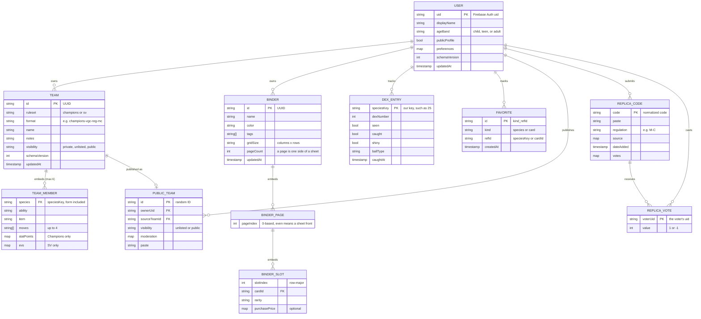
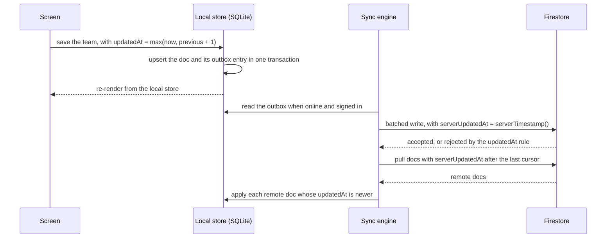
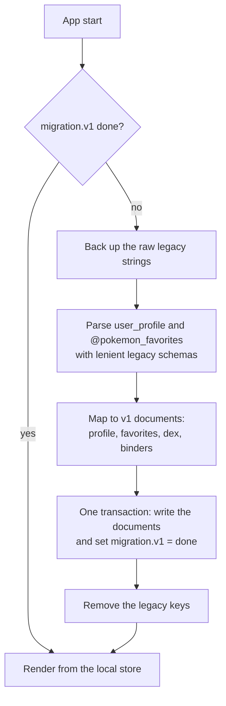

# Data model

- **As of:** 2026-09-28. §2 onward was updated on 2026-09-29 with the owner's decisions on species keys, binder pages and views, and new preferences.
- **Status:** §1 describes what `main` stores today. Everything from §2 on is the **proposed** target. None of it exists in code yet. It follows [ADR-0003](../decisions/ADR-0003-backend-and-auth.md) (backend and auth), [ADR-0007](../decisions/ADR-0007-state-and-data-fetching.md) (state and storage), and [ADR-0008](../decisions/ADR-0008-battle-engine.md) (battle engine).
- **Related:** [architecture overview](overview.md) · [test strategy](../testing/test-strategy.md) · [battle-ecosystem research](../research/2026-09-28-battle-ecosystem.md) · [open questions](../../specs/open-questions.md)

Line references point at `main` as of 2026-09-28. `BinderPlanner.tsx` and `SavedBinders.tsx` haven't been pushed yet, so how they use `SavedBinder` is inferred from their tests; items that depend on them are marked "(verify)".

## Contents

1. [Current storage inventory](#1-current-storage-inventory)
2. [Target model](#2-target-model)
3. [Local-first store and sync](#3-local-first-store-and-sync)
4. [Migration from today's keys](#4-migration-from-todays-keys)
5. [Validation rules](#5-validation-rules)
6. [Security-rules principles](#6-security-rules-principles)
7. [Open questions](#7-open-questions)

---

## 1. Current storage inventory

### 1.1 AsyncStorage keys

Everything persists through `@react-native-async-storage/async-storage` 1.18.2 as JSON strings. On web, that's plaintext `localStorage`.

| Key | Written | Read | Removed | Value |
|---|---|---|---|---|
| `user_profile` | `UserContext.tsx:154` (`saveUserData`) | `:141` (`loadUserData`) | `:188` (`logout`) | `UserProfile` ([§1.2](#12-current-typescript-models)) |
| `@pokemon_favorites` | `PokedexView.tsx:546` | `:532` | never | `number[]` of national dex numbers. The key constant is at `:92`; in memory it's a `Set<number>` (`:498`). |
| `@image_cache_metadata` | `imageCache.ts:94` | `:71` | `:244` | `{ entries: { [url]: CacheEntry }, totalSize: number }`. `size` is never set, so `totalSize` is always 0. |
| `@image_cache_<url>` | never | never | `imageCache.ts:182` | A phantom key: only `removeItem` is ever called on it. |

**Not persisted at all:** the deck (`DeckBuilder`), the team (`TeamBuilder`), the sprite style (`PokedexView.tsx:514`, reset on every launch), and every filter and toggle. `UserProfile.preferences` is written but never read, so `enableHaptics` does nothing.

### 1.2 Current TypeScript models

`UserProfile`, `CaughtPokemon`, and `SavedBinder` are in `src/contexts/UserContext.tsx`, quoted as written. `login()` sets `id` to `Date.now().toString()` (`:163`), and the preference defaults are `'best'`, `false`, `true`, and `false` (`:168-174`).

```ts
// UserContext.tsx:86-102
export interface UserProfile {
  id: string;
  email?: string;
  displayName?: string;
  authProvider: 'apple' | 'google' | 'facebook' | 'email' | 'guest';
  avatar?: string;
  preferences: {
    defaultSpriteVersion: string;
    showShinyByDefault: boolean;
    enableHaptics: boolean;
    enablePriceTracking: boolean;
  };
  caughtPokemon: CaughtPokemon[];
  savedBinders: SavedBinder[];
  favorites: string[]; // Pokemon IDs
  createdAt: string;
}

// UserContext.tsx:23-30
export interface CaughtPokemon {
  pokemonId: string;
  pokemonName: string;
  ballType: string;
  dateSpotted?: string;
  dateCaught?: string;
  isShiny?: boolean;
}

// UserContext.tsx:32-48
export interface SavedBinder {
  id: string;
  name: string;
  color: string;
  tags: string[];
  gridSize: '2x2' | '3x3' | '4x3' | '4x4' | '5x5';
  cards: Array<{
    position: number;
    cardId: string;
    cardName: string;
    rarity: string;
    purchasePrice?: number;
    dateAdded: string;
  }>;
  createdAt: string;
  updatedAt: string;
}
```

Supporting constants in the same file: `POKEBALL_TYPES` (8 balls, `:12-21`), `BINDER_COLORS` (10 colors, `:50-61`), and `SUGGESTED_TAGS` (20 tags, `:63-84`).

Two in-memory models are never persisted. `TCGCard` is defined in `src/api/tcgApi.ts:11-76`, and the `evs` and `ivs` objects below are condensed onto one line each:

```ts
// src/components/tcg/DeckBuilder.tsx:15-17
interface DeckCard extends TCGCard {
  count: number;
}

// src/components/teambuilder/TeamBuilder.tsx:12-36
interface PokemonTeamMember {
  pokemonId: number;
  pokemonName: string;
  nickname?: string;
  ability: string;
  nature: string;
  item?: string;
  moves: string[];
  evs: { hp: number; attack: number; defense: number; specialAttack: number; specialDefense: number; speed: number };
  ivs: { hp: number; attack: number; defense: number; specialAttack: number; specialDefense: number; speed: number };
}
```

`PokemonTeamMember` has no EV or IV limits, no level, gender, shiny, or Tera type, and no notion of a ruleset. The target replaces it outright; there's no stored team data to migrate.

### 1.3 Known problems

| # | Problem | Evidence | Fixed by |
|---|---|---|---|
| 1 | **Two favorites stores.** The Pokédex UI uses `@pokemon_favorites` (`number[]`). `UserProfile.favorites` (`string[]`, commented "Pokemon IDs") is exposed by `UserContext` but no screen uses it, and its tests pass names such as `'pikachu'` (`UserContext.test.tsx:44`). The two never sync. | `PokedexView.tsx:92,530-562`; `UserContext.tsx:100,257-270` | One `favorites` collection ([§2.4](#favorites)) |
| 2 | **No user scoping.** There's one global `user_profile`, and its `id` is a timestamp. Signing in as anyone overwrites it, and `@pokemon_favorites` isn't tied to a user at all. | `UserContext.tsx:141,161-184` | Documents owned by a Firebase `uid`, or by `local` before sign-in ([§3.2](#32-local-schema-sketch)) |
| 3 | **No schema version and no validation.** Stored JSON is `JSON.parse`d and trusted (`:143`), so any shape change breaks old installs silently. | `UserContext.tsx:141-146` | `schemaVersion` on every document; zod on every read ([§5](#5-validation-rules)) |
| 4 | **Binder positions have no page field.** Cards carry a single `position: number`, but the planner pages through up to 100 pages ("Page 1 of 100", `BinderPlanner.test.tsx:108`). So `position` has to encode page × slot, and changing `gridSize` silently moves every card. | `UserContext.tsx:37-45` | Explicit `pageIndex` and `slotIndex`, plus an explicit reflow when the grid changes ([§2.4](#binders)) |
| 5 | **Login overwrites and logout deletes.** Every login builds a fresh profile with empty arrays (the cold-start wipe), and sign-out removes the profile. | `UserContext.tsx:161-194`; `App.tsx:121,130-134` | Load-or-create on login, keep data on sign-out (upgrade step U4, [review §9](../reviews/2026-09-28-tech-stack-review.md#9-recommended-sequence)); later, a local-first store with no login gate |
| 6 | **Preferences merge bug.** `...userData` is spread last (`:179`), so a partial `preferences` object replaces the merged defaults (`:168-174`). | `UserContext.tsx:168-179` | Schema defaults applied by zod |
| 7 | **Loose identifiers.** `CaughtPokemon.pokemonId` is a string whose meaning (number or name) isn't defined; `ballType` is free text rather than a `POKEBALL_TYPES` id; `SavedBinder.color` is typed `string` although the tests store a `BINDER_COLORS` id (`'red'`, `UserContext.test.tsx:181`). | `UserContext.tsx:23-37` | Typed IDs ([§2.2](#22-identifiers)) |
| 8 | **Simulated identity is stored as if real.** Social logins store `user@<provider>.com` and a generated avatar URL. | `HomeScreen.tsx:28-41` | Dropped in migration ([§4](#4-migration-from-todays-keys)) |
| 9 | **Money as a bare number.** `purchasePrice` has no currency. | `UserContext.tsx:43` | `{ amount, currency }` in minor units |

---

## 2. Target model

### 2.1 Principles

- **One document per aggregate:** a profile, a team, a binder, a dex entry, a favorite. Sync resolves conflicts per document, so the document is the unit of "last write wins" ([§3.4](#34-conflict-notes)).
- **Every document carries** `schemaVersion`, `createdAt`, `updatedAt`, and an optional `deletedAt` tombstone. Synced documents also carry `serverUpdatedAt`, set by the server.
- **IDs are generated on the client** (random UUIDs from `expo-crypto`), so creating things offline needs no server round-trip. Firestore's best practices also discourage monotonically increasing IDs.
- **Game data is referenced by stable IDs** from the data bundle, never by display name. Pokémon and their forms use our own species key ([§2.2](#22-identifiers)).
- **Collect as little as possible.** Firestore stores no email (Firebase Auth holds it), no birth date (only an age band), and no location. Public surfaces show a display name only when the owner has opted in and isn't a child.

### 2.2 Identifiers

| ID | Format | Example | Source |
|---|---|---|---|
| `uid` | Firebase Auth user ID, or `local` before sign-in | n/a | Firebase Auth |
| `speciesKey` | **Our own key for a Pokémon or form** (decided 2026-09-29): the National Dex number, then a hyphen and a form slug for any form other than the default. Lowercase letters, digits, and hyphens. | `6`, `6-mega-x`, `37-alola`, `445-mega-z` | The data pipeline. It's the primary key everywhere. |
| `dexNumber` | National Pokédex number, 1–1025: the part of a `speciesKey` before the first hyphen | `445` | Data bundle |
| `moveId`, `abilityId`, `itemId`, `natureId`, `typeId` | Showdown-style IDs, for now ([§7](#7-open-questions)) | `earthquake`, `roughskin`, `choicescarf`, `jolly`, `dragon` | Data bundle |
| `format` | Our stable format ID; the bundle maps each to its Showdown format where one exists | `champions-vgc-reg-mc`, `gen9ou` | Data bundle |
| `cardId` | TCGdex card ID ([ADR-0009](../decisions/ADR-0009-tcg-data-source.md)) | n/a | Data bundle. Today's pokemontcg.io IDs need a mapping step (verify how many differ). |

#### Species keys

Decided 2026-09-29 ([OQ-13](../../specs/open-questions.md#oq-13-canonical-species-key)). Every document, ID, and route that names a Pokémon uses our key.

- **The shape:** the National Dex number for the default form, plus a form slug for every other form.

  | Key | Pokémon or form |
  |---|---|
  | `6`, `6-mega-x`, `6-mega-y`, `6-gmax` | Charizard, its two Mega Evolutions, and its Gigantamax form |
  | `150-mega-x`, `150-mega-y` | Mewtwo's two Mega Evolutions |
  | `445-mega`, `445-mega-z` | Mega Garchomp, and Champions' Mega Garchomp Z |
  | `359-mega`, `359-mega-z` | Absol's Mega and Mega Z forms |
  | `448-mega`, `448-mega-z` | Lucario's Mega and Mega Z forms |
  | `37-alola` | Alolan Vulpix |
  | `128-paldea-combat` | Paldean Tauros, Combat Breed |
  | `479-wash` | Wash Rotom |
  | `892-rapid-strike` | Urshifu, Rapid Strike Style |

- **Why our own key:** The Pokémon Company publishes only the National Dex number. The games themselves identify a Pokémon by dex number plus a form index, but those indexes aren't published, so our key mirrors that model with readable form names. No third party can break it, it's easy to read, and it works in URLs.
- **Form slugs** come from PokeAPI's form names where possible, minus the species name: `charizard-mega-x` gives `mega-x`. PokeAPI already models the Champions forms. A manual override table in the pipeline covers names that differ between sources or read badly; for example, PokeAPI's `tauros-paldea-combat-breed` becomes `128-paldea-combat` (verify each name against PokeAPI). Once published, a key never changes meaning.
- **Battle-relevant or cosmetic:** each form in the bundle carries a `cosmetic` flag. Vivillon's patterns are cosmetic; Megas, regional forms, and Rotom's appliance forms aren't. Dex progress can track cosmetic forms later.
- **The crosswalk is for reference only.** The pipeline generates a table that maps each key to PokeAPI names and IDs, Showdown IDs, TCGdex references, and display names. No document stores those IDs as keys: when a source renames something, we fix the crosswalk, never user data. A sketch of a few rows:

  | Key | Display name | PokeAPI name | Showdown ID | Cosmetic |
  |---|---|---|---|---|
  | `6-mega-x` | Mega Charizard X | `charizard-mega-x` | `charizardmegax` | No |
  | `445-mega-z` | Mega Garchomp Z | `garchomp-mega-z` | `garchompmegaz` (verify) | No |
  | `37-alola` | Alolan Vulpix | `vulpix-alola` | `vulpixalola` | No |
  | `666-polar` | Vivillon, Polar Pattern | `vivillon-polar` | `vivillonpolar` | Yes |

  The real table also carries PokeAPI's numeric IDs and the TCGdex references (verify every value when the pipeline generates it).
- **The battle engine converts at its boundary.** `packages/battle` turns keys into Showdown IDs only where it calls `@smogon/calc` and `@pkmn`, and turns Showdown names back into keys when it imports a paste.
- **Routes use the key too:** `/dex/6` opens Charizard with a form selector, and `/dex/6-mega-x` opens that form directly ([architecture overview §2.5](overview.md#25-client-architecture-and-route-map)).
- **Dex entries still copy the dex number** for sorting, because keys sort as text (`10` before `2`).

### 2.3 Entity-relationship diagram

Firestore paths: `users/{uid}` with subcollections `teams`, `binders`, `dex`, and `favorites`; top-level `publicTeams` and `replicaCodes`. Team members, binder pages, and binder slots are **embedded** in their parent document, not separate documents.



### 2.4 Field tables

Common fields (`schemaVersion`, `createdAt`, `updatedAt`, `serverUpdatedAt`, `deletedAt`) are listed once in [§2.1](#21-principles) and omitted below unless a rule differs. Every length limit we set ourselves (names, notes, tags) is a starting point.

#### users

`users/{uid}`: one document per account.

| Field | Type | Rules | Notes |
|---|---|---|---|
| *(document ID)* | string | = Firebase Auth `uid` | |
| `displayName` | string | 1–30 characters, trimmed | Default "Trainer". Shown publicly only when `publicProfile` is true. |
| `avatar` | `{ kind: 'preset', presetId }` or `null` | Preset avatars only in v1 | No uploads means no image moderation and no photos of children. |
| `ageBand` | `'child' \| 'teen' \| 'adult'` | Required; written once at sign-up; the client can't change it | `child` means under 13, and child accounts are off by default ([§6](#6-security-rules-principles)). Store the band, never a birth date. |
| `publicProfile` | boolean | Always `false` when `ageBand` is `child` | Off by default for everyone |
| `preferences` | map | See below | |
| `migratedFrom` | map, optional | `{ legacyCreatedAt, migratedAt }` | Audit trail for the [§4](#4-migration-from-todays-keys) migration |

`preferences`:

| Field | Type | Default | Today |
|---|---|---|---|
| `defaultSpriteVersion` | string | `'best'` | Exists, never read |
| `showShinyByDefault` | boolean | `false` | Exists, never read |
| `enableHaptics` | boolean | `true` | Exists, never read (haptics always fire) |
| `enablePriceTracking` | boolean | `false` | Exists, never read. Market prices are link-outs only for now, and collection value comes from purchase prices ([PRD TCG-6](../../specs/PRD.md#53-tcg)), so this may be dropped. |
| `spriteStyle` | `'party' \| 'animated' \| 'home' \| 'gen9'` | `'home'` | Component state only (`PokedexView.tsx:514`), reset on every launch |
| `tabOrder` | `('dex' \| 'tcg' \| 'battle')[]` | `['dex', 'tcg', 'battle']` | New (decided 2026-09-29): the order of the content tabs, set in Settings → Preferences. The first is the launch screen. Profile is always last, so it isn't listed. Each tab appears exactly once; on read, unknown IDs are dropped and missing ones are appended in the default order, so adding a tab never breaks a saved order. "Restore default" writes the default. |
| `battleSection` | `'champions' \| 'showdown'` | `'champions'` | New (decided 2026-09-29): the Battle section used last, so Battle reopens there. Deep links override it. |
| `binderView` | `'page' \| 'binder' \| 'continuous'` | `'page'` (proposed; verify) | New (decided 2026-09-29): single page, binder view, or continuous grid ([binders](#binders)) |
| `motion` | `'system' \| 'reduced'` | `'system'` | New; lets people calm the holo and gyroscope effects even when the OS setting is off |
| `marketplace` | `'auto' \| 'tcgplayer' \| 'cardmarket'` | `'auto'` | New (proposed, 2026-09-29): which marketplace gets a card's primary "View on …" button. `auto` follows the device's region setting, with no location permission ([PRD TCG-6](../../specs/PRD.md#53-tcg)). |
| `analytics` | `'on' \| 'off'` | `'on'` | New: the opt-out in Settings ([tracking plan](../analytics/tracking-plan.md)). When two copies disagree, `'off'` wins, so signing in never turns tracking back on. |

#### teams

`users/{uid}/teams/{teamId}`: one document per team, with members embedded.

| Field | Type | Rules | Notes |
|---|---|---|---|
| *(document ID)* | string | Client-generated UUID | |
| `name` | string | 1–60 characters | |
| `ruleset` | `'champions' \| 'sv'` | Required | Decides the member shape below |
| `format` | string | A format ID from the data bundle whose ruleset matches | For example `champions-vgc-reg-mc` or `gen9ou` |
| `members` | `TeamMember[]` | 0–6 entries | An empty team is a valid draft; legality is a separate check ([§5.2](#52-shape-versus-legality)) |
| `notes` | string | Up to 2,000 characters | |
| `visibility` | `'private' \| 'unlisted' \| 'public'` | Default `private`; child accounts: `private` only | `unlisted` means anyone with the link |
| `publicTeamId` | string or `null` | Written by the publish Function | Links to [publicTeams](#publicteams) |
| `dataBuildId` | string | | The data-bundle build the team was last validated against, so a data update can trigger re-validation |

#### team members

Embedded in `teams.members`. The team's `ruleset` decides which fields apply.

**Common fields**

| Field | Type | Rules |
|---|---|---|
| `species` | `speciesKey` | Must exist in the data bundle. The key names the form too, such as `37-alola`, so there's no separate form field. |
| `nickname` | string or `null` | Up to 12 characters (verify the in-game limit); no control characters |
| `ability` | `abilityId` | Legal for the species and form in the format |
| `item` | `itemId` or `null` | In the format's item pool; Champions pools are limited |
| `moves` | `moveId[]` | Up to 4, unique, each in the learnset for the format |
| `gender` | `'M' \| 'F'` or `null` | `null` for genderless or unspecified; must fit the species' gender ratio |
| `shiny` | boolean | Default `false` |

**Champions fields** (`ruleset: 'champions'`)

| Field | Type | Rules |
|---|---|---|
| `statPoints` | `{ hp, atk, def, spa, spd, spe }` | Each an integer 0–32; total at most 66 |
| `statAlignment` | `natureId` | One of the 25 natures, which Champions calls Stat Alignment |
| `megaForm` | `speciesKey` or `null` | The Mega form reached in battle, such as `6-mega-x` or `445-mega-z`. It has the same dex number as `species`, needs the matching Mega Stone as `item`, and must be legal in the regulation. |
| level | not stored | Fixed at 50 |
| IVs | not stored | Fixed at 31 |

**Scarlet/Violet fields** (`ruleset: 'sv'`)

| Field | Type | Rules |
|---|---|---|
| `evs` | `{ hp, atk, def, spa, spd, spe }` | Each an integer 0–252; total at most 510 |
| `ivs` | `{ hp, atk, def, spa, spd, spe }` | Each an integer 0–31; default 31 |
| `nature` | `natureId` | One of the 25 natures |
| `teraType` | `typeId` | One of the 18 types, or Stellar |
| `level` | integer | 1–100. The default comes from the format: 50 for VGC, 100 for Smogon singles. |

**Converting between rulesets**
- **Champions stat formulas** ([Showdown's champions mod](https://github.com/smogon/pokemon-showdown/tree/master/data/mods/champions)): HP = base + SP + 75; every other stat = (base + SP + 20) × the alignment modifier, rounded down (verify the rounding).
- **To SV EVs:** EV = 8·SP − 4, and 0 stays 0. At level 50 with IVs of 31, the Scarlet/Violet formula then gives the same stats (derived).
- **The reverse:** SP = ⌊(EV + 4) / 8⌋ (derived).
  - It loses the raw numbers (4 and 11 EVs both become 1 SP) but keeps every level-50 stat.
  - Any legal SV spread lands within 66 SP.
  - IVs below 31, common on Trick Room sets, have no Champions equivalent.
  - The [property tests](../testing/test-strategy.md#41-unit-tests-domain-logic-first) check both conversions against both formulas.
- **A legal 66-SP spread can exceed 510 EVs.** For example, 32/32/2 SP becomes 252/252/12 = 516 EVs. The SV export has to trim the spread and tell the user.
- **Showdown's Champions formats store Stat Points on the paste's `EVs:` line** (0–32 each). So exports to those formats keep the raw SP numbers there, and exports to SV formats convert.

#### binders

`users/{uid}/binders/{binderId}`: one document per binder, with pages and slots embedded and stored sparsely.

| Field | Type | Rules | Notes |
|---|---|---|---|
| *(document ID)* | string | Client-generated UUID; migrated binders keep their ID | |
| `name` | string | 1–60 characters | |
| `color` | string | A `BINDER_COLORS` id (`red`, `blue`, …) | |
| `tags` | string[] | Up to 20, each 1–30 characters | `SUGGESTED_TAGS` are suggestions, not a closed list |
| `gridSize` | `'2x2' \| '3x3' \| '3x4' \| '4x4'` | Columns × rows; the standard 4-, 9-, 12-, and 16-pocket pages (decided 2026-09-29) | Today's code also has `'4x3'` and `'5x5'`; the migration in [§4](#4-migration-from-todays-keys) maps them |
| `pageCount` | integer | 1–200; a new binder starts at 50, which is 25 sheets (decided 2026-09-29) | A page is one side of a sheet ([below](#pages-sheets-and-spreads)). Users add or remove single pages (decided 2026-09-29). Removing a page that holds cards asks whether to move those cards or remove them. The 200 cap is proposed, to keep the document well under Firestore's size limit. |
| `pages` | `BinderPage[]` | Only pages that hold cards; `pageIndex` unique | |

- **`BinderPage`:** `{ pageIndex, slots }`. `pageIndex` is an integer from 0 to `pageCount − 1`; the UI shows `pageIndex + 1`. `slots` holds only filled slots, with unique `slotIndex`.
- **`BinderSlot`:** `{ slotIndex, card }`. `slotIndex` runs from 0 to columns × rows − 1, row-major from the top left.
- **`BinderCard`:**

  | Field | Type | Rules |
  |---|---|---|
  | `cardId` | `cardId` | Exists in the data bundle |
  | `cardName` | string | Copied from the bundle so an offline binder can still show it |
  | `rarity` | string | As published by the source; normalized to an enum later |
  | `purchasePrice` | `{ amount, currency }`, optional | `amount` is an integer in minor units (cents); `currency` is an ISO 4217 code. Collection value sums these ([PRD TCG-6](../../specs/PRD.md#53-tcg)); how totals handle mixed currencies is still being planned ([OQ-14](../../specs/open-questions.md#oq-14-card-price-sources-and-logos)). |
  | `dateAdded` | timestamp | |

- **Changing `gridSize` is an explicit reflow.** Cards keep their reading order (page, then slot) and are laid into the new grid, and `pageCount` grows if needed. Stored indices are never reinterpreted.
- **Size check:** the worst case is 200 pages × 16 slots (4×4) = 3,200 cards. At a rough 150–200 bytes per slot, that's about 0.5–0.65 MB, under Firestore's 1 MiB document limit (an estimate). If binders outgrow it, pages move to a `binders/{id}/pages/{pageIndex}` subcollection.

##### Pages, sheets, and spreads

Decided 2026-09-29. A binder works like a physical one.

- **A page is one side of a sheet,** and every sheet has two sides. Page 1 is the front of sheet 1, page 2 is its back, page 3 is the front of sheet 2, and so on. Sheets aren't stored: a page's 0-based sheet index is ⌊`pageIndex` / 2⌋, and even page indices are fronts.
- **50 pages by default,** which is 25 sheets. Users add or remove single pages. With an odd count, the last sheet's back is blank: it holds no cards and isn't numbered.
- **Adding or removing a page in the middle** shifts every later page by one index. Those pages change sides and pair into different spreads, but their slots stay the same. It's one write, like a grid reflow.
- **Spreads** pair facing pages the way a binder opens. For a 50-page binder:

  | Spread | Left | Right |
  |---|---|---|
  | 1 | Inside front cover (blank) | Page 1, the front of sheet 1 |
  | 2 | Page 2, the back of sheet 1 | Page 3, the front of sheet 2 |
  | … | … | … |
  | 25 | Page 48, the back of sheet 24 | Page 49, the front of sheet 25 |
  | 26 | Page 50, the back of sheet 25 | Inside back cover |

  In general, page *p* (that's `pageIndex` + 1) sits on spread ⌊*p* / 2⌋ + 1: on the right when *p* is odd, and on the left when it's even. When the count is even, the last spread ends with the inside back cover.

##### Views

Decided 2026-09-29. The three views show the same pages, so switching views never moves a card: `pageIndex` and `slotIndex` mean the same thing in every view.

| View | `binderView` | What it shows |
|---|---|---|
| Single page | `page` | One page at a time |
| Binder view | `binder` | The spreads above, turning like a physical binder. On foldables and iPhone Duo's inner display, the fold is the spine ([device layouts §6](device-layouts.md#6-screen-by-screen-playbook)). |
| Continuous grid | `continuous` | Every page's slots in one scrolling grid, with no page breaks. It keeps the grid's columns (3 for 3×3), and the rows flow on: page 2's first row follows page 1's last. |

- **Which view opens:** the user's `binderView` preference ([users](#users)).
- **Each binder can also remember the view it was last opened in.** That last view stays on the device (MMKV, keyed by binder ID), not in the binder document, so switching views never rewrites a synced binder or creates a conflict copy ([§3.4](#34-conflict-notes)) (proposed).

#### dex progress

`users/{uid}/dex/{speciesKey}`. A document exists only once a species has some progress; no document means unseen.

| Field | Type | Rules |
|---|---|---|
| *(document ID)* | `speciesKey` | In v1, the default form's key, such as `25` |
| `dexNumber` | integer | 1–1025; copied for sorting, because keys sort as text |
| `seen` | boolean | |
| `caught` | boolean | `caught` implies `seen` |
| `shiny` | boolean | A shiny was caught |
| `ballType` | `POKEBALL_TYPES` id or `null` | Only when caught |
| `firstSeenAt` | timestamp, optional | |
| `caughtAt` | timestamp, optional | Only when caught |

Keys already name every form, so tracking forms separately needs no new IDs. Which forms get their own progress is an [open question](#7-open-questions); cosmetic forms, such as Vivillon's patterns, can come later.

#### favorites

`users/{uid}/favorites/{favoriteId}`.

| Field | Type | Rules |
|---|---|---|
| *(document ID)* | `<kind>_<refId>` | For example `species_25`. Deterministic, so favoriting twice is a no-op. |
| `kind` | `'species' \| 'card'` | v1 uses `species`; cards arrive with TCG v2 (P5) |
| `refId` | `speciesKey` or `cardId` | Exists in the data bundle |
| `createdAt` | timestamp | |
| `deletedAt` | timestamp, optional | Un-favoriting writes a tombstone, so the removal syncs |

**Why a collection, not an array on the profile:** each favorite is its own document, so favoriting on two devices never conflicts, and the profile carries no unbounded array.

#### publicTeams

`publicTeams/{publicTeamId}`: a snapshot of a team, published by a Cloud Function. The share URL is `/t/<publicTeamId>`.

| Field | Type | Rules |
|---|---|---|
| *(document ID)* | string | Random |
| `ownerUid` | string | Never shown publicly |
| `sourceTeamId` | string | The owner's team |
| `authorName` | string or `null` | The owner's `displayName` only when `publicProfile` is on; otherwise `null`, shown as "Anonymous Trainer" |
| `ruleset`, `format`, `name`, `notes`, `members` | as in [teams](#teams) | A snapshot at publish time, re-validated and filtered for profanity and personal information by the Function |
| `paste` | string | Showdown export, generated on the server |
| `visibility` | `'unlisted' \| 'public'` | `unlisted`: anyone with the link. `public`: also listed and searchable. |
| `moderation` | `{ status, reason?, reviewedAt? }` | `status` is `'pending'`, `'approved'`, `'rejected'`, or `'removed'`. It starts `approved` when automated checks pass and `pending` when they flag something. Written by Functions and moderators only. |
| `reportCount` | integer | Incremented by the report Function |

#### replicaCodes

`replicaCodes/{code}`: community-curated Pokémon Champions Replica Team codes. There's no official API, so every code is submitted by a user or imported from a curated list ([battle-ecosystem research](../research/2026-09-28-battle-ecosystem.md)).

| Field | Type | Rules |
|---|---|---|
| *(document ID)* | string | The code, uppercased with the space removed; 10 characters (verify the alphabet) |
| `displayCode` | string | As the game shows it, for example `7F8MM 0LD1F` |
| `paste` | string | Showdown-format paste, with Stat Points on the `EVs:` line |
| `regulation` | string | For example `M-C` |
| `format` | string | Our format ID |
| `source` | `{ kind: 'user' \| 'curated', url? }` | Curated imports keep the list's URL, so we can credit it |
| `dateAdded` | timestamp | |
| `submittedBy` | `uid` or `null` | `null` for curated imports and after account deletion |
| `votes` | `{ up, down }` | Maintained by a Function from the `votes` subcollection |
| `status` | `'pending' \| 'active' \| 'dead' \| 'removed'` | `dead` when votes say the code stopped working |
| `lastConfirmedAt` | timestamp, optional | |

`replicaCodes/{code}/votes/{uid}`: `{ value: 1 | -1, createdAt }`, one vote per user per code.

---

## 3. Local-first store and sync

The device is the source of truth for what you see. Firestore is the sync and backup target when you're signed in. Every screen works signed out and offline.

### 3.1 What lives where

| Store | Holds | Why |
|---|---|---|
| **SQLite** (`expo-sqlite`) | User documents (profile, teams, binders, dex, favorites), the outbox, sync cursors; optionally an indexed copy of the dex for search | Transactions: a document and its outbox entry commit together. Queries. |
| **MMKV** (`react-native-mmkv` 4) | Small synchronous values: a preferences cache (including the tab order and the analytics opt-out), feature flags, the migration marker, the anonymous analytics install ID, each binder's last view, and TanStack Query's persisted cache for small queries | Synchronous reads at startup, with no flash of defaults |
| **Files** (`expo-file-system`) and the `expo-image` cache | Immutable data bundles, keyed by content hash; sprites | Large and immutable |

- **Web:** check `expo-sqlite`'s web support and MMKV's web backend on SDK 57 before relying on them (verify); IndexedDB is the fallback.
- **Expo Go:** MMKV isn't in Expo Go, so it needs a development build. Until then, `expo-sqlite/kv-store` can stand in for key-value data ([ADR-0007](../decisions/ADR-0007-state-and-data-fetching.md)).

### 3.2 Local schema (sketch)

```sql
-- One table for every user document; mirrors the Firestore paths.
CREATE TABLE docs (
  collection     TEXT    NOT NULL,  -- 'profile' | 'teams' | 'binders' | 'dex' | 'favorites'
  id             TEXT    NOT NULL,
  owner          TEXT    NOT NULL,  -- a Firebase uid, or 'local' before sign-in
  schema_version INTEGER NOT NULL,
  updated_at     INTEGER NOT NULL,  -- ms since epoch, from the client clock
  deleted_at     INTEGER,           -- tombstone
  data           TEXT    NOT NULL,  -- JSON, validated with zod on every read and write
  PRIMARY KEY (owner, collection, id)
);

-- Pending writes, drained to Firestore when online and signed in.
CREATE TABLE outbox (
  seq        INTEGER PRIMARY KEY AUTOINCREMENT,
  owner      TEXT    NOT NULL,
  collection TEXT    NOT NULL,
  id         TEXT    NOT NULL,
  op         TEXT    NOT NULL CHECK (op IN ('upsert', 'delete')),
  attempts   INTEGER NOT NULL DEFAULT 0,
  last_error TEXT,
  UNIQUE (owner, collection, id)     -- coalesce: one pending entry per document
);

-- Pull cursors, per owner and collection (server time).
CREATE TABLE sync_state (
  owner          TEXT NOT NULL,
  collection     TEXT NOT NULL,
  last_pulled_at INTEGER,
  PRIMARY KEY (owner, collection)
);
```

**Ownership:**
- Before sign-in, documents are owned by `local`: the guest space.
- **Signing in** attaches them to the account ([§4.3](#43-first-sign-in-p4)).
- **Signing out** switches the active owner back to `local`. The account's documents stay on the device but hidden, until the same account signs in again or the user picks "clear this device". Another person signing in on the same device never sees them.

### 3.3 Writes, push, and pull



- **Write:** one SQLite transaction upserts the document, with `updatedAt = max(now, previous.updatedAt + 1)`, and adds or coalesces its outbox entry. The UI reads only from the local store, so it never waits on the network.
- **Push:** drain the outbox in batched writes. Each document is written whole, with `serverUpdatedAt` set to the server timestamp. Security rules reject any write whose `updatedAt` isn't newer than the stored one ([§6](#6-security-rules-principles)). When a write is rejected, pull that document and apply the rule below.
- **Pull:** on launch and on resume, query each collection for `serverUpdatedAt` after the saved cursor. While the app is in the foreground, keep `onSnapshot` listeners on the user's collections. A remote document replaces the local one if its `updatedAt` is newer; otherwise the local copy stays and pushes.
- **Deletes are tombstones:** set `deletedAt` and push like any other write. A scheduled Function purges tombstones older than 90 days (tunable). A device that has been offline longer than that does a full re-pull.
- **Why not rely on Firestore's own offline cache:** the JS SDK's persistent cache uses IndexedDB, which React Native doesn't have (verify), and we want the same behavior on every platform.

### 3.4 Conflict notes

- **The granularity is the document.** Last-write-wins loses concurrent edits to different parts of one document, such as two devices editing different members of the same team. That's acceptable for v1: one person rarely edits the same team on two devices at the same moment.
- **Teams and binders keep a conflict copy.** Each local edit records `baseUpdatedAt`, the version it started from. If a pull finds that both sides changed since that base, the newer `updatedAt` wins the document, and the other version is saved as a new document named "<name> (conflict copy)". Nothing effortful is lost silently.
- **Binders are the biggest documents,** so they're the likeliest to collide. If that happens in practice, move pages to their own documents.
- **Dex entries and favorites are tiny,** so last-write-wins is effectively per item, and toggles converge.
- **Preferences can merge per field** instead of per document; it's cheap because the map is flat. The analytics opt-out is the exception: `'off'` always wins.
- **Clock skew:** `updatedAt = max(now, previous + 1)` keeps an edit ordered after the version it edited, even on a device whose clock runs slow. Pull cursors use `serverUpdatedAt` (server time) only.
- **Schema skew:** a client never overwrites a document whose `schemaVersion` is newer than it understands. Instead it shows "Update the app to edit this." The rules also refuse any write that lowers `schemaVersion`.

---

## 4. Migration from today's keys

### 4.1 Versions

| Local schema | Storage | Ships in |
|---|---|---|
| v0 | The AsyncStorage keys in [§1.1](#11-asyncstorage-keys) | Today |
| v1 | SQLite documents and MMKV ([§3](#3-local-first-store-and-sync)) | P1, local only |
| v1 + sync | The same documents, synced to Firestore | P4 |

Each step is a pure function (`migrateV0toV1(legacy) → docs`) with fixture tests, and it's idempotent: running it again after a crash gives the same result ([test strategy](../testing/test-strategy.md#41-unit-tests-domain-logic-first)).

### 4.2 v0 → v1, on the first launch of the new version



- **It runs before any screen reads user data,** behind the splash screen. That also removes today's hydration race by construction.
- **The originals are removed only after the new store commits.** Values that can't be parsed or resolved stay in the backup, and they're reported once without personal data.
- **Mapping IDs needs the dex index.** Each build embeds a small seed bundle, generated by the pipeline and never committed ([ADR-0004](../decisions/ADR-0004-static-game-data-pipeline.md)). It includes the crosswalk (species key ↔ dex number ↔ names, [§2.2](#species-keys)), so the migration also works on a first launch that's offline.

| Legacy | v1 | Rule |
|---|---|---|
| `UserProfile.displayName` | `profile.displayName` | Kept, except the simulated defaults "Apple User", "Google User", and "Facebook User", which become "Trainer" |
| `UserProfile.email`, `avatar`, `authProvider`, `id` | dropped | Simulated identity. Real identity comes from Firebase Auth in P4. |
| `UserProfile.preferences` | `profile.preferences` | Missing fields get schema defaults |
| `UserProfile.createdAt` | `profile.migratedFrom.legacyCreatedAt` | |
| `@pokemon_favorites` (`number[]`) | `favorites/species_<speciesKey>` | A dex number is already the key of that species' default form, so `25` becomes `species_25` |
| `UserProfile.favorites` (`string[]`) | `favorites/species_<speciesKey>`, merged with the row above | Each string is resolved as a dex number first, then as a name through the crosswalk |
| `UserProfile.caughtPokemon[]` | `dex/{speciesKey}` | `pokemonId` is resolved the same way; `caught = seen = true`; `isShiny` → `shiny`; `ballType` kept if it's a `POKEBALL_TYPES` id; `dateSpotted` → `firstSeenAt`; `dateCaught` → `caughtAt` |
| `UserProfile.savedBinders[]` | `binders/{id}` | IDs, name, color, tags, `gridSize`, and dates are kept. `pageCount` becomes the larger of 50 and one more than the highest `pageIndex` in use (proposed). `position` → `pageIndex = ⌊position / slotsPerPage⌋`, `slotIndex = position mod slotsPerPage`, where `slotsPerPage` = columns × rows. That assumes a 0-based, page-major encoding (verify against `BinderPlanner.tsx`). `purchasePrice` → `{ amount: round(price × 100), currency: 'USD' }` (assumes USD; verify). Legacy grid sizes: `'4x3'` becomes `'3x4'` if it meant 4 rows × 3 columns (verify against `BinderPlanner.tsx`), and `'5x5'` becomes `'4x4'` with a reflow that adds pages. |
| `@image_cache_metadata` | dropped | Obsolete once expo-image lands |

### 4.3 First sign-in (P4)

- **The account has no cloud data yet:** local documents move from `local` to the `uid` and are pushed.
- **The account already has cloud data** (for example, a second device):
  - dex entries and favorites merge per document (last write wins)
  - teams and binders from both sides are all kept, because their IDs never collide
  - preferences: the cloud copy wins (verify that this feels right in testing), except that an analytics opt-out on either side stays `'off'`
- **The data wipe can't happen again.** Signing in never replaces local data with an empty profile, and signing out never deletes it ([§3.2](#32-local-schema-sketch)).

---

## 5. Validation rules

Types come from schemas (`type Team = z.infer<typeof Team>`), so there's one source of truth. The schemas live in `packages/battle` (teams) and `packages/pokedata` (game data), and both the app and the data pipeline import them.

### 5.1 Where zod runs

| Boundary | What's validated | On failure |
|---|---|---|
| Data pipeline output | Every bundle file, plus count checks | Block the publish |
| Bundle load in the app | Manifest, file hash, schema | Keep the last good bundle; report the error |
| Local store read and write | Every document | Read: quarantine the document and keep running. Write: reject it and show the error. |
| Firestore pull | Every remote document | Quarantine it; never let it overwrite local data |
| Paste import (Showdown text, PokéPaste) | The parsed sets, then legality | Show errors per line |
| Route params and deep links | IDs and query params | The not-found screen |
| Cloud Function inputs | Every callable payload | Reject with a typed error |

### 5.2 Shape versus legality

- **Shape** is zod: types, ranges, and totals. It's cheap, runs everywhere, and needs no game data.
- **Legality** is `packages/battle`: learnsets, item pools, Mega lists, species clauses, and gender ratios for a given format. It needs the data bundle, and it returns a list of issues instead of throwing, so the editor can show them inline and still save a draft.

### 5.3 Rules

| Field | Rule | Layer |
|---|---|---|
| `statPoints` (Champions) | Each an integer 0–32; total at most 66 | Shape |
| `evs` (SV) | Each an integer 0–252; total at most 510 | Shape |
| `ivs` (SV) | Each an integer 0–31. Champions IVs are fixed at 31 and not stored. | Shape |
| Level | Champions: 50, not stored. SV: 1–100. | Shape |
| `members` | At most 6 | Shape |
| `moves` | At most 4, unique; each in the learnset for the format | Shape; legality |
| `teraType` | SV only: one of the 18 types, or Stellar | Shape |
| `species`, `megaForm` | A species key: a dex number with an optional form slug, and it must exist in the bundle's crosswalk | Shape; legality |
| `megaForm` | Champions only: a Mega form with the same dex number as `species`, legal in the regulation, with the matching Mega Stone held | Legality |
| `item`, `ability` | In the format's pools, and legal for the species | Legality |
| `nickname` | Up to 12 characters (verify), no control characters. Public teams are also filtered for profanity and personal information. | Shape; Function |
| Team `name`, `notes` | 1–60 characters; up to 2,000 | Shape |
| Binder indices | `pageIndex` 0–199 and below `pageCount`; `slotIndex` below columns × rows; each (page, slot) pair unique | Shape |
| `purchasePrice` | `amount` a non-negative integer in minor units; `currency` a three-letter ISO 4217 code | Shape |
| Replica code | 10 characters after normalization (verify the alphabet) | Shape |
| Every document | `schemaVersion` known to this app; `updatedAt` present | Shape |

### 5.4 Schema sketch

A sketch in zod 4. The real schemas live in `packages/battle`.

```ts
import { z } from 'zod';

const Id = z.string().regex(/^[a-z0-9]+$/); // Showdown-style IDs for moves, abilities, items, and natures, for now
// Our species key: the dex number, plus a form slug for any other form (6, 6-mega-x, 37-alola).
// This checks the shape only; the bundle's crosswalk checks that the key exists.
const SpeciesKey = z.string().regex(/^[1-9][0-9]{0,3}(-[a-z0-9]+)*$/);
const AbilityId = Id, ItemId = Id, MoveId = Id, NatureId = Id;
const TeraType = z.enum([
  'normal', 'fire', 'water', 'electric', 'grass', 'ice', 'fighting', 'poison', 'ground',
  'flying', 'psychic', 'bug', 'rock', 'ghost', 'dragon', 'dark', 'steel', 'fairy', 'stellar',
]);

const stat = (max: number) => z.number().int().min(0).max(max);
const statTable = (max: number) =>
  z.object({ hp: stat(max), atk: stat(max), def: stat(max), spa: stat(max), spd: stat(max), spe: stat(max) });
const total = (s: Record<string, number>) => Object.values(s).reduce((a, b) => a + b, 0);

const StatPoints = statTable(32).refine((s) => total(s) <= 66, { message: 'At most 66 Stat Points in total' });
const Evs = statTable(252).refine((s) => total(s) <= 510, { message: 'At most 510 EVs in total' });
const Ivs = statTable(31);

const MemberBase = z.object({
  species: SpeciesKey, // names the form too, such as 37-alola
  nickname: z.string().max(12).nullable(),
  ability: AbilityId,
  item: ItemId.nullable(),
  moves: z.array(MoveId).max(4).refine((m) => new Set(m).size === m.length, { message: 'Moves must be unique' }),
  gender: z.enum(['M', 'F']).nullable(),
  shiny: z.boolean(),
});

// zod strips unknown keys by default, so a stray teraType never survives parsing a Champions member.
// Use z.strictObject where an unknown key should be an error instead.
export const ChampionsMember = MemberBase.extend({
  statPoints: StatPoints,
  statAlignment: NatureId,
  megaForm: SpeciesKey.nullable(), // a Mega form's key, such as 6-mega-x
});

export const SvMember = MemberBase.extend({
  evs: Evs,
  ivs: Ivs,
  nature: NatureId,
  teraType: TeraType,
  level: z.number().int().min(1).max(100),
});

const TeamBase = z.object({
  id: z.uuid(),
  schemaVersion: z.literal(1),
  name: z.string().trim().min(1).max(60),
  format: z.string().min(1), // checked against the bundle's format list
  notes: z.string().max(2000),
  visibility: z.enum(['private', 'unlisted', 'public']),
  createdAt: z.number().int(),
  updatedAt: z.number().int(),
  deletedAt: z.number().int().nullable(),
});

export const Team = z.discriminatedUnion('ruleset', [
  TeamBase.extend({ ruleset: z.literal('champions'), members: z.array(ChampionsMember).max(6) }),
  TeamBase.extend({ ruleset: z.literal('sv'), members: z.array(SvMember).max(6) }),
]);
export type Team = z.infer<typeof Team>;
```

---

## 6. Security-rules principles

- **Per-user ownership.** `users/{uid}` and everything under it is readable and writable only when `request.auth.uid == uid`.
- **Validate in the rules too.** zod on the client is for UX; the rules are the real gate.
  - Check types, sizes, and required fields on every write.
  - `updatedAt` must increase (the last-write-wins guard), and `schemaVersion` must never decrease.
  - `serverUpdatedAt` must equal `request.time`.
- **Public reads for shared teams only.**
  - An approved `publicTeams` document can be read by ID, so unlisted links work.
  - Only approved *and* public documents can be listed.
  - Clients never write `publicTeams` directly. Publishing, unpublishing, sanitizing, and moderation run in Cloud Functions.
- **No public profiles for under-13s.**
  - At first sign-in, a neutral age screen records only the band (verify against the FTC's COPPA guidance).
  - Under COPPA, collecting personal information such as an email address from a child under 13 needs verifiable parental consent. Until we support that, children keep the whole app in local-only guest mode and can't create an account (verify with legal guidance before P4).
  - If child accounts are added later, `ageBand` can't be changed by the client, and child accounts can't turn on `publicProfile`, publish teams, or submit Replica codes. The rules below enforce the profile part even though the Functions check it too.
  - Crash reports carry no personal data (Sentry's `sendDefaultPii` stays off).
- **Account deletion is in the app and complete,** through a callable Function:
  1. require a recent sign-in
  2. recursively delete `users/{uid}`, the user's `publicTeams`, and their votes
  3. set `submittedBy` to `null` on their Replica codes
  4. revoke Sign in with Apple tokens, which [Apple requires](https://developer.apple.com/support/offering-account-deletion-in-your-app/)
  5. delete the Auth user
  6. clear that account's data on the device
- **Abuse limits:** App Check on Firestore and Functions, rate limits on the publish, vote, report, and submit Functions, and budget alerts.
- **The rules are tested.** Emulator tests run in CI before any rules deploy ([test strategy §4.3](../testing/test-strategy.md#43-contract-tests-data-pipeline-and-backend)).

**Rules sketch.** Field-level validation is left out for brevity; the real rules need it.

```text
rules_version = '2';
service cloud.firestore {
  match /databases/{database}/documents {

    function signedIn() { return request.auth != null; }
    function isOwner(uid) { return signedIn() && request.auth.uid == uid; }
    // Last-write-wins guard, schema monotonicity, and server time on every update.
    function movesForward() {
      return request.resource.data.updatedAt > resource.data.updatedAt
        && request.resource.data.schemaVersion >= resource.data.schemaVersion
        && request.resource.data.serverUpdatedAt == request.time;
    }

    match /users/{uid} {
      allow read: if isOwner(uid);
      allow create: if isOwner(uid)
        && request.resource.data.ageBand in ['child', 'teen', 'adult']
        && !(request.resource.data.ageBand == 'child' && request.resource.data.publicProfile == true);
      allow update: if isOwner(uid) && movesForward()
        && request.resource.data.ageBand == resource.data.ageBand
        && !(resource.data.ageBand == 'child' && request.resource.data.publicProfile == true);
      allow delete: if false;   // account deletion runs in a Cloud Function

      // teams, binders, dex, favorites
      match /{collection}/{docId} {
        allow read, create: if isOwner(uid);
        allow update: if isOwner(uid) && movesForward();
        allow delete: if false; // deletes are tombstones (deletedAt)
      }
    }

    match /publicTeams/{id} {
      allow get: if resource.data.moderation.status == 'approved';
      allow list: if resource.data.moderation.status == 'approved'
        && resource.data.visibility == 'public';
      allow write: if false;    // publish, unpublish, and moderation run in Cloud Functions
    }

    match /replicaCodes/{code} {
      allow read: if resource.data.status == 'active';
      allow write: if false;    // submissions and vote tallies run in Cloud Functions
      match /votes/{voterUid} {
        allow read, delete: if isOwner(voterUid);
        allow create, update: if isOwner(voterUid) && request.resource.data.value in [1, -1];
      }
    }
  }
}
```

Firestore rules aren't filters: a list query has to include the same constraints the rule checks (for example, `where('moderation.status', '==', 'approved')`).

---

## 7. Open questions

Settled answers become ADR updates; the shared list is [specs/open-questions.md](../../specs/open-questions.md).

- **The canonical species key: decided 2026-09-29.** Our own key, the National Dex number plus a form slug, is the primary key in every document and ID. The crosswalk to PokeAPI, Showdown, and TCGdex is for reference only ([§2.2](#species-keys), [OQ-13](../../specs/open-questions.md#oq-13-canonical-species-key)).
- **Keys for moves, abilities, items, and natures.** The species-key decision doesn't cover them, so they stay Showdown-style for now. Should they get keys of our own too?
- **Form-level dex tracking.** Keys already name every form. Which forms get their own progress in v1, such as regional forms and Megas, as Pokémon HOME tracks them? Cosmetic forms can come later (owner, 2026-09-29).
- **The default binder view.** Single page is proposed.
- **Binder encoding today.** What does `'4x3'` mean, and is `position` 0-based and page-major? Confirm when `BinderPlanner.tsx` lands.
- **The currency of legacy `purchasePrice`.** Assumed USD.
- **Moderation workload.** Auto-approve after automated checks, with reports afterwards, or review everything first?
- **Age bands.** Are three bands right, and what do teens get by default? Check COPPA and similar rules before accounts launch (verify).
- **Nickname limits** per ruleset (verify the in-game limits).
