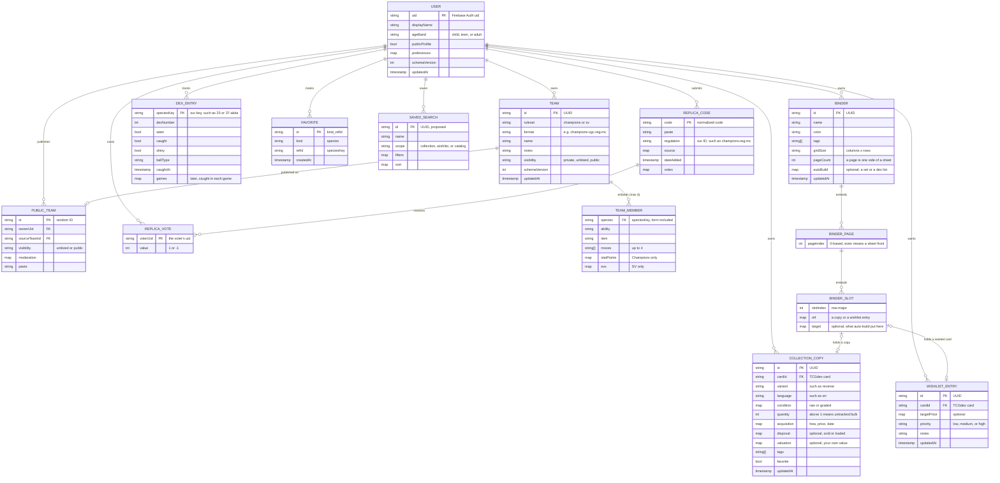
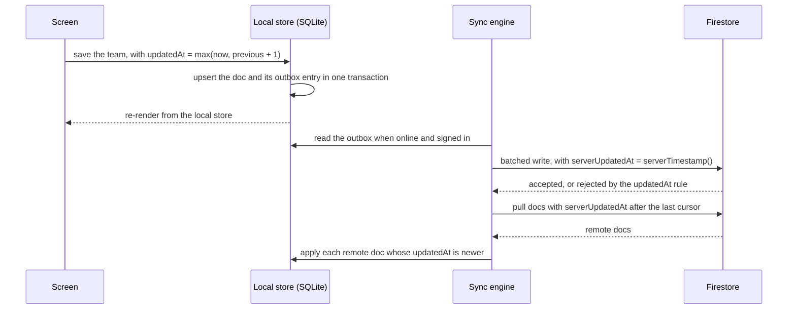
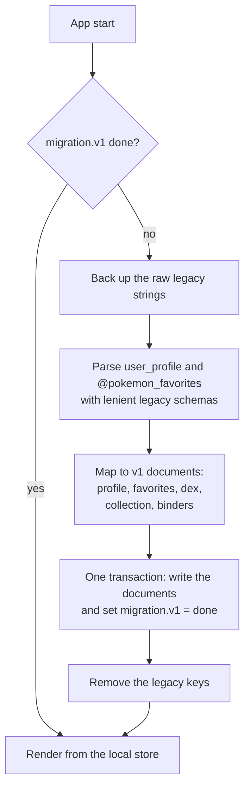

# Data model

- **As of:** 2026-09-28. §2 onward was updated on 2026-09-29 with the owner's decisions on species keys, binder pages and views, and new preferences; then with the decisions of 14:03 (the collection before binders, the wishlist, dex progress sources, and full collection search) and 14:41 (our own keys for other game entities, "Your valuation", the first-launch age question, and a separate crash-report switch).
- **Status:** §1 describes what `main` stores today. Everything from §2 on is the **proposed** target. None of it exists in code yet. It follows [ADR-0003](../decisions/ADR-0003-backend-and-auth.md) (backend and auth), [ADR-0007](../decisions/ADR-0007-state-and-data-fetching.md) (state and storage), and [ADR-0008](../decisions/ADR-0008-battle-engine.md) (battle engine).
- **Related:** [architecture overview](overview.md) · [test strategy](../testing/test-strategy.md) · [battle-ecosystem research](../research/2026-09-28-battle-ecosystem.md) · [open questions](../../specs/open-questions.md)

Line references point at `main` as of 2026-09-28. `BinderPlanner.tsx` and `SavedBinders.tsx` haven't been pushed yet, so how they use `SavedBinder` is inferred from their tests; items that depend on them are marked "(verify)".

## Contents

1. [Current storage inventory](#1-current-storage-inventory)
2. [Target model](#2-target-model)
3. [Local-first store and sync](#3-local-first-store-and-sync)
4. [Migration from today's keys](#4-migration-from-todays-keys)
5. [Validation rules](#5-validation-rules)
6. [Security-rules principles](#6-security-rules-principles)
7. [Open questions](#7-open-questions)

---

## 1. Current storage inventory

### 1.1 AsyncStorage keys

Everything persists through `@react-native-async-storage/async-storage` 1.18.2 as JSON strings. On web, that's plaintext `localStorage`.

| Key | Written | Read | Removed | Value |
|---|---|---|---|---|
| `user_profile` | `UserContext.tsx:154` (`saveUserData`) | `:141` (`loadUserData`) | `:188` (`logout`) | `UserProfile` ([§1.2](#12-current-typescript-models)) |
| `@pokemon_favorites` | `PokedexView.tsx:546` | `:532` | never | `number[]` of national dex numbers. The key constant is at `:92`; in memory it's a `Set<number>` (`:498`). |
| `@image_cache_metadata` | `imageCache.ts:94` | `:71` | `:244` | `{ entries: { [url]: CacheEntry }, totalSize: number }`. `size` is never set, so `totalSize` is always 0. |
| `@image_cache_<url>` | never | never | `imageCache.ts:182` | A phantom key: only `removeItem` is ever called on it. |

**Not persisted at all:** the deck (`DeckBuilder`), the team (`TeamBuilder`), the sprite style (`PokedexView.tsx:514`, reset on every launch), and every filter and toggle. `UserProfile.preferences` is written but never read, so `enableHaptics` does nothing.

### 1.2 Current TypeScript models

`UserProfile`, `CaughtPokemon`, and `SavedBinder` are in `src/contexts/UserContext.tsx`, quoted as written. `login()` sets `id` to `Date.now().toString()` (`:163`), and the preference defaults are `'best'`, `false`, `true`, and `false` (`:168-174`).

```ts
// UserContext.tsx:86-102
export interface UserProfile {
  id: string;
  email?: string;
  displayName?: string;
  authProvider: 'apple' | 'google' | 'facebook' | 'email' | 'guest';
  avatar?: string;
  preferences: {
    defaultSpriteVersion: string;
    showShinyByDefault: boolean;
    enableHaptics: boolean;
    enablePriceTracking: boolean;
  };
  caughtPokemon: CaughtPokemon[];
  savedBinders: SavedBinder[];
  favorites: string[]; // Pokemon IDs
  createdAt: string;
}

// UserContext.tsx:23-30
export interface CaughtPokemon {
  pokemonId: string;
  pokemonName: string;
  ballType: string;
  dateSpotted?: string;
  dateCaught?: string;
  isShiny?: boolean;
}

// UserContext.tsx:32-48
export interface SavedBinder {
  id: string;
  name: string;
  color: string;
  tags: string[];
  gridSize: '2x2' | '3x3' | '4x3' | '4x4' | '5x5';
  cards: Array<{
    position: number;
    cardId: string;
    cardName: string;
    rarity: string;
    purchasePrice?: number;
    dateAdded: string;
  }>;
  createdAt: string;
  updatedAt: string;
}
```

Supporting constants in the same file: `POKEBALL_TYPES` (8 balls, `:12-21`), `BINDER_COLORS` (10 colors, `:50-61`), and `SUGGESTED_TAGS` (20 tags, `:63-84`).

Two in-memory models are never persisted. `TCGCard` is defined in `src/api/tcgApi.ts:11-76`, and the `evs` and `ivs` objects below are condensed onto one line each:

```ts
// src/components/tcg/DeckBuilder.tsx:15-17
interface DeckCard extends TCGCard {
  count: number;
}

// src/components/teambuilder/TeamBuilder.tsx:12-36
interface PokemonTeamMember {
  pokemonId: number;
  pokemonName: string;
  nickname?: string;
  ability: string;
  nature: string;
  item?: string;
  moves: string[];
  evs: { hp: number; attack: number; defense: number; specialAttack: number; specialDefense: number; speed: number };
  ivs: { hp: number; attack: number; defense: number; specialAttack: number; specialDefense: number; speed: number };
}
```

`PokemonTeamMember` has no EV or IV limits, no level, gender, shiny, or Tera type, and no notion of a ruleset. The target replaces it outright; there's no stored team data to migrate.

### 1.3 Known problems

| # | Problem | Evidence | Fixed by |
|---|---|---|---|
| 1 | **Two favorites stores.** The Pokédex UI uses `@pokemon_favorites` (`number[]`). `UserProfile.favorites` (`string[]`, commented "Pokemon IDs") is exposed by `UserContext` but no screen uses it, and its tests pass names such as `'pikachu'` (`UserContext.test.tsx:44`). The two never sync. | `PokedexView.tsx:92,530-562`; `UserContext.tsx:100,257-270` | One `favorites` collection ([§2.4](#favorites)) |
| 2 | **No user scoping.** There's one global `user_profile`, and its `id` is a timestamp. Signing in as anyone overwrites it, and `@pokemon_favorites` isn't tied to a user at all. | `UserContext.tsx:141,161-184` | Documents owned by a Firebase `uid`, or by `local` before sign-in ([§3.2](#32-local-schema-sketch)) |
| 3 | **No schema version and no validation.** Stored JSON is `JSON.parse`d and trusted (`:143`), so any shape change breaks old installs silently. | `UserContext.tsx:141-146` | `schemaVersion` on every document; zod on every read ([§5](#5-validation-rules)) |
| 4 | **Binder positions have no page field.** Cards carry a single `position: number`, but the planner pages through up to 100 pages ("Page 1 of 100", `BinderPlanner.test.tsx:108`). So `position` has to encode page × slot, and changing `gridSize` silently moves every card. | `UserContext.tsx:37-45` | Explicit `pageIndex` and `slotIndex`, plus an explicit reflow when the grid changes ([§2.4](#binders)) |
| 5 | **Login overwrites and logout deletes.** Every login builds a fresh profile with empty arrays (the cold-start wipe), and sign-out removes the profile. | `UserContext.tsx:161-194`; `App.tsx:121,130-134` | Load-or-create on login, keep data on sign-out (upgrade step U4, [review §9](../reviews/2026-09-28-tech-stack-review.md#9-recommended-sequence)); later, a local-first store with no login gate |
| 6 | **Preferences merge bug.** `...userData` is spread last (`:179`), so a partial `preferences` object replaces the merged defaults (`:168-174`). | `UserContext.tsx:168-179` | Schema defaults applied by zod |
| 7 | **Loose identifiers.** `CaughtPokemon.pokemonId` is a string whose meaning (number or name) isn't defined; `ballType` is free text rather than a `POKEBALL_TYPES` id; `SavedBinder.color` is typed `string` although the tests store a `BINDER_COLORS` id (`'red'`, `UserContext.test.tsx:181`). | `UserContext.tsx:23-37` | Typed IDs ([§2.2](#22-identifiers)) |
| 8 | **Simulated identity is stored as if real.** Social logins store `user@<provider>.com` and a generated avatar URL. | `HomeScreen.tsx:28-41` | Dropped in migration ([§4](#4-migration-from-todays-keys)) |
| 9 | **Money as a bare number.** `purchasePrice` has no currency. | `UserContext.tsx:43` | `{ amount, currency }` in minor units |
| 10 | **Binders are the only record of ownership.** A card exists only as a binder slot, so an unplaced card, a duplicate, or a card's condition can't be recorded. | `UserContext.tsx:37-45` | A collection of copies, with binders referencing them ([§2.4](#collection)) |

---

## 2. Target model

### 2.1 Principles

- **One document per aggregate:** a profile, a team, a collection copy, a wishlist entry, a binder, a dex entry, a favorite. Sync resolves conflicts per document, so the document is the unit of "last write wins" ([§3.4](#34-conflict-notes)).
- **Every document carries** `schemaVersion`, `createdAt`, `updatedAt`, and an optional `deletedAt` tombstone. Synced documents also carry `serverUpdatedAt`, set by the server.
- **IDs are generated on the client** (random UUIDs from `expo-crypto`), so creating things offline needs no server round-trip. Firestore's best practices also discourage monotonically increasing IDs.
- **Game data is referenced by stable IDs** from the data bundle, never by display name. Pokémon and their forms use our own species key ([§2.2](#22-identifiers)).
- **Collect as little as possible.** Firestore stores no email (Firebase Auth holds it), no birth date (only an age band), and no location. Public surfaces show a display name only when the owner has opted in and isn't a child.

### 2.2 Identifiers

| ID | Format | Example | Source |
|---|---|---|---|
| `uid` | Firebase Auth user ID, or `local` before sign-in | n/a | Firebase Auth |
| `speciesKey` | **Our own key for a Pokémon or form** (decided 2026-09-29): the National Dex number, then a hyphen and a form slug for any form other than the default. Lowercase letters, digits, and hyphens. | `6`, `6-mega-x`, `37-alola`, `445-mega-z` | The data pipeline. It's the primary key everywhere. |
| `dexNumber` | National Pokédex number, 1–1025: the part of a `speciesKey` before the first hyphen | `445` | Data bundle |
| `moveId`, `abilityId`, `itemId`, `natureId`, `typeId` | **Our own kebab-case slugs** (decided 2026-09-29), in PokeAPI's naming style. Natures double as Champions' Stat Alignments. | `earthquake`, `rough-skin`, `choice-scarf`, `jolly`, `dragon` | The data pipeline. The crosswalk maps each slug to its Showdown ID, such as `roughskin` or `choicescarf`. |
| `format` | Our own format ID (decided 2026-09-29); the crosswalk maps each to its Showdown format where one exists | `champions-vgc-reg-mc`, `sv-ou` (the SV spelling is proposed; Showdown's is `gen9ou`) | Data bundle |
| `regulationId` | Our own ID for a Champions regulation (decided 2026-09-29), shown by its official name, such as "M-C" | `champions-reg-mc` (the spelling is proposed) | The curated regulation files |
| `cardId` | TCGdex card ID, the primary key for cards (decided 2026-09-29; [ADR-0009](../decisions/ADR-0009-tcg-data-source.md)) | `swsh3-136` (verify the format) | Data bundle. A card crosswalk maps each card to its legacy pokemontcg.io ID and its marketplace product IDs, from TCGdex's `thirdParty` field. Until a legacy card is mapped, its copy keeps the old ID in `legacyCardId` ([§4](#4-migration-from-todays-keys)). |
| `setId` | TCGdex set ID | `swsh3` (verify) | Data bundle |
| `variant` | **Our key for one printing of a card** (proposed): the finish (`normal`, `holo`, `reverse`, `metal`, or `lenticular`, as TCGdex names them), then any foil pattern, stamp, or edition, in lowercase words joined by hyphens | `normal`, `reverse`, `reverse-pokeball`, `holo-1st-edition` | The data pipeline builds each card's list from TCGdex's variant data (verify how fully its detailed variants cover older sets) |
| `copyId`, `wishId` | Client-generated UUIDs | n/a | The app ([collection](#collection), [wishlist](#wishlist)) |
| `dexListId` | Our ID for a dex list | `national`, `kanto` … `paldea`, `regional-forms`, `mega` | The data pipeline ([dex lists](#dex-lists)) |

#### Species keys

Decided 2026-09-29 ([OQ-13](../../specs/open-questions.md#oq-13-canonical-species-key)). Every document, ID, and route that names a Pokémon uses our key.

- **The shape:** the National Dex number for the default form, plus a form slug for every other form.

  | Key | Pokémon or form |
  |---|---|
  | `6`, `6-mega-x`, `6-mega-y`, `6-gmax` | Charizard, its two Mega Evolutions, and its Gigantamax form |
  | `150-mega-x`, `150-mega-y` | Mewtwo's two Mega Evolutions |
  | `445-mega`, `445-mega-z` | Mega Garchomp, and Champions' Mega Garchomp Z |
  | `359-mega`, `359-mega-z` | Absol's Mega and Mega Z forms |
  | `448-mega`, `448-mega-z` | Lucario's Mega and Mega Z forms |
  | `37-alola` | Alolan Vulpix |
  | `128-paldea-combat` | Paldean Tauros, Combat Breed |
  | `479-wash` | Wash Rotom |
  | `892-rapid-strike` | Urshifu, Rapid Strike Style |

- **Why our own key:** The Pokémon Company publishes only the National Dex number. The games themselves identify a Pokémon by dex number plus a form index, but those indexes aren't published, so our key mirrors that model with readable form names. No third party can break it, it's easy to read, and it works in URLs.
- **Form slugs** come from PokeAPI's form names where possible, minus the species name: `charizard-mega-x` gives `mega-x`. PokeAPI already models the Champions forms. A manual override table in the pipeline covers names that differ between sources or read badly; for example, PokeAPI's `tauros-paldea-combat-breed` becomes `128-paldea-combat` (verify each name against PokeAPI). Once published, a key never changes meaning.
- **Battle-relevant or cosmetic:** each form in the bundle carries a `cosmetic` flag. Vivillon's patterns are cosmetic; Megas, regional forms, and Rotom's appliance forms aren't. Dex progress can track cosmetic forms later.
- **The crosswalk is for reference only.** The pipeline generates a table that maps each key to PokeAPI names and IDs, Showdown IDs, TCGdex references, and display names. No document stores those IDs as keys: when a source renames something, we fix the crosswalk, never user data. A sketch of a few rows:

  | Key | Display name | PokeAPI name | Showdown ID | Cosmetic |
  |---|---|---|---|---|
  | `6-mega-x` | Mega Charizard X | `charizard-mega-x` | `charizardmegax` | No |
  | `445-mega-z` | Mega Garchomp Z | `garchomp-mega-z` | `garchompmegaz` (verify) | No |
  | `37-alola` | Alolan Vulpix | `vulpix-alola` | `vulpixalola` | No |
  | `666-polar` | Vivillon, Polar Pattern | `vivillon-polar` | `vivillonpolar` | Yes |

  The real table also carries PokeAPI's numeric IDs and the TCGdex references (verify every value when the pipeline generates it).
- **The battle engine converts at its boundary.** `packages/battle` turns species keys and our slugs into Showdown IDs only where it calls `@smogon/calc` and `@pkmn`, and turns Showdown names back into keys and slugs when it imports a paste.
- **Routes use the key too:** `/dex/6` opens Charizard with a form selector, and `/dex/6-mega-x` opens that form directly ([architecture overview §2.5](overview.md#25-client-architecture-and-route-map)).
- **Dex entries still copy the dex number** for sorting, because keys sort as text (`10` before `2`).
- **The same idea covers the other game entities** (decided 2026-09-29, 14:41). Moves, abilities, items, natures, and types get our own kebab-case slugs, and formats and regulations get our own IDs ([the table above](#22-identifiers)). The crosswalk maps them to Showdown IDs the same way. Cards are the exception: TCGdex IDs stay primary, with their own crosswalk to legacy pokemontcg.io IDs and marketplace product IDs.

### 2.3 Entity-relationship diagram

Firestore paths: `users/{uid}` with subcollections `teams`, `collection`, `wishlist`, `binders`, `dex`, `favorites`, and `savedSearches` (proposed); top-level `publicTeams` and `replicaCodes`. Team members, binder pages, and binder slots are **embedded** in their parent document, not separate documents. Binder slots **reference** collection copies and wishlist entries by ID; they never hold a copy of them (decided 2026-09-29).



### 2.4 Field tables

Common fields (`schemaVersion`, `createdAt`, `updatedAt`, `serverUpdatedAt`, `deletedAt`) are listed once in [§2.1](#21-principles) and omitted below unless a rule differs. Every length limit we set ourselves (names, notes, tags) is a starting point.

#### users

`users/{uid}`: one document per account.

| Field | Type | Rules | Notes |
|---|---|---|---|
| *(document ID)* | string | = Firebase Auth `uid` | |
| `displayName` | string | 1–30 characters, trimmed | Default "Trainer". Shown publicly only when `publicProfile` is true. |
| `avatar` | `{ kind: 'preset', presetId }` or `null` | Preset avatars only in v1 | No uploads means no image moderation and no photos of children. |
| `ageBand` | `'child' \| 'teen' \| 'adult'` | Required; written once at sign-up; the client can't change it | Taken from the install's first-launch answer, so sign-up never asks again (decided 2026-09-29, [§6](#6-security-rules-principles)). `child` means under 13, and child accounts are off by default. Store the band, never a birth date. If an install's band and the account's ever differ, the younger one applies on that device (proposed). |
| `publicProfile` | boolean | Always `false` when `ageBand` is `child` | Off by default for everyone |
| `preferences` | map | See below | |
| `migratedFrom` | map, optional | `{ legacyCreatedAt, migratedAt }` | Audit trail for the [§4](#4-migration-from-todays-keys) migration |

`preferences`:

| Field | Type | Default | Today |
|---|---|---|---|
| `defaultSpriteVersion` | string | `'best'` | Exists, never read |
| `showShinyByDefault` | boolean | `false` | Exists, never read |
| `enableHaptics` | boolean | `true` | Exists, never read (haptics always fire) |
| `enablePriceTracking` | boolean | `false` | Exists, never read. Market prices are link-outs only for now, and collection value comes from the user's own prices ([PRD TCG-12](../../specs/PRD.md#53-tcg)), so this may be dropped. |
| `spriteStyle` | `'party' \| 'animated' \| 'home' \| 'gen9'` | `'home'` | Component state only (`PokedexView.tsx:514`), reset on every launch |
| `tabOrder` | `('dex' \| 'tcg' \| 'battle')[]` | `['dex', 'tcg', 'battle']` | New (decided 2026-09-29): the order of the content tabs, set in Settings → Preferences. The first is the launch screen. Profile is always last, so it isn't listed. Each tab appears exactly once; on read, unknown IDs are dropped and missing ones are appended in the default order, so adding a tab never breaks a saved order. "Restore default" writes the default. |
| `battleSection` | `'champions' \| 'showdown'` | `'champions'` | New (decided 2026-09-29): the Battle section used last, so Battle reopens there. Deep links override it. |
| `binderView` | `'page' \| 'binder' \| 'continuous'` | `'page'` (decided 2026-09-29) | New (decided 2026-09-29): single page, binder view, or continuous grid ([binders](#binders)) |
| `motion` | `'system' \| 'reduced'` | `'system'` | New; lets people calm the holo and gyroscope effects even when the OS setting is off |
| `marketplace` | `'auto' \| 'tcgplayer' \| 'cardmarket'` | `'auto'` | New (decided 2026-09-29): which marketplace gets a card's primary "View on …" button. `auto` follows the device's region setting, with no location permission: TCGplayer in the US and Canada, Cardmarket in the UK and EU, and both elsewhere ([PRD TCG-6](../../specs/PRD.md#53-tcg)). |
| `currency` | ISO 4217 code | From the device's region, such as `USD` or `EUR` (proposed) | New (proposed, 2026-09-29): the default currency for new prices in the collection and wishlist. Every price keeps its own currency ([collection](#collection)). |
| `analytics` | `'on' \| 'off'` | `'on'` | New: the product-analytics opt-out in Settings ([tracking plan](../analytics/tracking-plan.md)). When two copies disagree, `'off'` wins (decided 2026-09-29), so signing in never turns tracking back on. |
| `crashReports` | `'on' \| 'off'` | `'on'` | New (decided 2026-09-29): the "Send crash reports" switch, separate from `analytics`. Crash reports are anonymous. When two copies disagree, `'off'` wins here too (proposed). |

#### teams

`users/{uid}/teams/{teamId}`: one document per team, with members embedded.

| Field | Type | Rules | Notes |
|---|---|---|---|
| *(document ID)* | string | Client-generated UUID | |
| `name` | string | 1–60 characters | |
| `ruleset` | `'champions' \| 'sv'` | Required | Decides the member shape below |
| `format` | string | A format ID from the data bundle whose ruleset matches | Our own ID, such as `champions-vgc-reg-mc` or `sv-ou` ([§2.2](#22-identifiers)) |
| `members` | `TeamMember[]` | 0–6 entries | An empty team is a valid draft; legality is a separate check ([§5.2](#52-shape-versus-legality)) |
| `notes` | string | Up to 2,000 characters | |
| `visibility` | `'private' \| 'unlisted' \| 'public'` | Default `private`; child accounts: `private` only | `unlisted` means anyone with the link |
| `publicTeamId` | string or `null` | Written by the publish Function | Links to [publicTeams](#publicteams) |
| `dataBuildId` | string | | The data-bundle build the team was last validated against, so a data update can trigger re-validation |

#### team members

Embedded in `teams.members`. The team's `ruleset` decides which fields apply. Abilities, items, moves, natures, and types are our own kebab-case slugs, such as `rough-skin` or `choice-scarf` ([§2.2](#22-identifiers)); the battle engine converts them to Showdown IDs at its boundary.

**Common fields**

| Field | Type | Rules |
|---|---|---|
| `species` | `speciesKey` | Must exist in the data bundle. The key names the form too, such as `37-alola`, so there's no separate form field (decided 2026-09-29). |
| `nickname` | string or `null` | Up to 12 characters (verify the in-game limit); no control characters |
| `ability` | `abilityId` | Legal for the species and form in the format |
| `item` | `itemId` or `null` | In the format's item pool; Champions pools are limited |
| `moves` | `moveId[]` | Up to 4, unique, each in the learnset for the format |
| `gender` | `'M' \| 'F'` or `null` | `null` for genderless or unspecified; must fit the species' gender ratio |
| `shiny` | boolean | Default `false` |

**Champions fields** (`ruleset: 'champions'`)

| Field | Type | Rules |
|---|---|---|
| `statPoints` | `{ hp, atk, def, spa, spd, spe }` | Each an integer 0–32; total at most 66 |
| `statAlignment` | `natureId` | One of the 25 natures, which Champions calls Stat Alignment |
| `megaForm` | `speciesKey` or `null` | The Mega form reached in battle, such as `6-mega-x` or `445-mega-z`. It has the same dex number as `species`, needs the matching Mega Stone as `item`, and must be legal in the regulation. |
| level | not stored | Fixed at 50 |
| IVs | not stored | Fixed at 31 |

**Scarlet/Violet fields** (`ruleset: 'sv'`)

| Field | Type | Rules |
|---|---|---|
| `evs` | `{ hp, atk, def, spa, spd, spe }` | Each an integer 0–252; total at most 510 |
| `ivs` | `{ hp, atk, def, spa, spd, spe }` | Each an integer 0–31; default 31 |
| `nature` | `natureId` | One of the 25 natures |
| `teraType` | `typeId` | One of the 18 types, or Stellar |
| `level` | integer | 1–100. The default comes from the format: 50 for VGC, 100 for Smogon singles. |

**Converting between rulesets**
- **Champions stat formulas** ([Showdown's champions mod](https://github.com/smogon/pokemon-showdown/tree/master/data/mods/champions)): HP = base + SP + 75; every other stat = (base + SP + 20) × the alignment modifier, rounded down (verify the rounding).
- **To SV EVs:** EV = 8·SP − 4, and 0 stays 0. At level 50 with IVs of 31, the Scarlet/Violet formula then gives the same stats (derived).
- **The reverse:** SP = ⌊(EV + 4) / 8⌋ (derived).
  - It loses the raw numbers (4 and 11 EVs both become 1 SP) but keeps every level-50 stat.
  - Any legal SV spread lands within 66 SP.
  - IVs below 31, common on Trick Room sets, have no Champions equivalent.
  - The [property tests](../testing/test-strategy.md#41-unit-tests-domain-logic-first) check both conversions against both formulas.
- **A legal 66-SP spread can exceed 510 EVs.** For example, 32/32/2 SP becomes 252/252/12 = 516 EVs. The SV export has to trim the spread and tell the user.
- **Showdown's Champions formats store Stat Points on the paste's `EVs:` line** (0–32 each). So exports to those formats keep the raw SP numbers there, and exports to SV formats convert.

#### collection

`users/{uid}/collection/{copyId}`: one document per copy of a card. The collection is the source of truth for ownership (decided 2026-09-29): a copy doesn't have to sit in a binder, and binders only reference copies ([binders](#binders)). The field shape is proposed.

| Field | Type | Rules | Notes |
|---|---|---|---|
| *(document ID)* | string | Client-generated UUID | |
| `cardId` | `cardId` or `null` | Exists in the card bundle; `null` only while a migrated card still needs matching | The TCGdex card |
| `legacyCardId` | string or `null` | Set only by the migration | A pokemontcg.io ID waiting to be matched to TCGdex (PRD TCG-5). The copy is flagged "needs matching", never dropped ([§4](#4-migration-from-todays-keys)). |
| `cardName` | string | Up to 100 characters | Copied from the bundle, or from a legacy binder for an unmatched card, so the copy can always be shown |
| `variant` | `variant` key or `null` | One of the card's variants in the bundle; `null` only while the card needs matching | The finish and printing: normal, holo, reverse holo, 1st edition, and so on ([§2.2](#22-identifiers)) |
| `language` | string | A language TCGdex publishes the card in, such as `en`, `fr`, or `pt-br` (verify per card); default `en` | The printed language. Japanese and other Asian-language cards are separate catalog entries, and come later. |
| `condition` | `Condition` or `null` | See below; `null` means not recorded | |
| `quantity` | integer | 1–999; default 1 | The optional bulk shortcut (proposed): above 1, the document stands for that many identical, untracked copies. Placing one in a binder, or giving one its own details, splits it off as its own copy. A graded copy is always 1. |
| `acquisition` | `{ method, price, date }` or `null` | `method`: `'bought' \| 'traded' \| 'pulled' \| 'gift'`. `price`: `Money` or `null`. `date`: an ISO date (`YYYY-MM-DD`) or `null`, never in the future. | All optional. The price feeds Your valuation when the copy has no `valuation`, and the whole record feeds the buy/sell/trade log. |
| `disposal` | `{ method, price, date }` or `null` | `method`: `'sold' \| 'traded'`; `price` and `date` as above; not dated before the acquisition | Optional. A disposed copy stays for the log and spending stats, but it stops counting as owned: it leaves set completion, dex progress, and its binder slot, which turns into a ghost ([below](#slots-ghosts-and-auto-build)). |
| `valuation` | `{ price, date }` or `null` | `price`: `Money`; `date`: an ISO date or `null` | Optional. The user's own value for the copy, which feeds "Your valuation" (decided 2026-09-29) |
| `notes` | string | Up to 2,000 characters | |
| `tags` | string[] | Up to 20, each 1–30 characters | For organizing; searchable |
| `favorite` | boolean | Default `false` | Card favorites live here (proposed), not in [favorites](#favorites) |

- **`Condition`** is one of:
  - **Raw:** `{ kind: 'raw', grade }`, where `grade` is `'nm' | 'lp' | 'mp' | 'hp' | 'dmg'`: near mint, lightly played, moderately played, heavily played, or damaged.
  - **Graded:** `{ kind: 'graded', company, grade, label, certNumber }`. `company` is `'psa' | 'bgs' | 'cgc' | 'sgc' | 'tag' | 'ace' | 'other'` (verify the list). `grade` runs from 1 to 10 in half steps. `label` is an optional qualifier, such as "Pristine" or "Black Label", and `certNumber` is optional, up to 20 letters, digits, and hyphens. Check each company's scale (verify).
- **`Money`** is `{ amount, currency }`: `amount` is an integer in minor units (cents), and `currency` is an ISO 4217 code. How totals combine currencies is still being planned ([OQ-14](../../specs/open-questions.md#oq-14-card-price-sources-and-logos)).
- **Duplicates and extras are computed, not stored.** Copies of the same card are duplicates. Copies beyond one per card and variant are "extras for trade", chosen so that copies in a binder, favorites, and graded copies are kept first (proposed).
- **The buy/sell/trade log** is every acquisition and disposal, sorted by date. It's optional: a copy with no acquisition details is fine.
- **Where a copy sits isn't stored on the copy.** Binders hold the references, and a local index answers "which binder is this in?" ([§3.5](#35-search-and-derived-indexes)), so the two can't disagree.
- **Your valuation** (decided 2026-09-29) uses only the user's own numbers: a copy counts at its `valuation` if one is set, and otherwise at its acquisition price (that order is proposed). Wishlist target prices add the "projected" part ([PRD TCG-12](../../specs/PRD.md#53-tcg)).
- **Licensed market prices, later,** aren't stored on copies. Each approved source's prices are kept apart, per source, with their source, fetch time, and license basis, and they're never blended into Your valuation or with each other. eBay listings are never summed or averaged ([OQ-14](../../specs/open-questions.md#oq-14-card-price-sources-and-logos)).
- **Spending stats (v1.1)** come from the acquisition, disposal, and valuation fields.

#### wishlist

`users/{uid}/wishlist/{wishId}`: one document per wanted card (decided 2026-09-29).

| Field | Type | Rules | Notes |
|---|---|---|---|
| *(document ID)* | string | Client-generated UUID | |
| `cardId` | `cardId` | Exists in the card bundle | |
| `variant` | `variant` key or `null` | One of the card's variants; `null` means any printing | Proposed, for master sets: wanting the reverse holo, for example |
| `targetPrice` | `Money` or `null` | As in [collection](#collection) | Optional. Feeds the projected part of Your valuation. |
| `priority` | `'low' \| 'medium' \| 'high'` | Default `'medium'` (proposed) | |
| `notes` | string | Up to 2,000 characters | |
| *(binder slot)* | derived | | Optional. A wanted card can sit in a binder slot, drawn as a ghost. Like a copy's place, the slot is held by the binder and looked up locally, not stored on the entry (proposed). |

- **When a wanted card is acquired,** the app offers to turn the entry into a copy. The copy takes over the entry's binder slot, and the entry is removed (proposed).

#### binders

`users/{uid}/binders/{binderId}`: one document per binder, with pages and slots embedded and stored sparsely. A binder is an arrangement: its slots reference collection copies and wishlist entries (decided 2026-09-29).

| Field | Type | Rules | Notes |
|---|---|---|---|
| *(document ID)* | string | Client-generated UUID; migrated binders keep their ID | |
| `name` | string | 1–60 characters | |
| `color` | string | A `BINDER_COLORS` id (`red`, `blue`, …) | |
| `tags` | string[] | Up to 20, each 1–30 characters | `SUGGESTED_TAGS` are suggestions, not a closed list |
| `gridSize` | `'2x2' \| '3x3' \| '3x4' \| '4x4'` | Columns × rows; the standard 4-, 9-, 12-, and 16-pocket pages (decided 2026-09-29) | Today's code also has `'4x3'` and `'5x5'`; the migration in [§4](#4-migration-from-todays-keys) maps them |
| `pageCount` | integer | 1–200; a new binder starts at 50, which is 25 sheets (decided 2026-09-29) | A page is one side of a sheet ([below](#pages-sheets-and-spreads)). Users add or remove single pages (decided 2026-09-29). Removing a page that holds cards asks whether to move those cards or remove them. The 200 cap is proposed, to keep the document well under Firestore's size limit. |
| `autoBuild` | `{ kind: 'set', setId, masterSet }`, `{ kind: 'dex', listId }`, or `null` | Proposed | How the binder was auto-built, if it was, so the app can offer new slots when a set or a dex list grows ([below](#slots-ghosts-and-auto-build)) |
| `pages` | `BinderPage[]` | Only pages that hold something; `pageIndex` unique | |

- **`BinderPage`:** `{ pageIndex, slots }`. `pageIndex` is an integer from 0 to `pageCount − 1`; the UI shows `pageIndex + 1`. `slots` holds only slots that aren't empty, with unique `slotIndex`.
- **`BinderSlot`:** `{ slotIndex, ref, target }`. `slotIndex` runs from 0 to columns × rows − 1, row-major from the top left. A slot holds a `ref`, a `target`, or both; an empty slot isn't stored.
  - **`ref`** is what's in the pocket (decided 2026-09-29): `{ kind: 'copy', copyId }` for an owned copy, or `{ kind: 'wish', wishId }` for a wanted card.
  - **`target`** is what belongs there (proposed): `{ kind: 'card', cardId, variant }` from a set auto-build, or `{ kind: 'species', speciesKey }` from a Living Dex auto-build. A slot with a target and no owned copy is drawn as a ghost.
- **Card details live on the copy, not the slot:** the name, variant, condition, and prices. Today's embedded `cards` become copies in the migration ([§4](#4-migration-from-todays-keys)).
- **Changing `gridSize` is an explicit reflow.** Cards keep their reading order (page, then slot) and are laid into the new grid, and `pageCount` grows if needed. Stored indices are never reinterpreted.
- **Size check:** the worst case is 200 pages × 16 slots (4×4) = 3,200 slots. With a reference and a target, a slot is roughly 150–200 bytes, so that's about 0.5–0.65 MB, under Firestore's 1 MiB document limit (an estimate). If binders outgrow it, pages move to a `binders/{id}/pages/{pageIndex}` subcollection.

##### Slots, ghosts, and auto-build

Decided 2026-09-29, except where marked proposed.

- **One pocket per copy** (proposed). A copy sits in at most one slot across all binders, because it's one physical card. The device enforces it: placing a copy that's already in a binder moves it, after asking, and a bulk copy splits off one card first. Sync can still produce a copy in two slots; [§3.4](#34-conflict-notes) resolves it.
- **Ghosts:** owned cards are drawn in full color, and missing ones faded. A slot is a ghost when it has a `target` but no owned copy, or when it holds a wishlist entry, which also gets a "wanted" marker.
- **When a copy leaves,** because it's sold, traded away, or deleted, its slot keeps a `target` for the same card and turns into a ghost, so nothing reshuffles (proposed).
- **Auto-build from a set:** the set's cards in number order, and for a master set, each card's variants side by side (proposed). Every slot gets a `target`, and the app fills it with an owned copy that isn't already in a binder; the rest stay ghosts. Adding a copy of a ghost's card later fills the first matching ghost, unless the user turns that off (proposed).
- **Living Dex auto-build:** one slot per entry of a [dex list](#dex-lists), in list order, each with a species `target`. The user picks which owned card fills each slot, from the cards that feature that species ([counting](#counting-cards-toward-dex-progress)); one tap accepts the app's suggestions (proposed). A list that needs more than 200 pages is split into volumes by region (proposed): a National Dex in 2×2 pockets needs 257 pages.
- **Drag and drop** moves a slot's contents to an empty slot, or swaps two slots, on one page, across pages, or between binders. It changes only `pageIndex` and `slotIndex`, and a move between binders writes both documents.
- **Saved searches could drive auto-build too:** the matching cards, in the search's sort order (proposed, [saved searches](#saved-searches)).

##### Pages, sheets, and spreads

Decided 2026-09-29. A binder works like a physical one.

- **A page is one side of a sheet,** and every sheet has two sides. Page 1 is the front of sheet 1, page 2 is its back, page 3 is the front of sheet 2, and so on. Sheets aren't stored: a page's 0-based sheet index is ⌊`pageIndex` / 2⌋, and even page indices are fronts.
- **50 pages by default,** which is 25 sheets. Users add or remove single pages. With an odd count, the last sheet's back is blank: it holds no cards and isn't numbered.
- **Adding or removing a page in the middle** shifts every later page by one index. Those pages change sides and pair into different spreads, but their slots stay the same. It's one write, like a grid reflow.
- **Spreads** pair facing pages the way a binder opens. For a 50-page binder:

  | Spread | Left | Right |
  |---|---|---|
  | 1 | Inside front cover (blank) | Page 1, the front of sheet 1 |
  | 2 | Page 2, the back of sheet 1 | Page 3, the front of sheet 2 |
  | … | … | … |
  | 25 | Page 48, the back of sheet 24 | Page 49, the front of sheet 25 |
  | 26 | Page 50, the back of sheet 25 | Inside back cover |

  In general, page *p* (that's `pageIndex` + 1) sits on spread ⌊*p* / 2⌋ + 1: on the right when *p* is odd, and on the left when it's even. When the count is even, the last spread ends with the inside back cover.

##### Views

Decided 2026-09-29. The three views show the same pages, so switching views never moves a card: `pageIndex` and `slotIndex` mean the same thing in every view.

| View | `binderView` | What it shows |
|---|---|---|
| Single page | `page` | One page at a time |
| Binder view | `binder` | The spreads above, turning like a physical binder. On foldables and iPhone Duo's inner display, the fold is the spine ([device layouts §6](device-layouts.md#6-screen-by-screen-playbook)). |
| Continuous grid | `continuous` | Every page's slots in one scrolling grid, with no page breaks. It keeps the grid's columns (3 for 3×3), and the rows flow on: page 2's first row follows page 1's last. |

- **Which view opens:** the user's `binderView` preference ([users](#users)).
- **Each binder can also remember the view it was last opened in.** That last view stays on the device (MMKV, keyed by binder ID), not in the binder document, so switching views never rewrites a synced binder or creates a conflict copy ([§3.4](#34-conflict-notes)) (decided 2026-09-29).

#### dex progress

`users/{uid}/dex/{speciesKey}`: the marks the user sets by hand. A document exists only once a species has some progress; no document means unseen. Ownership from the TCG collection isn't stored here: it's derived ([below](#counting-cards-toward-dex-progress)).

| Field | Type | Rules |
|---|---|---|
| *(document ID)* | `speciesKey` | Any key in a [dex list](#dex-lists): default forms such as `25`, and the regional forms and Megas that have their own progress, such as `37-alola` or `6-mega-x` |
| `dexNumber` | integer | 1–1025; copied for sorting, because keys sort as text |
| `seen` | boolean | |
| `caught` | boolean | `caught` implies `seen`. The manual "caught" mark (PRD DEX-5). |
| `shiny` | boolean | A shiny was caught |
| `ballType` | `POKEBALL_TYPES` id or `null` | Only when caught |
| `firstSeenAt` | timestamp, optional | |
| `caughtAt` | timestamp, optional | Only when caught |
| `games` | map, optional (later) | "Caught in <game>" marks, `{ [gameId]: { caught, shiny } }`, keyed by a game ID from the bundle |

**Progress has several sources** (decided 2026-09-29). The progress views combine them per species key, and the user picks which sources count (proposed: all of them by default).

| Source | Comes from | Ships |
|---|---|---|
| Owned (TCG) | Derived from the [collection](#collection): an owned copy of any card that features the Pokémon | P3, with the collection and the progress views |
| Caught | The manual marks above | The marks in P1; they count in the progress views from P3 |
| Caught in a game | `games` | Later |
| Pokémon HOME | Manual marks too, since HOME has no public API (verify) | Possibly later |

- **Owned (TCG) is never stored,** here or anywhere else that syncs. The device recomputes it from the collection and the card bundle, so it can't drift, and a collection edit never rewrites dex documents ([§3.5](#35-search-and-derived-indexes)) (proposed).
- **Forms:** the National and regional views count a species once any of its forms counts, so an Alolan Vulpix counts toward #37 (proposed). The Regional Forms and Mega views count each form's own key. Keys already name every form, so this needs no new IDs. Cosmetic forms, such as Vivillon's patterns, can come later.

##### Dex lists

The pipeline publishes the lists that the progress views and the Living Dex auto-build share, as `dex-lists.json` (a sketch; [ADR-0004](../decisions/ADR-0004-static-game-data-pipeline.md)). Each list is `{ id, kind, name, entries }`, and each entry is `{ speciesKey, number }`, in the list's order.

| List | `id` | Entries |
|---|---|---|
| National Dex | `national` | All 1,025 species, as default forms |
| Regional dexes | `kanto`, `johto`, `hoenn`, `sinnoh`, `unova`, `kalos`, `alola`, `galar`, `paldea` | The species each generation introduced: Kanto #1–151, Johto #152–251, Hoenn #252–386, Sinnoh #387–493, Unova #494–649, Kalos #650–721, Alola #722–809, Galar #810–905, and Paldea #906–1025 (proposed). The pipeline settles edge cases, such as Meltan and Melmetal, and the Hisuian species in Galar's range. |
| Regional Forms | `regional-forms` | Every Alolan, Galarian, Hisuian, and Paldean form, such as `37-alola` and `128-paldea-combat` |
| Mega | `mega` | Every Mega Evolution, including both X and Y forms and Champions' Mega Z forms, such as `6-mega-x` and `445-mega-z` |
| Later | Game-prefixed IDs, such as `sv-paldea` | The games' own regional dexes. A shiny dex is proposed for later too. |

##### Counting cards toward dex progress

Decided 2026-09-29, except where marked proposed.

- **A card counts for every Pokémon it features.** Tag-team cards count for each Pokémon named on them: Pikachu & Zekrom-GX counts for #25 and #644.
- **Cameos don't count.** Pokémon in the background of the illustration, or anywhere else that isn't the card's own Pokémon, don't count.
- **The source is TCGdex's `dexId`,** the card's main Pokémon. TCGdex's schema keeps artwork-only Pokémon apart, in `cameoDexIds`, so `dexId` should exclude cameos (verify across sets, including older cards and tag teams).
- **The pipeline maps each card to species keys,** forms included. `dexId` gives the dex number, and the crosswalk's form rules and override table give the form, so an Alolan Vulpix card maps to `37-alola`, and a Mega card to its Mega's key (verify each rule against the card names). A card that can't be mapped is listed in the pipeline's report, never guessed.
- **Only Pokémon cards count** (proposed). Trainer and Energy cards don't feature a Pokémon, even when one appears in the art.
- **Only copies the user still owns count.** A sold or traded-away copy doesn't count, and a copy that isn't in any binder does.

#### favorites

`users/{uid}/favorites/{favoriteId}`.

| Field | Type | Rules |
|---|---|---|
| *(document ID)* | `<kind>_<refId>` | For example `species_25`. Deterministic, so favoriting twice is a no-op. |
| `kind` | `'species'` | Card favorites moved to the copy's `favorite` flag (proposed, 2026-09-29), so each thing has one favorites store ([collection](#collection)) |
| `refId` | `speciesKey` | Exists in the data bundle |
| `createdAt` | timestamp | |
| `deletedAt` | timestamp, optional | Un-favoriting writes a tombstone, so the removal syncs |

**Why a collection, not an array on the profile:** each favorite is its own document, so favoriting on two devices never conflicts, and the profile carries no unbounded array.

#### saved searches

`users/{uid}/savedSearches/{searchId}`: a saved search, or "smart collection" (proposed, 2026-09-29).

| Field | Type | Rules | Notes |
|---|---|---|---|
| *(document ID)* | string | Client-generated UUID | |
| `name` | string | 1–60 characters | Free text, so it's never sent in analytics |
| `scope` | `'collection' \| 'wishlist' \| 'catalog'` | | |
| `filters` | `{ field, op, value }[]` | Up to 30; `field` is a filter from [§3.5](#35-search-and-derived-indexes) | Structured, never a raw query string, so it can be validated and survives schema changes |
| `sort` | `{ field, direction }` | `direction` is `'asc'` or `'desc'` | |

- **It can drive a binder auto-build:** the matching cards, in its sort order (proposed).

#### publicTeams

`publicTeams/{publicTeamId}`: a snapshot of a team, published by a Cloud Function. The share URL is `/t/<publicTeamId>`.

| Field | Type | Rules |
|---|---|---|
| *(document ID)* | string | Random |
| `ownerUid` | string | Never shown publicly |
| `sourceTeamId` | string | The owner's team |
| `authorName` | string or `null` | The owner's `displayName` only when `publicProfile` is on; otherwise `null`, shown as "Anonymous Trainer" |
| `ruleset`, `format`, `name`, `notes`, `members` | as in [teams](#teams) | A snapshot at publish time, re-validated and filtered for profanity and personal information by the Function |
| `paste` | string | Showdown export, generated on the server |
| `visibility` | `'unlisted' \| 'public'` | `unlisted`: anyone with the link. `public`: also listed and searchable. |
| `moderation` | `{ status, reason?, reviewedAt? }` | `status` is `'pending'`, `'approved'`, `'rejected'`, or `'removed'`. It starts `approved` when automated checks pass and `pending` when they flag something. Written by Functions and moderators only. |
| `reportCount` | integer | Incremented by the report Function |

#### replicaCodes

`replicaCodes/{code}`: community-curated Pokémon Champions Replica Team codes. There's no official API, so every code is submitted by a user or imported from a curated list ([battle-ecosystem research](../research/2026-09-28-battle-ecosystem.md)).

| Field | Type | Rules |
|---|---|---|
| *(document ID)* | string | The code, uppercased with the space removed; 10 characters (verify the alphabet) |
| `displayCode` | string | As the game shows it, for example `7F8MM 0LD1F` |
| `paste` | string | Showdown-format paste, with Stat Points on the `EVs:` line |
| `regulation` | `regulationId` | Our regulation ID, such as `champions-reg-mc`, shown as "M-C" ([§2.2](#22-identifiers)) |
| `format` | string | Our format ID |
| `source` | `{ kind: 'user' \| 'curated', url? }` | Curated imports keep the list's URL, so we can credit it |
| `dateAdded` | timestamp | |
| `submittedBy` | `uid` or `null` | `null` for curated imports and after account deletion |
| `votes` | `{ up, down }` | Maintained by a Function from the `votes` subcollection |
| `status` | `'pending' \| 'active' \| 'dead' \| 'removed'` | `dead` when votes say the code stopped working |
| `lastConfirmedAt` | timestamp, optional | |

`replicaCodes/{code}/votes/{uid}`: `{ value: 1 | -1, createdAt }`, one vote per user per code.

---

## 3. Local-first store and sync

The device is the source of truth for what you see. Firestore is the sync and backup target when you're signed in. Every screen works signed out and offline.

### 3.1 What lives where

| Store | Holds | Why |
|---|---|---|
| **SQLite** (`expo-sqlite`) | User documents (profile, teams, the collection, the wishlist, binders, dex, favorites, saved searches), the outbox, and sync cursors. Also derived indexes that never sync: search over the dex, the card catalog, and the collection, and the TCG dex-ownership rollup ([§3.5](#35-search-and-derived-indexes)). | Transactions: a document and its outbox entry commit together. Indexed queries and full-text search. |
| **MMKV** (`react-native-mmkv` 4) | Small synchronous values: a preferences cache (including the tab order, the analytics opt-out, and the crash-report switch), feature flags and the last known remote flags (such as "images off"), the migration marker, the anonymous analytics install ID, the install's age band from the first-launch question, the web cookie-consent choice, each binder's last view, and TanStack Query's persisted cache for small queries | Synchronous reads at startup, with no flash of defaults |
| **Files** (`expo-file-system`) and the `expo-image` cache | Immutable data bundles, keyed by content hash; sprites | Large and immutable |

- **Web:** check `expo-sqlite`'s web support and MMKV's web backend on SDK 57 before relying on them (verify); IndexedDB is the fallback. Search has a fallback of its own, an in-memory index ([§3.5](#35-search-and-derived-indexes)).
- **Expo Go:** MMKV isn't in Expo Go, so it needs a development build. Until then, `expo-sqlite/kv-store` can stand in for key-value data ([ADR-0007](../decisions/ADR-0007-state-and-data-fetching.md)).

### 3.2 Local schema (sketch)

```sql
-- One table for every user document; mirrors the Firestore paths.
CREATE TABLE docs (
  collection     TEXT    NOT NULL,  -- 'profile' | 'teams' | 'collection' | 'wishlist' | 'binders' | 'dex' | 'favorites' | 'savedSearches'
  id             TEXT    NOT NULL,
  owner          TEXT    NOT NULL,  -- a Firebase uid, or 'local' before sign-in
  schema_version INTEGER NOT NULL,
  updated_at     INTEGER NOT NULL,  -- ms since epoch, from the client clock
  deleted_at     INTEGER,           -- tombstone
  data           TEXT    NOT NULL,  -- JSON, validated with zod on every read and write
  PRIMARY KEY (owner, collection, id)
);

-- Pending writes, drained to Firestore when online and signed in.
CREATE TABLE outbox (
  seq        INTEGER PRIMARY KEY AUTOINCREMENT,
  owner      TEXT    NOT NULL,
  collection TEXT    NOT NULL,
  id         TEXT    NOT NULL,
  op         TEXT    NOT NULL CHECK (op IN ('upsert', 'delete')),
  attempts   INTEGER NOT NULL DEFAULT 0,
  last_error TEXT,
  UNIQUE (owner, collection, id)     -- coalesce: one pending entry per document
);

-- Pull cursors, per owner and collection (server time).
CREATE TABLE sync_state (
  owner          TEXT NOT NULL,
  collection     TEXT NOT NULL,
  last_pulled_at INTEGER,
  PRIMARY KEY (owner, collection)
);
```

**Ownership:**
- Before sign-in, documents are owned by `local`: the guest space.
- **Signing in** attaches them to the account ([§4.3](#43-first-sign-in-p5)).
- **Signing out** switches the active owner back to `local`. The account's documents stay on the device but hidden, until the same account signs in again or the user picks "clear this device". Another person signing in on the same device never sees them.

### 3.3 Writes, push, and pull



- **Write:** one SQLite transaction upserts the document, with `updatedAt = max(now, previous.updatedAt + 1)`, and adds or coalesces its outbox entry. The UI reads only from the local store, so it never waits on the network.
- **Push:** drain the outbox in batched writes. Each document is written whole, with `serverUpdatedAt` set to the server timestamp. Security rules reject any write whose `updatedAt` isn't newer than the stored one ([§6](#6-security-rules-principles)). When a write is rejected, pull that document and apply the rule below.
- **Pull:** on launch and on resume, query each collection for `serverUpdatedAt` after the saved cursor. While the app is in the foreground, keep `onSnapshot` listeners on the user's collections. A remote document replaces the local one if its `updatedAt` is newer; otherwise the local copy stays and pushes.
- **Deletes are tombstones:** set `deletedAt` and push like any other write. A scheduled Function purges tombstones older than 90 days (tunable). A device that has been offline longer than that does a full re-pull.
- **Why not rely on Firestore's own offline cache:** the JS SDK's persistent cache uses IndexedDB, which React Native doesn't have (verify), and we want the same behavior on every platform.

### 3.4 Conflict notes

- **The granularity is the document.** Last-write-wins loses concurrent edits to different parts of one document, such as two devices editing different members of the same team. That's acceptable for v1: one person rarely edits the same team on two devices at the same moment.
- **Teams and binders keep a conflict copy.** Each local edit records `baseUpdatedAt`, the version it started from. If a pull finds that both sides changed since that base, the newer `updatedAt` wins the document, and the other version is saved as a new document named "<name> (conflict copy)". Nothing effortful is lost silently.
- **Binders are the biggest documents,** so they're the likeliest to collide. If that happens in practice, move pages to their own documents.
- **Dex entries and favorites are tiny,** so last-write-wins is effectively per item, and toggles converge.
- **Copies and wishlist entries are small too,** so last-write-wins per document is enough (proposed). Two devices that each add a copy of the same card end up with two copies, which is right for physical cards; the user can merge them.
- **A copy in two slots.** The device keeps each copy in one slot, but two offline devices can each place the same copy. After a pull, the copy stays in the binder with the newer `updatedAt`, and the other slot turns into a ghost of that card (proposed). A binder's conflict copy starts the same way: its slots whose copies the winning version holds become ghosts.
- **Dangling references,** such as a slot whose copy was deleted on another device, show a ghost of the card. They never break a binder.
- **Preferences can merge per field** instead of per document; it's cheap because the map is flat. The analytics and crash-report switches are the exception: `'off'` always wins (decided 2026-09-29 for analytics; proposed for crash reports).
- **Clock skew:** `updatedAt = max(now, previous + 1)` keeps an edit ordered after the version it edited, even on a device whose clock runs slow. Pull cursors use `serverUpdatedAt` (server time) only.
- **Schema skew:** a client never overwrites a document whose `schemaVersion` is newer than it understands. Instead it shows "Update the app to edit this." The rules also refuse any write that lowers `schemaVersion`.

### 3.5 Search and derived indexes

Full collection search was decided on 2026-09-29: people can search and filter on anything a collector would ask about ([PRD TCG-14](../../specs/PRD.md#53-tcg)). The field list and the engine below are proposed.

- **What's searched:** the collection, the wishlist, and the full TCGdex card catalog, so people can find cards to add.
- **Local and offline.** Search runs on the device, over the card bundle and the user's documents, with no server.
- **Derived, never synced.** The index tables are projections of the card bundle and the `docs` table. Document writes update them in the same transaction, and they're rebuilt from scratch when the bundle's build ID or the local schema changes. The TCG dex-ownership rollup lives here too ([counting](#counting-cards-toward-dex-progress)).
- **iOS and Android:** SQLite indexes on the filter columns, plus FTS5 for text. expo-sqlite turns on FTS3, FTS4, and FTS5 by default (`enableFTS` in its config plugin). The pipeline could publish the catalog as a ready-built SQLite file, to skip indexing on the device (proposed; verify that expo-sqlite can open a downloaded database file).
- **Web:** expo-sqlite's web support is alpha, and it needs cross-origin isolation, through the `Cross-Origin-Opener-Policy` and `Cross-Origin-Embedder-Policy` headers ([Expo docs](https://docs.expo.dev/versions/latest/sdk/sqlite/)). Check that those headers don't block cross-origin sprites and card images; COEP `credentialless` should allow them (verify browser support, including Safari). If SQLite isn't usable on the web, an in-memory index such as MiniSearch or FlexSearch serves the same queries (verify its size and speed).
- **Budget:** results in under 100 ms for a collection of 10,000 copies plus the catalog, on a mid-range phone (proposed).

**Filters, and where their data comes from.** TCGdex field names are from its data repository's schema, as of 2026-09-29. Every filter can also sort.

| Filter | Source | Notes |
|---|---|---|
| Pokémon: species key (forms included) and name | `dexId`, mapped to species keys ([counting](#counting-cards-toward-dex-progress)); `name` | |
| Evolution family, such as Eevee and every Eeveelution | The dex bundle's evolution chains | Proposed |
| Set, series (era), release year or date | `set.id`, `set.serie`, `set.releaseDate` | |
| Card number | `localId`, plus a numeric sort key | |
| Rarity | `rarity`, such as "Illustration rare" | TCGdex's own rarity names |
| Supertype | `category`: Pokémon, Trainer, or Energy | |
| Subtypes | `stage`, `suffix` (ex, V, GX, …), `trainerType`, `energyType` | TCGdex has no Tera flag, and no Ancient or Future tags (verify another source) |
| Type | `types`: the TCG's 11 types, such as Fire or Lightning | Not the games' 18 |
| Stage or evolution | `stage`, `evolveFrom` | |
| HP | `hp` | |
| Regulation mark | `regulationMark` | Printed from Sword & Shield on; older cards have none |
| Format legality: Standard, Expanded | Derived by the pipeline | TCGdex's API reports legality, but its data repository doesn't store it (verify how to derive it) |
| Illustrator | `illustrator` | |
| Language | The copy's `language` | The catalog is English in v1 |
| Finish or variant | The card's variants; the copy's `variant` | |
| Condition, grading company, grade | The copy's `condition` | |
| Owned, wanted, duplicates or extras, favorite | The collection and wishlist | |
| Binder, tags | Binder references; the copy's `tags` | |
| Purchase price; date added or acquired | The copy's `acquisition` and `createdAt` | A price range filters within one currency. Your valuation can sort too. |
| Attack and ability text | `attacks`, `abilities`, and card `effect` text, through FTS5 | |

**Index tables** (a sketch):

```sql
-- From the card bundle; rebuilt when its build ID changes.
CREATE TABLE card (
  card_id TEXT PRIMARY KEY, name TEXT NOT NULL,
  set_id TEXT NOT NULL, series_id TEXT NOT NULL, release_date TEXT NOT NULL,  -- ISO date, from the set
  number TEXT NOT NULL, number_sort INTEGER,                                   -- TCGdex localId, and its numeric part
  rarity TEXT, category TEXT NOT NULL, stage TEXT, suffix TEXT, trainer_type TEXT, energy_type TEXT,
  hp INTEGER, evolve_from TEXT, regulation_mark TEXT,
  legal_standard INTEGER, legal_expanded INTEGER,                              -- derived by the pipeline
  illustrator TEXT
);
CREATE TABLE card_type    (card_id TEXT NOT NULL, type TEXT NOT NULL);
CREATE TABLE card_species (card_id TEXT NOT NULL, species_key TEXT NOT NULL, dex_number INTEGER NOT NULL); -- featured Pokémon only
CREATE TABLE card_variant (card_id TEXT NOT NULL, variant TEXT NOT NULL);
CREATE VIRTUAL TABLE card_text USING fts5(card_id UNINDEXED, name, attacks, abilities, effect);

-- From the user's documents; updated in the same transaction as each write.
CREATE TABLE copy_index (
  owner TEXT NOT NULL, copy_id TEXT NOT NULL, card_id TEXT,                    -- card_id is null while a copy needs matching
  variant TEXT, language TEXT, condition_kind TEXT, raw_grade TEXT, grader TEXT, grade REAL,
  quantity INTEGER NOT NULL, favorite INTEGER NOT NULL, disposed INTEGER NOT NULL,
  price_amount INTEGER, price_currency TEXT, acquired_on TEXT, added_at INTEGER NOT NULL,
  value_amount INTEGER, value_currency TEXT,                                   -- Your valuation: the copy's own value, else its price
  binder_id TEXT,                                                              -- where it sits, from the binders' references
  PRIMARY KEY (owner, copy_id)
);
CREATE TABLE copy_tag   (owner TEXT NOT NULL, copy_id TEXT NOT NULL, tag TEXT NOT NULL);
CREATE TABLE wish_index (
  owner TEXT NOT NULL, wish_id TEXT NOT NULL, card_id TEXT NOT NULL, variant TEXT, priority TEXT NOT NULL,
  target_amount INTEGER, target_currency TEXT, binder_id TEXT,
  PRIMARY KEY (owner, wish_id)
);

CREATE INDEX card_by_set     ON card (set_id, number_sort);
CREATE INDEX card_by_release ON card (release_date);
CREATE INDEX card_by_rarity  ON card (rarity);
CREATE INDEX species_by_key  ON card_species (species_key);
CREATE INDEX copy_by_card    ON copy_index (owner, card_id);
CREATE INDEX wish_by_card    ON wish_index (owner, card_id);

-- TCG dex ownership: computed, never stored in dex documents.
CREATE VIEW dex_tcg AS
  SELECT c.owner, s.species_key, s.dex_number, SUM(c.quantity) AS copies
  FROM copy_index c JOIN card_species s ON s.card_id = c.card_id
  WHERE c.disposed = 0
  GROUP BY c.owner, s.species_key;
```

- **Combined filters are one query.** "Illustration Rares from 2023–2024 featuring Eeveelutions that I don't own" joins `card` with `card_species` (the keys of Eevee's family) and excludes cards found in `copy_index`.
- **Filter values stay on the device.** Tags, binder names, and search text are never sent; analytics record only which filter fields were used ([tracking plan](../analytics/tracking-plan.md)).

---

## 4. Migration from today's keys

### 4.1 Versions

| Local schema | Storage | Ships in |
|---|---|---|
| v0 | The AsyncStorage keys in [§1.1](#11-asyncstorage-keys) | Today |
| v1 | SQLite documents and MMKV ([§3](#3-local-first-store-and-sync)) | P1, local only |
| v1 + sync | The same documents, synced to Firestore | P5 |

Each step is a pure function (`migrateV0toV1(legacy) → docs`) with fixture tests, and it's idempotent: running it again after a crash gives the same result ([test strategy](../testing/test-strategy.md#41-unit-tests-domain-logic-first)).

### 4.2 v0 → v1, on the first launch of the new version



- **It runs before any screen reads user data,** behind the splash screen. That also removes today's hydration race by construction.
- **The originals are removed only after the new store commits.** Values that can't be parsed or resolved stay in the backup, and they're reported once without personal data.
- **Mapping IDs needs the dex index.** Each build embeds a small seed bundle, generated by the pipeline and never committed ([ADR-0004](../decisions/ADR-0004-static-game-data-pipeline.md)). It includes the crosswalk (species key ↔ dex number ↔ names, [§2.2](#species-keys)), so the migration also works on a first launch that's offline.

| Legacy | v1 | Rule |
|---|---|---|
| `UserProfile.displayName` | `profile.displayName` | Kept, except the simulated defaults "Apple User", "Google User", and "Facebook User", which become "Trainer" |
| `UserProfile.email`, `avatar`, `authProvider`, `id` | dropped | Simulated identity. Real identity comes from Firebase Auth in P5. |
| `UserProfile.preferences` | `profile.preferences` | Missing fields get schema defaults |
| `UserProfile.createdAt` | `profile.migratedFrom.legacyCreatedAt` | |
| `@pokemon_favorites` (`number[]`) | `favorites/species_<speciesKey>` | A dex number is already the key of that species' default form, so `25` becomes `species_25` |
| `UserProfile.favorites` (`string[]`) | `favorites/species_<speciesKey>`, merged with the row above | Each string is resolved as a dex number first, then as a name through the crosswalk |
| `UserProfile.caughtPokemon[]` | `dex/{speciesKey}` | `pokemonId` is resolved the same way; `caught = seen = true`; `isShiny` → `shiny`; `ballType` kept if it's a `POKEBALL_TYPES` id; `dateSpotted` → `firstSeenAt`; `dateCaught` → `caughtAt` |
| `UserProfile.savedBinders[]` | `binders/{id}` | IDs, name, color, tags, `gridSize`, and dates are kept. `pageCount` becomes the larger of 50 and one more than the highest `pageIndex` in use (proposed). `position` → `pageIndex = ⌊position / slotsPerPage⌋`, `slotIndex = position mod slotsPerPage`, where `slotsPerPage` = columns × rows. That assumes a 0-based, page-major encoding (verify against `BinderPlanner.tsx`). Legacy grid sizes: `'4x3'` becomes `'3x4'` if it meant 4 rows × 3 columns (verify against `BinderPlanner.tsx`), and `'5x5'` becomes `'4x4'` with a reflow that adds pages. `autoBuild` is `null`. |
| `SavedBinder.cards[]` | `collection/{copyId}`, plus a slot `ref` | Each binder card becomes one collection copy, and its slot references that copy (decided 2026-09-29). `cardId` is mapped to a TCGdex ID with the pipeline's pokemontcg.io → TCGdex map ([ADR-0009](../decisions/ADR-0009-tcg-data-source.md)). A card the map can't resolve, or any card migrated before the map ships, keeps its old ID in `legacyCardId`, with `cardId` and `variant` null, and is flagged "needs matching", never dropped (PRD TCG-5). Until then, the pokemontcg.io screens read `legacyCardId`. `cardName` is kept. `purchasePrice` → `acquisition: { method: 'bought', price: { amount: round(price × 100), currency: 'USD' }, date: null }` (assumes USD; verify); without a price, `acquisition` is `null`. `dateAdded` → the copy's `createdAt`. `rarity` is dropped, because the catalog has it. A matched card gets its default variant from the bundle (for most cards, its only one), `language: 'en'`, `condition: null`, and `quantity: 1` (proposed; the old model records none of them). |
| `@image_cache_metadata` | dropped | Obsolete once expo-image lands |

### 4.3 First sign-in (P5)

- **The account has no cloud data yet:** local documents move from `local` to the `uid` and are pushed.
- **The account already has cloud data** (for example, a second device):
  - dex entries and favorites merge per document (last write wins)
  - teams, binders, collection copies, and wishlist entries from both sides are all kept, because their IDs never collide
  - preferences: the cloud copy wins (verify that this feels right in testing), except that the analytics and crash-report switches stay `'off'` if either side is `'off'`
- **The data wipe can't happen again.** Signing in never replaces local data with an empty profile, and signing out never deletes it ([§3.2](#32-local-schema-sketch)).

---

## 5. Validation rules

Types come from schemas (`type Team = z.infer<typeof Team>`), so there's one source of truth. The schemas live in `packages/battle` (teams) and `packages/pokedata` (game data, plus the collection, wishlist, and binder documents that reference card data, proposed), and both the app and the data pipeline import them.

### 5.1 Where zod runs

| Boundary | What's validated | On failure |
|---|---|---|
| Data pipeline output | Every bundle file, plus count checks | Block the publish |
| Bundle load in the app | Manifest, file hash, schema | Keep the last good bundle; report the error |
| Local store read and write | Every document | Read: quarantine the document and keep running. Write: reject it and show the error. |
| Firestore pull | Every remote document | Quarantine it; never let it overwrite local data |
| Paste import (Showdown text, PokéPaste) | The parsed sets, then legality | Show errors per line |
| CSV import (collection, wishlist) | Every row, then its card match | Show errors per row. Unmatched rows wait for the user; nothing is dropped. |
| Route params and deep links | IDs and query params | The not-found screen |
| Cloud Function inputs | Every callable payload | Reject with a typed error |

### 5.2 Shape versus legality

- **Shape** is zod: types, ranges, and totals. It's cheap, runs everywhere, and needs no game data.
- **Legality** is `packages/battle`: learnsets, item pools, Mega lists, species clauses, and gender ratios for a given format. It needs the data bundle, and it returns a list of issues instead of throwing, so the editor can show them inline and still save a draft.
- **The bundle check** is the TCG equivalent: card IDs, variant keys, and languages must exist in the card bundle. Like legality, it needs the bundle and returns issues, so a copy that needs matching can still be saved.

### 5.3 Rules

| Field | Rule | Layer |
|---|---|---|
| `statPoints` (Champions) | Each an integer 0–32; total at most 66 | Shape |
| `evs` (SV) | Each an integer 0–252; total at most 510 | Shape |
| `ivs` (SV) | Each an integer 0–31. Champions IVs are fixed at 31 and not stored. | Shape |
| Level | Champions: 50, not stored. SV: 1–100. | Shape |
| `members` | At most 6 | Shape |
| `moves` | At most 4, unique; each in the learnset for the format | Shape; legality |
| `teraType` | SV only: one of the 18 types, or Stellar | Shape |
| `species`, `megaForm` | A species key: a dex number with an optional form slug, and it must exist in the bundle's crosswalk | Shape; legality |
| Move, ability, item, nature, and type IDs | Our kebab-case slugs, each in the bundle's crosswalk | Shape; legality |
| `megaForm` | Champions only: a Mega form with the same dex number as `species`, legal in the regulation, with the matching Mega Stone held | Legality |
| `item`, `ability` | In the format's pools, and legal for the species | Legality |
| `nickname` | Up to 12 characters (verify), no control characters. Public teams are also filtered for profanity and personal information. | Shape; Function |
| Team `name`, `notes` | 1–60 characters; up to 2,000 | Shape |
| Binder indices | `pageIndex` 0–199 and below `pageCount`; `slotIndex` below columns × rows; each (page, slot) pair unique | Shape |
| Binder slot | Holds a `ref`, a `target`, or both; an empty slot isn't stored | Shape |
| Binder slot `ref` | Points to one of the user's copies that isn't disposed, or to one of their wishlist entries; a copy sits in at most one slot across all binders | The device (the security rules can't follow references) |
| Money (`acquisition.price`, `disposal.price`, `targetPrice`) | `amount` a non-negative integer in minor units; `currency` a three-letter ISO 4217 code | Shape |
| Copy `cardId`, `legacyCardId` | `cardId` exists in the card bundle. It's `null` only while a migrated card needs matching, and then `legacyCardId` is set. | Shape; bundle check |
| Copy and wishlist `variant` | One of the card's variant keys in the bundle; `null` only while the card needs matching (copies) or for any printing (wishlist) | Shape; bundle check |
| Copy `language` | A language code, such as `en` or `pt-br`, that TCGdex publishes the card in (verify) | Shape; bundle check |
| Copy `condition` | Raw: `nm`, `lp`, `mp`, `hp`, or `dmg`. Graded: a known company, a grade from 1 to 10 in half steps, an optional label of up to 30 characters, and an optional cert number of up to 20 letters, digits, and hyphens (verify each company's scale). | Shape |
| Copy `quantity` | An integer from 1 to 999; always 1 for a graded copy | Shape |
| Acquisition and disposal | Known methods; ISO dates, not in the future; a disposal isn't dated before its acquisition | Shape |
| Wishlist `priority` | `low`, `medium`, or `high` | Shape |
| Copy and wishlist `notes`; copy `tags` | Up to 2,000 characters; up to 20 tags of 1–30 characters | Shape |
| Saved search | 1–60 character name; up to 30 filters, each on a known field | Shape |
| Replica code | 10 characters after normalization (verify the alphabet) | Shape |
| Every document | `schemaVersion` known to this app; `updatedAt` present | Shape |

### 5.4 Schema sketch

A sketch in zod 4. The real team schemas live in `packages/battle`, and the TCG ones would live in `packages/pokedata` (proposed).

```ts
import { z } from 'zod';

// Our kebab-case slugs for moves, abilities, items, natures, and types (rough-skin, choice-scarf).
// The crosswalk maps each to its Showdown ID; the battle engine converts only at its boundary.
const Slug = z.string().regex(/^[a-z0-9]+(-[a-z0-9]+)*$/);
// Our species key: the dex number, plus a form slug for any other form (6, 6-mega-x, 37-alola).
// This checks the shape only; the bundle's crosswalk checks that the key exists.
const SpeciesKey = z.string().regex(/^[1-9][0-9]{0,3}(-[a-z0-9]+)*$/);
const AbilityId = Slug, ItemId = Slug, MoveId = Slug, NatureId = Slug;
const TeraType = z.enum([
  'normal', 'fire', 'water', 'electric', 'grass', 'ice', 'fighting', 'poison', 'ground',
  'flying', 'psychic', 'bug', 'rock', 'ghost', 'dragon', 'dark', 'steel', 'fairy', 'stellar',
]);

const stat = (max: number) => z.number().int().min(0).max(max);
const statTable = (max: number) =>
  z.object({ hp: stat(max), atk: stat(max), def: stat(max), spa: stat(max), spd: stat(max), spe: stat(max) });
const total = (s: Record<string, number>) => Object.values(s).reduce((a, b) => a + b, 0);

const StatPoints = statTable(32).refine((s) => total(s) <= 66, { message: 'At most 66 Stat Points in total' });
const Evs = statTable(252).refine((s) => total(s) <= 510, { message: 'At most 510 EVs in total' });
const Ivs = statTable(31);

const MemberBase = z.object({
  species: SpeciesKey, // names the form too, such as 37-alola
  nickname: z.string().max(12).nullable(),
  ability: AbilityId,
  item: ItemId.nullable(),
  moves: z.array(MoveId).max(4).refine((m) => new Set(m).size === m.length, { message: 'Moves must be unique' }),
  gender: z.enum(['M', 'F']).nullable(),
  shiny: z.boolean(),
});

// zod strips unknown keys by default, so a stray teraType never survives parsing a Champions member.
// Use z.strictObject where an unknown key should be an error instead.
export const ChampionsMember = MemberBase.extend({
  statPoints: StatPoints,
  statAlignment: NatureId,
  megaForm: SpeciesKey.nullable(), // a Mega form's key, such as 6-mega-x
});

export const SvMember = MemberBase.extend({
  evs: Evs,
  ivs: Ivs,
  nature: NatureId,
  teraType: TeraType,
  level: z.number().int().min(1).max(100),
});

const TeamBase = z.object({
  id: z.uuid(),
  schemaVersion: z.literal(1),
  name: z.string().trim().min(1).max(60),
  format: z.string().min(1), // checked against the bundle's format list
  notes: z.string().max(2000),
  visibility: z.enum(['private', 'unlisted', 'public']),
  createdAt: z.number().int(),
  updatedAt: z.number().int(),
  deletedAt: z.number().int().nullable(),
});

export const Team = z.discriminatedUnion('ruleset', [
  TeamBase.extend({ ruleset: z.literal('champions'), members: z.array(ChampionsMember).max(6) }),
  TeamBase.extend({ ruleset: z.literal('sv'), members: z.array(SvMember).max(6) }),
]);
export type Team = z.infer<typeof Team>;

// TCG documents (proposed). The bundle check confirms that card IDs, variants, and languages exist.
const Doc = {
  id: z.uuid(),
  schemaVersion: z.literal(1),
  createdAt: z.number().int(),
  updatedAt: z.number().int(),
  deletedAt: z.number().int().nullable(),
};
const CardId = z.string().min(1);                             // a TCGdex card ID, such as swsh3-136
const VariantKey = Slug;                                      // such as reverse or holo-1st-edition
const Tags = z.array(z.string().trim().min(1).max(30)).max(20);
const Money = z.object({
  amount: z.number().int().min(0),                            // minor units, such as cents
  currency: z.string().regex(/^[A-Z]{3}$/),                   // ISO 4217
});

const Condition = z.discriminatedUnion('kind', [
  z.object({ kind: z.literal('raw'), grade: z.enum(['nm', 'lp', 'mp', 'hp', 'dmg']) }),
  z.object({
    kind: z.literal('graded'),
    company: z.enum(['psa', 'bgs', 'cgc', 'sgc', 'tag', 'ace', 'other']), // verify the list
    grade: z.number().min(1).max(10).multipleOf(0.5),
    label: z.string().max(30).nullable(),                     // such as Pristine or Black Label
    certNumber: z.string().regex(/^[A-Za-z0-9-]{1,20}$/).nullable(),
  }),
]);
const Acquisition = z.object({
  method: z.enum(['bought', 'traded', 'pulled', 'gift']),
  price: Money.nullable(),
  date: z.iso.date().nullable(),                              // YYYY-MM-DD
});
const Disposal = Acquisition.extend({ method: z.enum(['sold', 'traded']) });

export const Copy = z
  .object({
    ...Doc,
    cardId: CardId.nullable(),                                // null only while a migrated card needs matching
    legacyCardId: z.string().nullable(),                      // a pokemontcg.io ID from the migration
    cardName: z.string().max(100),
    variant: VariantKey.nullable(),                           // null only while the card needs matching
    language: z.string().regex(/^[a-z]{2}(-[a-z]{2})?$/),     // such as en or pt-br
    condition: Condition.nullable(),                          // null: not recorded
    quantity: z.number().int().min(1).max(999),               // above 1: identical, untracked bulk copies
    acquisition: Acquisition.nullable(),
    disposal: Disposal.nullable(),                            // sold or traded away, so no longer owned
    valuation: z.object({ price: Money, date: z.iso.date().nullable() }).nullable(), // feeds Your valuation
    notes: z.string().max(2000),
    tags: Tags,
    favorite: z.boolean(),
  })
  .refine((c) => c.cardId !== null || c.legacyCardId !== null, { message: 'A copy needs a card' })
  .refine((c) => c.condition?.kind !== 'graded' || c.quantity === 1, { message: 'A graded copy is one card' });

export const WishlistEntry = z.object({
  ...Doc,
  cardId: CardId,
  variant: VariantKey.nullable(),                             // null: any printing
  targetPrice: Money.nullable(),
  priority: z.enum(['low', 'medium', 'high']),
  notes: z.string().max(2000),
});

const BinderSlot = z
  .object({
    slotIndex: z.number().int().min(0).max(15),               // and below columns × rows, checked on the binder
    ref: z
      .discriminatedUnion('kind', [
        z.object({ kind: z.literal('copy'), copyId: z.uuid() }),
        z.object({ kind: z.literal('wish'), wishId: z.uuid() }),
      ])
      .nullable(),
    target: z
      .discriminatedUnion('kind', [
        z.object({ kind: z.literal('card'), cardId: CardId, variant: VariantKey.nullable() }),
        z.object({ kind: z.literal('species'), speciesKey: SpeciesKey }),
      ])
      .nullable(),                                            // from auto-build; a ghost until an owned copy fills it
  })
  .refine((s) => s.ref !== null || s.target !== null, { message: 'Empty slots are not stored' });

export const Binder = z.object({
  ...Doc,
  name: z.string().trim().min(1).max(60),
  color: z.string(),                                          // a BINDER_COLORS id
  tags: Tags,
  gridSize: z.enum(['2x2', '3x3', '3x4', '4x4']),
  pageCount: z.number().int().min(1).max(200),
  autoBuild: z
    .discriminatedUnion('kind', [
      z.object({ kind: z.literal('set'), setId: z.string(), masterSet: z.boolean() }),
      z.object({ kind: z.literal('dex'), listId: z.string() }),
    ])
    .nullable(),
  pages: z.array(z.object({ pageIndex: z.number().int().min(0).max(199), slots: z.array(BinderSlot).max(16) })),
}); // A refinement, left out here, checks indices against pageCount and gridSize, and that each (page, slot) pair is unique.
```

---

## 6. Security-rules principles

- **Per-user ownership.** `users/{uid}` and everything under it is readable and writable only when `request.auth.uid == uid`.
- **Validate in the rules too.** zod on the client is for UX; the rules are the real gate.
  - Check types, sizes, and required fields on every write.
  - `updatedAt` must increase (the last-write-wins guard), and `schemaVersion` must never decrease.
  - `serverUpdatedAt` must equal `request.time`.
  - Rules can't follow references cheaply, so they don't check that a binder slot's copy or wishlist entry exists. The device checks that, and a dangling reference shows as a ghost ([§3.4](#34-conflict-notes)).
- **Public reads for shared teams only.**
  - An approved `publicTeams` document can be read by ID, so unlisted links work.
  - Only approved *and* public documents can be listed.
  - Clients never write `publicTeams` directly. Publishing, unpublishing, sanitizing, and moderation run in Cloud Functions.
  - **Shares (v1.1)** of a binder, the wishlist, or the trade list would follow the same pattern: a Function publishes a read-only snapshot to a top-level `shares` collection, prices stay hidden unless the owner includes them, and child accounts can't create one (proposed; designed with the feature).
- **No public profiles for under-13s.**
  - At first launch, in production builds, a neutral age screen records only the band on the device, once per install, and sign-up reuses it (decided 2026-09-29). A development flag skips the screen, such as `EXPO_PUBLIC_SKIP_AGE_GATE=1` or a dev-menu toggle (proposed), and production builds ignore that flag. Check the screen's wording against the FTC's COPPA guidance (verify).
  - Under COPPA, collecting personal information such as an email address from a child under 13 needs verifiable parental consent. Until we support that, children keep the whole app in local-only guest mode and can't create an account (verify with legal guidance before P5).
  - If child accounts are added later, `ageBand` can't be changed by the client, and child accounts can't turn on `publicProfile`, publish teams, or submit Replica codes. The rules below enforce the profile part even though the Functions check it too.
  - Crash reports carry no personal data (Sentry's `sendDefaultPii` stays off).
- **Account deletion is in the app and complete,** through a callable Function:
  1. require a recent sign-in
  2. recursively delete `users/{uid}` (collection, wishlist, and binders included), the user's `publicTeams` and shares (v1.1), and their votes
  3. set `submittedBy` to `null` on their Replica codes
  4. revoke Sign in with Apple tokens, which [Apple requires](https://developer.apple.com/support/offering-account-deletion-in-your-app/)
  5. delete the Auth user
  6. clear that account's data on the device
- **Abuse limits:** App Check on Firestore and Functions, rate limits on the publish, vote, report, and submit Functions, and budget alerts.
- **The rules are tested.** Emulator tests run in CI before any rules deploy ([test strategy §4.3](../testing/test-strategy.md#43-contract-tests-data-pipeline-and-backend)).

**Rules sketch.** Field-level validation is left out for brevity; the real rules need it.

```text
rules_version = '2';
service cloud.firestore {
  match /databases/{database}/documents {

    function signedIn() { return request.auth != null; }
    function isOwner(uid) { return signedIn() && request.auth.uid == uid; }
    // The subcollections a user may keep under users/{uid}.
    function userSubcollection(name) {
      return name in ['teams', 'collection', 'wishlist', 'binders', 'dex', 'favorites', 'savedSearches'];
    }
    // Last-write-wins guard, schema monotonicity, and server time on every update.
    function movesForward() {
      return request.resource.data.updatedAt > resource.data.updatedAt
        && request.resource.data.schemaVersion >= resource.data.schemaVersion
        && request.resource.data.serverUpdatedAt == request.time;
    }

    match /users/{uid} {
      allow read: if isOwner(uid);
      allow create: if isOwner(uid)
        && request.resource.data.ageBand in ['child', 'teen', 'adult']
        && !(request.resource.data.ageBand == 'child' && request.resource.data.publicProfile == true);
      allow update: if isOwner(uid) && movesForward()
        && request.resource.data.ageBand == resource.data.ageBand
        && !(resource.data.ageBand == 'child' && request.resource.data.publicProfile == true);
      allow delete: if false;   // account deletion runs in a Cloud Function

      // teams, collection, wishlist, binders, dex, favorites, savedSearches
      match /{subcollection}/{docId} {
        allow read, create: if isOwner(uid) && userSubcollection(subcollection);
        allow update: if isOwner(uid) && userSubcollection(subcollection) && movesForward();
        allow delete: if false; // deletes are tombstones (deletedAt)
      }
    }

    match /publicTeams/{id} {
      allow get: if resource.data.moderation.status == 'approved';
      allow list: if resource.data.moderation.status == 'approved'
        && resource.data.visibility == 'public';
      allow write: if false;    // publish, unpublish, and moderation run in Cloud Functions
    }

    match /replicaCodes/{code} {
      allow read: if resource.data.status == 'active';
      allow write: if false;    // submissions and vote tallies run in Cloud Functions
      match /votes/{voterUid} {
        allow read, delete: if isOwner(voterUid);
        allow create, update: if isOwner(voterUid) && request.resource.data.value in [1, -1];
      }
    }
  }
}
```

Firestore rules aren't filters: a list query has to include the same constraints the rule checks (for example, `where('moderation.status', '==', 'approved')`).

---

## 7. Open questions

Settled answers become ADR updates; the shared list is [specs/open-questions.md](../../specs/open-questions.md).

- **The canonical species key: decided 2026-09-29.** Our own key, the National Dex number plus a form slug, is the primary key in every document and ID. The crosswalk to PokeAPI, Showdown, and TCGdex is for reference only ([§2.2](#species-keys), [OQ-13](../../specs/open-questions.md#oq-13-canonical-species-key)).
- **Keys for moves, abilities, items, natures, types, formats, and regulations: decided 2026-09-29.** Our own kebab-case slugs and IDs, which the crosswalk maps to Showdown IDs ([§2.2](#22-identifiers), [OQ-13](../../specs/open-questions.md#oq-13-canonical-species-key)). The exact spellings of the SV format and regulation IDs, such as `sv-ou` and `champions-reg-mc`, are proposed.
- **Form-level dex tracking.** Regional forms and Megas now get their own progress, because the Regional Forms and Mega dexes count them (2026-09-29). Which other battle-relevant forms get their own, such as Gigantamax or Rotom's appliance forms? Cosmetic forms can come later (owner, 2026-09-29).
- **Ghosts without the wishlist.** The decision says a slot holds a copy or a wishlist entry. Auto-build also gives each slot a `target`, so a missing card can be a ghost without being on the wishlist (proposed). The alternative is to make every ghost a wishlist entry, which would fill the wishlist with whole missing sets.
- **The wishlist entry's binder slot** is held by the binder, not stored on the entry too (proposed), so the two can't disagree.
- **The extras rule.** Keep one copy per card and variant, favoring copies in binders, favorites, and graded copies (proposed), or let the user set a keep count per card?
- **Your valuation's order.** A copy's own value first, then its purchase price (proposed)?
- **Variant keys.** How fully do TCGdex's detailed variants cover older sets, and do pattern reverse holos and stamps need overrides (verify)?
- **Card favorites** moved to the copy's `favorite` flag (proposed). Is a favorite per copy right, or should it be per card?
- **When legacy binders move.** The v0 → v1 migration (P1) turns binder cards into copies, so the old binder screens read the new model until P3. The alternative is to keep them in the legacy backup until P3's TCG work.
- **Search on the web.** expo-sqlite, which is alpha and needs cross-origin isolation, or an in-memory index (verify)?
- **Grading scales.** Each company's grades and labels, and whether half grades apply to all of them (verify).
- **Binder encoding today.** What does `'4x3'` mean, and is `position` 0-based and page-major? Confirm when `BinderPlanner.tsx` lands.
- **The currency of legacy `purchasePrice`.** Assumed USD.
- **Moderation workload.** Auto-approve after automated checks, with reports afterwards, or review everything first?
- **Age bands.** Are three bands right, and what do teens get by default? Check COPPA and similar rules before accounts launch (verify).
- **Nickname limits** per ruleset (verify the in-game limits).
