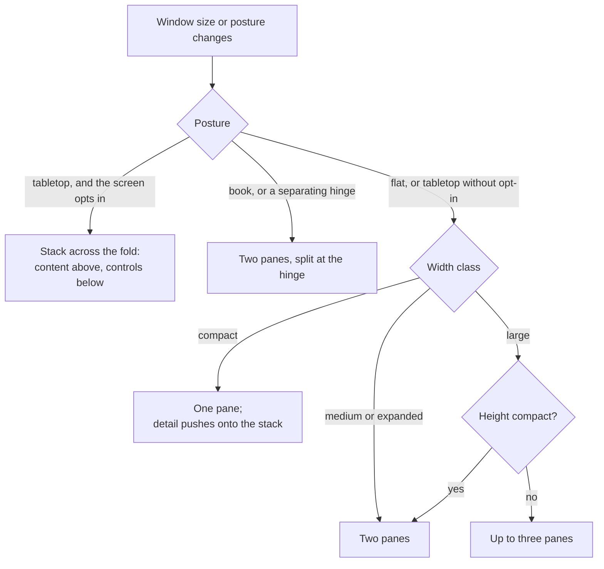

# Device layouts

- **As of:** 2026-09-28
- **Status:** Proposed. The decision is [ADR-0011](../decisions/ADR-0011-adaptive-layouts-and-foldables.md), and the work lands in roadmap phase P2 ("iOS 27 and devices").
- **Related:** [device research](../research/2026-09-28-devices.md) · [architecture overview](overview.md) · [test strategy](../testing/test-strategy.md) · platform guides for [iOS](../../.claude/skills/ios-platform/SKILL.md) and [Android](../../.claude/skills/android-platform/SKILL.md)

**Today** the app is locked to portrait (`app.json`), uses fixed pixel sizes, and reads `Dimensions` once at module load (`HoloCard.tsx:25`). Nothing below exists in code yet. The portrait lock comes off in P1; the adaptive screens land in P2.

## The rules in one screen

1. **Lay out from the window, never the device.** Use the window-size class, never the model name, `Platform.isPad`, or orientation.
2. **Posture is an enhancement.** Every screen works with `state: 'flat'`. Folding adds polish, never features.
3. **Bars come from native containers.** On iPhone Duo, only system tab bars and toolbars move to the side, so no custom JS headers for primary navigation.
4. **Respect the fold.** Nothing important sits under the hinge or a camera, and grids use even column counts across a fold.
5. **State survives every change.** Folding, unfolding, rotating, and resizing keep scroll position, selection, and unsaved input.

## Contents

1. [Device facts](#1-device-facts)
2. [Platform rules that force responsive design](#2-platform-rules-that-force-responsive-design)
3. [Layout system](#3-layout-system)
4. [Layout components](#4-layout-components)
5. [Navigation per platform](#5-navigation-per-platform)
6. [Screen-by-screen playbook](#6-screen-by-screen-playbook)
7. [Delight moments](#7-delight-moments)
8. [Testing matrix](#8-testing-matrix)
9. [Gating](#9-gating)

---

## 1. Device facts

Point (pt) and density-independent pixel (dp) sizes are what React Native's `useWindowDimensions()` reports. Pixel sizes come from the sources listed; point sizes marked "derived" assume the stated scale factor.

| Device | Display(s) | Refresh | Window class (portrait) | Notes |
|---|---|---|---|---|
| **iPhone 18 Pro** | 6.3", 2622×1206 px; ≈402×874 pt at @3x (derived) | 120 Hz | Compact. Landscape is 874 pt wide but compact height. | Released 2026-09-18. Smaller Dynamic Island, 3 simultaneous Live Activities, Camera Control button. [MacRumors](https://www.macrumors.com/roundup/iphone-18-pro/) |
| **iPhone 18 Pro Max** | 6.9", 2868×1320 px; ≈440×956 pt at @3x (derived) | 120 Hz | Compact. Landscape is 956 pt wide but compact height. | As above |
| **iPhone Duo, outer** | 5.4", 1398×2034 px, 460 ppi; ≈466×678 pt if @3x (verify) | 120 Hz | Compact width ([HIG](https://developer.apple.com/design/human-interface-guidelines/designing-for-iphone-duo)) | Wider and shorter than other iPhones, so the system puts tab bars and toolbars on the side. The front camera sits in a corner and is always an occlusion. |
| **iPhone Duo, inner** | 7.6", 1878×2670 px, 430 ppi; ≈626×890 pt if @3x (verify) | 120 Hz | Regular width (HIG); medium in portrait and expanded in landscape in our classes, if @3x | Book-style hinge. When partially open, the fold is a division. Horizontal bars in portrait, side bars in landscape. Preorders 2026-10-16; ships 2026-10-23 with iOS 27.1. Touch ID; the Dock and Dynamic Island are vertical. Split View runs two apps. [MacRumors](https://www.macrumors.com/roundup/iphone-duo/) |
| **Galaxy Z Fold8** | Cover 5.5", 1248×1972 px ("wide", about 16:10). Inner 7.6", 2448×1848 px (4:3). | 120 Hz | Cover compact; inner medium or expanded (verify on device) | Announced 2026-07-22 and released 2026-08-07 with Android 17 and One UI 9 ([Samsung](https://news.samsung.com/us/samsung-galaxy-z-fold8-ultra-fold8-flip8-foldables-perfected-every-way-of-living/)). Resolutions from [GSMArena](https://www.gsmarena.com/samsung_galaxy_z_fold_wide_5g-14673.php), which lists the inner screen as wider than it is tall (verify against Samsung's spec sheet). |
| **Galaxy Z Fold8 Ultra** | Cover 6.5", 1080×2520 px. Inner 8.0", 2256×2504 px. | 120 Hz | Cover compact; inner medium or expanded (verify) | Samsung's productivity model. [GSMArena](https://www.gsmarena.com/samsung_galaxy_z_fold8_ultra_5g-14802.php) |
| **Galaxy Z Flip8** | Main 6.9", 1080×2520 px (21:9). Cover ("FlexWindow") 4.1", 948×1048 px. | 120 Hz | Compact on both | Flex Mode when half-folded (tabletop posture). The main screen is phone-sized, so Android 17's large-screen rules don't apply to it (verify). [GSMArena](https://www.gsmarena.com/samsung_galaxy_z_flip8_5g-14803.php) |
| **Pixel Fold line** (Pixel 11 Pro Fold is current) | Outer 6.5", 1080×2342 px. Inner 8.0", 2076×2152 px (almost square). | 120 Hz | Outer compact; inner medium or expanded (verify) | Announced 2026-08-12 and released 2026-08-20 with Android 17. Earlier Pixel Folds follow the same rules. [GSMArena](https://www.gsmarena.com/google_pixel_11_pro_fold-14874.php) (verify) |
| **iPad** (all models) | Varies | 60–120 Hz | Regular width full screen; any class in a resized window | Split View, Stage Manager, and freely resizable windows (verify the current iPadOS behavior). Pointer, keyboard, and Apple Pencil hover. |
| **Desktop web** | Any window | Display-dependent | Usually expanded or large; compact when narrow | Pointer with hover, keyboard, freely resizable windows. No posture. |

The [device research](../research/2026-09-28-devices.md) has the long-form notes and sources.

## 2. Platform rules that force responsive design

### iOS 27 and iPhone Duo

- **iPhone apps become resizable.** "iOS 27 requires the UIKit scene-based life cycle and makes iPhone apps resizable, and apps built with the iOS 27 SDK get both automatically", and `requireFullScreen` no longer opts out ([Expo SDK 58 beta](https://expo.dev/changelog/sdk-58-beta)).
- **The HIG, "Designing for iPhone Duo"** ([2026-09-09](https://developer.apple.com/design/human-interface-guidelines/designing-for-iphone-duo)):
  - **Size classes:** the outer display is compact width and the inner display is regular width. Don't design a custom layout per pose, and "don't reinvent your app when it resizes".
  - **Consistency:** keep the same functionality and state on both displays and in every pose. Showing an extra level of hierarchy on the inner display is encouraged, as Mail does with list and message side by side.
  - **Grids:** prefer an even number of columns, so content divides cleanly at the fold. Favor small adjustments over extreme layout changes when folding.
  - **Vertical controls:** toolbars, tab bars, and navigation controls move to the side, except on the inner display in portrait. Only standard components do this automatically.
  - **Bar items:**
    - give every item a title and a symbol; text-only buttons stay horizontal
    - put primary navigation (Back, Close) first, then prominent actions (Done)
    - items overflow from bottom to top
    - don't override the default bar placement
- **The developer guide, "Preparing your app for iPhone Duo"** ([Apple](https://developer.apple.com/documentation/technologyoverviews/preparing-your-app-for-iphone-duo)):
  - "When you build with Xcode 26 and earlier, your app doesn't extend under the status bar and camera."
  - Don't use `userInterfaceIdiom` or `UIInterfaceOrientation` for layout decisions. Track `horizontalSizeClass` and `verticalSizeClass`, and size views from the scene or container, not the screen.
  - Custom bars built on `UIToolbar`, `UINavigationBar`, or `UITabBar` don't go vertical. Only the bar support in navigation containers does.
  - Detect vertical bars with the `verticalBarEdge` trait (UIKit) or `toolbarVerticalEdge` (SwiftUI).
  - **Reserved regions:** a *division* is the fold, and an *occlusion* is a camera covering content. Read them with `UIView.reservedRegions(kind:options:)` (UIKit) or `GeometryProxy.reservedRegions(kind:options:layoutDirectionBehavior:)` (SwiftUI). The fold region is active when the device is partially open.
  - **Sheets:** on the outer display, sheets present their bars vertically by default. On the inner display, bars are horizontal for centered or leading placements and vertical for trailing ones.
- **What this means for React Native:** a header drawn in JavaScript stays horizontal while the system tab bar goes vertical. Header buttons have to be native bar items ([§5](#5-navigation-per-platform)).

### Android 16 and 17

- **Large screens ignore orientation and resizability locks.** Android 16 (API 36) began ignoring orientation, aspect-ratio, and resizability restrictions on large screens (smallest width ≥ 600dp) for apps targeting API 36, with a temporary opt-out. For apps targeting Android 17 (API 37), the opt-out is gone ([Android 17 behavior changes](https://developer.android.com/about/versions/17/behavior-changes-17)).
- **So our `"orientation": "portrait"` stops applying** on a Fold's inner screen and on tablets once the app targets API 36 or later. At API 36 only the temporary opt-out keeps it, and at API 37 nothing does. The target API level comes with the Expo SDK (verify which SDK targets which level).
- **Use window size classes** ([Android: window size classes](https://developer.android.com/develop/ui/compose/layouts/adaptive/use-window-size-classes)) and Jetpack WindowManager's `FoldingFeature` for the hinge and posture ([Android: make your app fold aware](https://developer.android.com/develop/ui/compose/layouts/adaptive/foldables/make-your-app-fold-aware)).

### Web

- There's no orientation lock, and windows can be any size.
- Foldable browsers expose the [Viewport Segments API](https://developer.mozilla.org/en-US/docs/Web/API/Viewport_segments_API) and the [Device Posture API](https://developer.mozilla.org/en-US/docs/Web/API/Device_Posture_API). Both are experimental with limited support, so treat them as progressive enhancement.

## 3. Layout system

The layout system lives in `packages/ui` ([monorepo layout](overview.md#23-monorepo-layout)).

### 3.1 `useWindowClass()`

```ts
type WidthClass = 'compact' | 'medium' | 'expanded' | 'large';
type HeightClass = 'compact' | 'medium' | 'expanded';

function useWindowClass(): {
  width: WidthClass;
  height: HeightClass;
  windowWidth: number;   // pt on iOS, dp on Android, CSS px on web
  windowHeight: number;
};
```

| Width class | Window width | Height class | Window height |
|---|---|---|---|
| `compact` | < 600 | `compact` | < 480 |
| `medium` | 600–839 | `medium` | 480–899 |
| `expanded` | 840–1199 | `expanded` | ≥ 900 |
| `large` | ≥ 1200 | | |

- **Where the thresholds come from:** they're Material's window size classes ([Android docs](https://developer.android.com/develop/ui/compose/layouts/adaptive/use-window-size-classes)). We merge Material's large (1200–1599) and extra-large (≥ 1600) into one `large`.
- **Width decides the layout,** but a compact height caps it. A landscape phone (874×402 pt on iPhone 18 Pro) is expanded by width alone, yet three panes in 402 pt of height is unusable. Android's guidance makes the same point for phones and open flippables in landscape.
- **Measure the window, not the screen:** `useWindowDimensions()`, never `Dimensions.get('screen')` or a module-level read. Components that adapt to their own container use `onLayout`.
- **Derived examples** (verify on devices):

  | Device and pose | Width class | Height class |
  |---|---|---|
  | iPhone 18 Pro, portrait | compact | medium |
  | iPhone 18 Pro, landscape | expanded | compact |
  | iPhone Duo outer | compact | medium |
  | iPhone Duo inner, portrait | medium | medium |
  | iPhone Duo inner, landscape | expanded | medium |
  | iPad mini, full screen, portrait (744 pt wide) | medium | expanded |
  | 13-inch iPad, full screen, landscape (1366 pt wide) | large | expanded |
  | Desktop browser at 1440 px | large | depends on the window |

### 3.2 `usePosture()`

```ts
type Rect = { x: number; y: number; width: number; height: number }; // window coordinates

type Posture = {
  state: 'flat' | 'book' | 'tabletop' | 'closed';
  hinge?: {
    rect: Rect;
    orientation: 'vertical' | 'horizontal'; // vertical: left and right halves
    separating: boolean;                    // splits the window into two logical areas
    occluding: boolean;                     // hides content, such as a physical hinge
  };
  occlusions: Rect[];                       // hardware covering content, such as the Duo's cameras
  verticalBarEdge?: 'left' | 'right';       // iOS: where the system placed vertical bars
};
```

**States:**
- `flat`: no active fold. That covers non-foldables and fully open foldables, and it's the fallback everywhere.
- `book`: half open with a vertical fold (left and right halves).
- `tabletop`: half open with a horizontal fold (top and bottom halves).
- `closed`: reserved for platforms that report the outer display. Layout must never depend on it; the window class already covers the smaller screen.

**Platform sources**, all implemented in `modules/fold-aware`, a local Expo Module in Swift, Kotlin, and TypeScript:

| Field | iOS 27 (iPhone Duo) | Android (Jetpack WindowManager) | Web |
|---|---|---|---|
| `state` | Derived from the active division region: vertical means `book`, horizontal means `tabletop`, none means `flat` | `FoldingFeature.state` `HALF_OPENED` with orientation `VERTICAL` means `book`, and with `HORIZONTAL` means `tabletop` (the definitions in Android's docs). `FLAT` or no feature means `flat`. | `navigator.devicePosture.type` is `'folded'`: two side-by-side viewport segments mean `book`, and two stacked segments mean `tabletop`. `'continuous'` means `flat`. |
| `hinge` | The division region's rect, from `UIView.reservedRegions(kind:options:)` | `FoldingFeature.bounds`, `isSeparating`, and `occlusionType` (`FULL` means occluding) | The gap between the rects in `window.viewport.segments`, or `env(viewport-segment-*)` in CSS |
| `occlusions` | Occlusion regions (the cameras) | Not from `FoldingFeature`. Display cutouts come through safe-area insets. | None; safe-area insets cover cutouts |
| `verticalBarEdge` | The `verticalBarEdge` trait (verify its value set) | n/a | n/a |
| Change events | Trait and geometry changes | The `windowLayoutInfo` flow from `WindowInfoTracker` | The `change` event on `navigator.devicePosture`, plus resize |

- **Fallback:** when the module isn't present (Expo Go, older OS versions, and web browsers without the APIs), `usePosture()` returns `{ state: 'flat', occlusions: [] }`.
- **Watch, don't adopt yet:** [react-native-duo](https://github.com/CAWRESTLER/react-native-duo) is MIT-licensed but very early. It's iOS only, and it needs the New Architecture, Xcode 27.1+, iOS 27.1+, and Expo SDK 57+ with scene configuration, with no Expo Go. We keep our own interface, so we can adopt it behind that interface later.

## 4. Layout components

How a screen picks its arrangement, from posture and window class:



Switching arrangements never loses state ([rule 5](#the-rules-in-one-screen)): scroll position, selection, and input carry across.

### `<AdaptiveSplit>`

```tsx
<AdaptiveSplit
  primary={<DexList onSelect={setSelectedId} />}
  secondary={selectedId ? <DexDetail id={selectedId} /> : <EmptyDetail />}
  primaryWidth={{ min: 320, ratio: 0.4 }}
  tabletop="stack"
/>
```

| Condition | Behavior |
|---|---|
| Width `compact` | One pane. Selecting an item pushes the detail route onto the native stack; the URL is the same either way. |
| Width `medium` and up | Two panes side by side. |
| A separating vertical hinge | Split exactly at the hinge, one pane per side, with nothing under an occluding hinge. |
| `tabletop` posture with `tabletop="stack"` | Primary above the fold, secondary below. This is how "DS mode" works. |
| Height `compact` | Never more than two panes. |

- **State survives transitions.** Keep pane components mounted across layout changes where possible, keyed by route rather than by layout. Where a remount can't be avoided, such as collapsing two panes into a pushed screen, restore scroll position, selection, and input from state.
- **It mirrors Apple's split arrangement** (side by side when wide, stacked when tall) and Android's list-detail pattern.
- **Keep navigation containers outside it,** as the HIG says for arrangement views.

### `<AdaptiveGrid>`

```tsx
<AdaptiveGrid minItemWidth={112} gap={8}>{cards}</AdaptiveGrid>
```

- `columns = max(1, ⌊(width + gap) / (minItemWidth + gap)⌋)`, clamped per screen.
- **When a separating vertical hinge crosses the grid,** round down to an even number and put a gutter at least as wide as the hinge on the fold, so no item straddles it.
- **On iPhone Duo's inner display, use even counts even while it's flat,** so the grid doesn't jump when the device half-folds. This follows the HIG.

### `<SafeContent>`

- Applies safe-area insets from `react-native-safe-area-context`: the status bar, the home indicator, the Dynamic Island, and display cutouts.
- On iPhone Duo, native containers already inset their content for vertical bars. Check how those bars surface in the safe-area insets that React Native views receive (verify on SDK 58).
- Keeps content off an occluding hinge.
- On web, uses `env(safe-area-inset-*)` (which needs `viewport-fit=cover`) and `100dvh`.

## 5. Navigation per platform

The top-level tabs are **Pokédex, Battle, TCG, and Profile** ([ADR-0001](../decisions/ADR-0001-universal-app-expo-router.md)). Battle holds two top tabs: Champions (the default) and Showdown.

| Platform | Compact | Medium | Expanded and large |
|---|---|---|---|
| **iOS** | Native Tabs (a system tab bar) and the native stack | The same containers; the system adapts them | The same; on iPad the tabs may move to the top |
| **iPhone Duo** | Outer display: the system moves the tab bar and toolbars to the side | Inner, portrait: horizontal bars | Inner, landscape: bars on the side |
| **Android** | Native Tabs (Material bottom navigation), also when the height is compact or in tabletop posture | Navigation rail | Navigation rail |
| **Web** | Bottom tabs | Rail (proposed here; ADR-0011 only fixes phones and 840 px up) | Sidebar from 840 px |

### iOS

- **Native Tabs render a `UITabBarController`**, with Liquid Glass on iOS 26+ ([Expo: native tabs](https://docs.expo.dev/router/advanced/native-tabs/)). Import them from `expo-router/unstable-native-tabs` on SDK 55–57, and from `expo-router/native-tabs`, which is stable, on SDK 58.
- **System containers go vertical on iPhone Duo automatically.** We draw no custom tab bars or JS headers for primary navigation.
- **Header buttons are native bar items.** Use the native stack's `unstable_headerLeftItems` and `unstable_headerRightItems`, which Expo Router's `Stack` passes through to React Navigation ([React Navigation: native stack](https://reactnavigation.org/docs/native-stack-navigator/)). They're iOS only and experimental. Each item gets an icon and a label, per the HIG. `Stack.Toolbar` ([Expo docs](https://docs.expo.dev/router/advanced/stack-toolbar/)) is the alternative: alpha on SDK 57 and stable in SDK 58. Confirm which of the two renders into iPhone Duo's vertical bars (verify on SDK 58).
- **Today's settings button** (`App.tsx:22-36`) is a custom `headerRight` view, which is exactly the kind that stays horizontal.

### Android

- **Compact:** Native Tabs render Material bottom navigation, which allows at most 5 tabs; we use 4. Following Material 3's adaptive default ([ADR-0011](../decisions/ADR-0011-adaptive-layouts-and-foldables.md)), the bottom bar is also used when the height is compact or the device is in tabletop posture.
- **Medium and up:** otherwise, a navigation rail. Native Tabs don't document a rail, so we build it with Expo Router's headless tabs (`Tabs`, `TabList`, `TabTrigger`, and `TabSlot` from `expo-router/ui`, [experimental](https://docs.expo.dev/router/advanced/custom-tabs/)) and switch by window class. Verify that switching layouts keeps navigation state.
- **Also:** support predictive back, and draw edge to edge, which is mandatory on Android 16+.

### Web

- Native Tabs on web fall back to "a basic implementation, loosely based on iPad design", so web uses the same headless tabs:
  - bottom tabs below 600 px
  - a rail from 600 to 839 px
  - a sidebar from 840 px
- Every screen has a URL.
- **Desktop adds** keyboard shortcuts, visible focus rings, and hover states. Nothing depends on hover alone.

## 6. Screen-by-screen playbook

"Compact phone" covers iPhone 18 Pro and Pro Max, the Flip8's main screen, and the Fold cover screens. "Half-folded" covers book and tabletop postures.

| Screen | Compact phone | iPhone Duo outer | Duo or Fold inner, flat | Half-folded | Desktop web |
|---|---|---|---|---|---|
| **Pokédex** | 2–3 column grid with bottom tabs; detail pushes a screen | 3 columns with the side tab bar | List and detail side by side, split at the fold | **Tabletop:** artwork on top, stats below the fold. **Book:** the same as flat. | Three panes: list, detail, and an inspector (forms, sprites, comparison) |
| **Team builder** | One editor; pickers in sheets | One editor; toolbar items on the side | Team list next to the member editor | **Book:** the team on the left, the calculator on the right. **Tabletop:** a live stat preview above, the editor below. | Team list, editor, and calculator; paste import from the keyboard |
| **Damage calc** | Stacked: attacker, defender, and a pinned result | Stacked, with the result pinned at the top | Attacker and defender side by side, results across the top | **Tabletop: "DS mode"**: results on the top half, controls on the bottom | Side by side, with a history of recent calcs |
| **TCG binder** | One 3×3 page at a time; swipe to turn | One page; toolbar on the side | **A two-page spread, with the fold as the binder's spine** | **Book:** the spread, held like a real binder. **Tabletop:** the page on top, the card picker below. | Spread plus a card-search panel |
| **Meta/usage** | List | List | List plus the selected set's detail | **Book:** list and detail. **Tabletop:** chart on top, list below. | Table with charts and filters |

- **Every cell keeps the same functionality.** Only the arrangement changes, as the HIG asks.
- **The binder spread uses `AdaptiveGrid`'s even-column rule:** with two 3×3 pages across the fold, it's 6 columns with the gutter on the spine.

## 7. Delight moments

| Device | Moment | Needs |
|---|---|---|
| iPhone 18 Pro / Pro Max | A Live Activity in the Dynamic Island for tournament rounds or a ranked-season countdown | A widget extension through a config plugin (P6) |
| iPhone 18 Pro / Pro Max | Liquid Glass native tabs, 120 Hz motion, and haptics on key actions | Native Tabs; Reanimated on the UI thread |
| iPhone 18 Pro / Pro Max | Later: press Camera Control to scan a card | Camera work (later) |
| iPhone Duo and Folds | Open the phone like a binder: the spread appears as it unfolds | `AdaptiveSplit` / `AdaptiveGrid` with the hinge |
| iPhone Duo and Folds | A DS-style tabletop mode for the damage calculator | `usePosture()` tabletop |
| iPhone Duo and Folds | State kept intact when you fold or unfold, mid-edit | [Rule 5](#the-rules-in-one-screen) |
| Galaxy Z Flip8 | A quick calculator in Flex Mode | Tabletop posture |
| Galaxy Z Flip8 | A cover-screen widget with the day's meta pick | An Android widget through a config plugin (later) |
| iPad and desktop web (ideas) | Holo cards that tilt under the pointer on hover; drag cards between binder pages; keyboard-first team building | Pointer and keyboard handling |

**Reduce Motion always wins.** Holo and gyroscope effects fall back to a static shine, and stat bars appear without animating ([test strategy: accessibility](../testing/test-strategy.md#7-accessibility-testing)).

## 8. Testing matrix

| Tool | Runs on | Covers | Limits |
|---|---|---|---|
| **Xcode 27 Device Hub** | macOS only | iPhone 18 Pro/Pro Max, iPhone Duo displays and poses (the HIG recommends previewing poses here), iPad windowing | Needs a Mac. Duo builds need SDK 58 and Xcode 27. Expo CLI detects Device Hub from SDK 58 on. |
| **Android Studio emulators** | Windows, macOS, Linux | Foldable virtual devices (inner and outer displays, hinge postures from the emulator's controls), the resizable emulator, tablets, and desktop windows | The hinge is simulated (verify the current device-profile names) |
| **[Samsung Remote Test Lab](https://developer.samsung.com/remote-test-lab)** | A browser | Real Galaxy Z Fold and Flip hardware, remotely | Time-limited sessions (verify quotas); the newest models may not be listed yet |
| **[Chrome DevTools device mode](https://developer.chrome.com/docs/devtools/device-mode)** | Any desktop | Foldable presets with a Continuous/Folded posture toggle, dual-screen mode, viewport segments | Chromium only; experimental APIs |
| **Playwright** | CI (Linux) | Phone, tablet, and desktop viewports; foldables through the Chrome DevTools Protocol (`Emulation.setDisplayFeaturesOverride` and `Emulation.setDevicePostureOverride`, both experimental) | Fold emulation is Chromium only |
| **Physical devices** | In hand | The maintainer's iPhone and one Android phone; community testers for Duo and Fold hardware | Depends on volunteers |

**Device QA checklist.** The P2 gate is "iPhone Duo + Fold checklist passes". The [test strategy](../testing/test-strategy.md#6-device-test-matrix) schedules when it runs:
- [ ] Fold and unfold on every top-level screen: scroll position, selection, and input survive.
- [ ] Nothing important sits under the hinge or a camera, and no tap target straddles the fold.
- [ ] On the Duo's outer display, tab bars and toolbars move to the side, and header items show an icon and a label and overflow in order.
- [ ] Grids use even column counts across a fold.
- [ ] Landscape phones (compact height) never show three panes.
- [ ] The narrowest multitasking width (Split View, Android multi-window) still works as compact.
- [ ] A desktop browser window resizes smoothly from 320 px to full width.
- [ ] The largest text size, VoiceOver and TalkBack order across two panes, and Reduce Motion all work.

## 9. Gating

- **iPhone Duo work waits for:**
  - Expo SDK 58 stable, which ships shortly after React Native 0.88, per the [SDK 58 beta post](https://expo.dev/changelog/sdk-58-beta)
  - EAS Build images with Xcode 27, which that post calls "coming soon"
  - or, until then, a Mac with Xcode 27 for local builds and Device Hub
  - Apps built with Xcode 26 or earlier don't extend under the status bar and camera on iPhone Duo.
- **Also in SDK 58:** the scene-based life cycle is a breaking change, and Native Tabs and toolbars become stable.
- **Android foldable work can start on SDK 57 with emulators.**
  - Android 17's rules bite once we target API 37 (verify which Expo SDK first does).
  - Plan for the portrait lock to stop working on large screens either way.
- **Web fold APIs** are experimental; ship them as progressive enhancement.
- **Roadmap:** this is phase P2 in the [roadmap](../../specs/roadmap.md), which can overlap the end of P1. The window-class work doesn't need SDK 58 and can start earlier.
