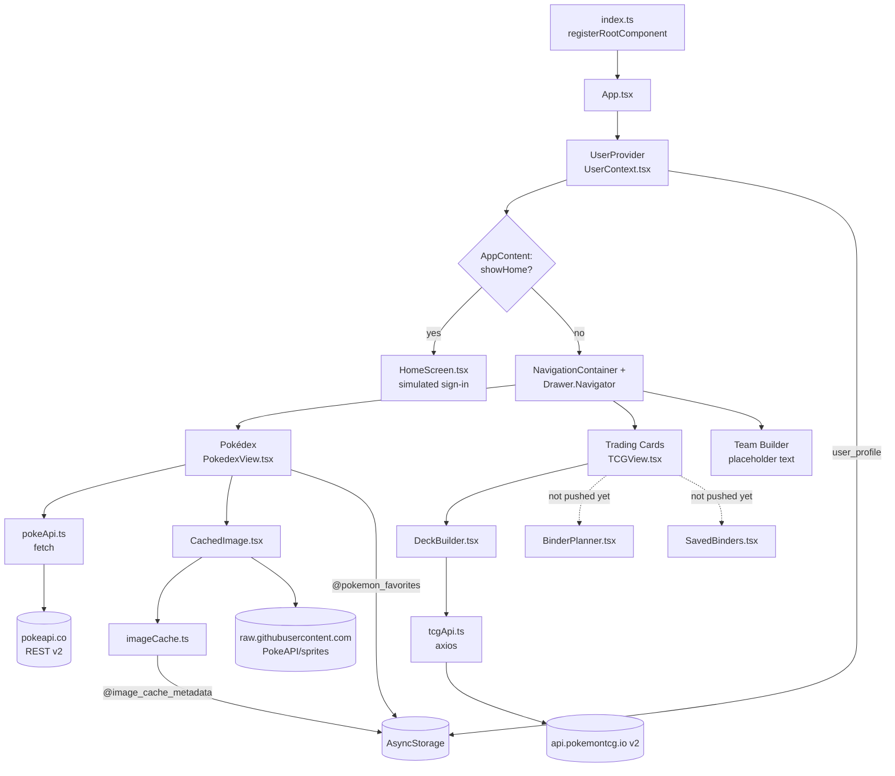
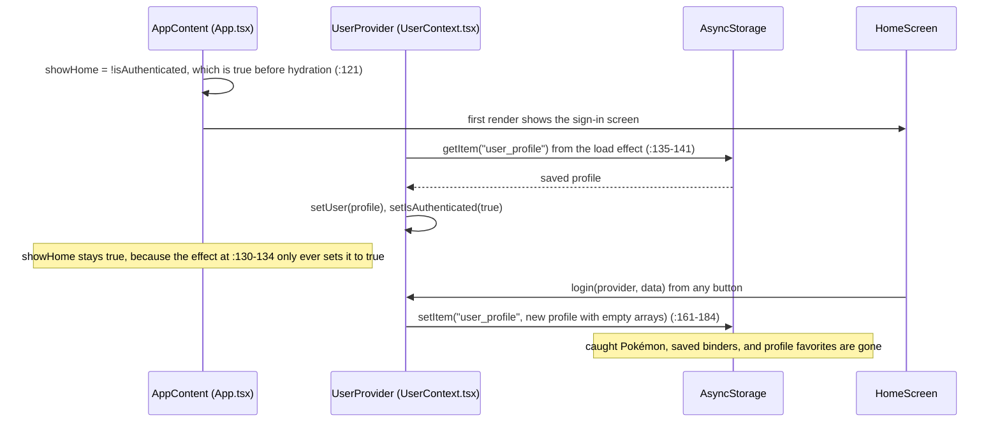
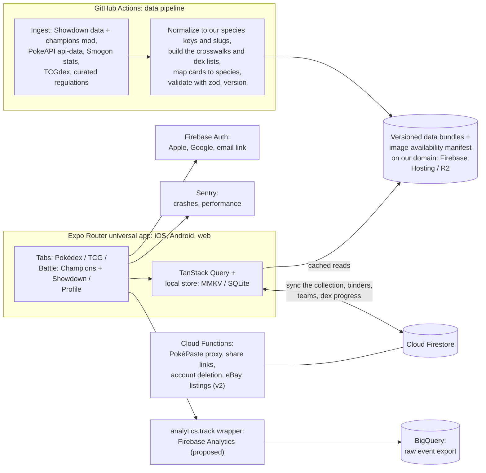
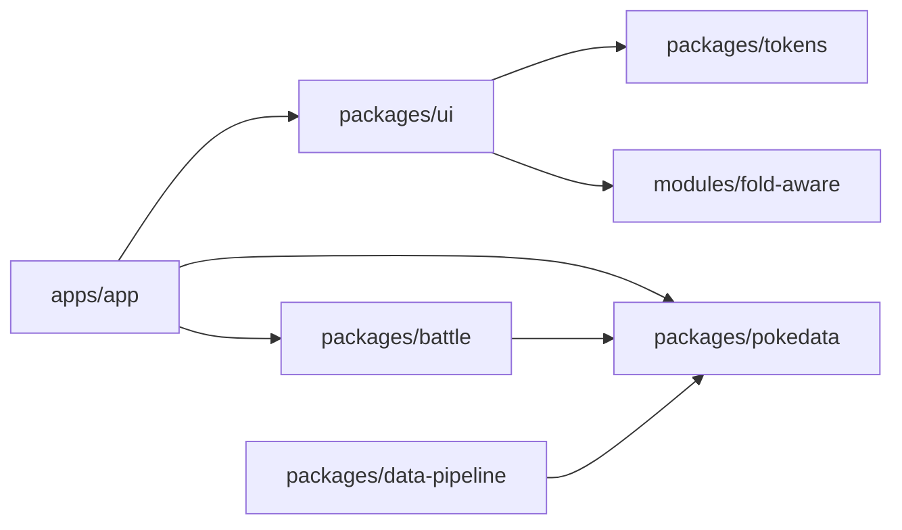
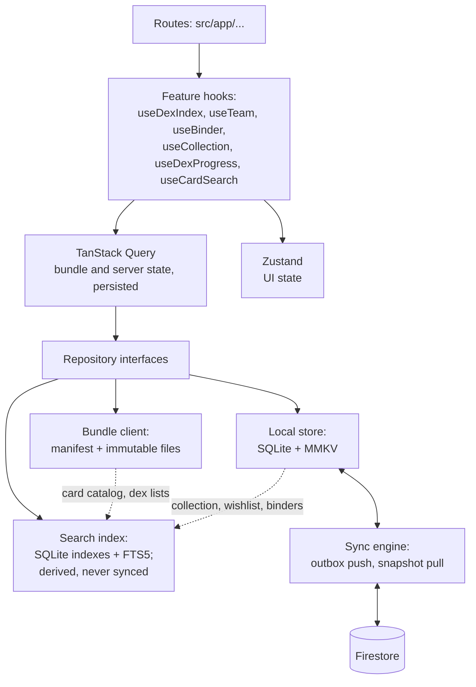

# Architecture overview

- **As of:** 2026-09-28. Part 2 was updated on 2026-09-29 with the owner's decisions on tabs, species keys, and analytics, and later that day with the collection, dex progress, our own keys for other game entities, and the new phase order.
- **Status:** Part 1 (as-is) describes `main` on 2026-09-28. Part 2 (target) is the working plan from the [tech-stack review](../reviews/2026-09-28-tech-stack-review.md); most of it is recorded in Proposed ADRs under [`docs/decisions/`](../decisions/).
- **Related:** [data model](data-model.md) · [device layouts](device-layouts.md) · [test strategy](../testing/test-strategy.md) · [tracking plan](../analytics/tracking-plan.md) · [roadmap](../../specs/roadmap.md) · [open questions](../../specs/open-questions.md)

Line references (`file:line`) point at `main` as of 2026-09-28.

> **Since 2026-09-28 (noted 2026-09-30):** the maintainer's work from another machine landed on 2026-09-29 (PRs #31–#36), so parts of Part 1 are out of date.
> - `BinderPlanner.tsx` and `SavedBinders.tsx` are in the repo, so `main` bundles again. `PokeBallSelector.tsx` arrived too, unused so far.
> - `.github/workflows/ci.yml` runs the Jest suites and `tsc --noEmit` on every push and pull request to `main`, and both pass ([test strategy §5](../testing/test-strategy.md#5-ci-gates)).
> - `react-native-web` and `@expo/webpack-config` are installed, and a webpack web build deploys to a GitHub Pages preview ([ADR-0005](../decisions/ADR-0005-web-hosting.md)).
> - `tcgApi.ts` gained a 15 s timeout, retries, and a silent fallback to bundled sample cards (`src/data/tcgFixtures.json`), and `HoloCard.tsx` imports `Text`.
>
> Still true: the cold-start wipe, the demo type map, the URL-only image cache, and HoloCard's hook call inside a helper. Line references into `tcgApi.ts`, `HoloCard.tsx`, and `TeamBuilder.tsx` have shifted.

## Contents

- [Part 1: As-is](#part-1-as-is-2026-09-28)
  - [At a glance](#11-at-a-glance) · [Runtime map](#12-runtime-map) · [Shell, login gate, navigation](#13-shell-login-gate-and-navigation) · [Screens](#14-screens) · [Data layer](#15-data-layer) · [Image cache](#16-the-image-cache) · [Storage keys](#17-storage-keys) · [Modules](#18-modules-and-responsibilities) · [Cross-cutting gaps](#19-cross-cutting-gaps)
- [Part 2: Target](#part-2-target)
  - [Principles](#21-principles) · [System diagram](#22-system-diagram) · [Monorepo](#23-monorepo-layout) · [Data planes](#24-data-planes) · [Client architecture and routes](#25-client-architecture-and-route-map) · [Web](#26-web-approach) · [Hosting](#27-hosting-options) · [Accounts](#28-accounts-and-user-data) · [Scalability](#29-scalability) · [Performance budgets](#210-performance-budgets)
- [Part 3: From here to there](#part-3-from-here-to-there)

---

## Part 1: As-is (2026-09-28)

### 1.1 At a glance

| Area | Today | Evidence |
|---|---|---|
| Framework | Expo SDK 49, React Native 0.72.10, React 18.2.0 | `package.json` |
| New Architecture | Disabled (`newArchEnabled: false`, `turboModules: false`); SDK 49 ignores both | `app.json` |
| Navigation | One React Navigation 6 drawer, plus `Modal`s and `useState` mode switches | `App.tsx:146-181` |
| State | One React Context (`UserContext`) plus local `useState`; no memoization anywhere | `src/contexts/UserContext.tsx` |
| Persistence | AsyncStorage JSON blobs, no schema version | [§1.7](#17-storage-keys) |
| Network | `fetch` for PokeAPI, axios for the Pokémon TCG API | `src/api/pokeApi.ts:2`, `src/api/tcgApi.ts:4-9` |
| Images | React Native `Image`, plus a URL-only "LRU cache" | `src/utils/imageCache.ts` |
| Styling | `StyleSheet` with hardcoded hex values; NativeWind and Tailwind installed but unused | `package.json`, `tailwind.config.js` |
| Platforms | iOS and Android. The web build fails: `react-native-web` isn't installed. | `package.json` |
| Orientation | Locked to portrait | `app.json` |
| Tests and CI | 5 Jest suites that can't run; no CI, typecheck, or lint scripts | [test strategy](../testing/test-strategy.md#1-current-state-2026-09-28) |

> **`main` doesn't bundle today.** `TCGView.tsx:11` and `:13` import `./BinderPlanner` and `./SavedBinders`, which aren't in the repo, and `App.tsx:14` imports `TCGView`. Metro fails on every platform until those files are pushed.

### 1.2 Runtime map



### 1.3 Shell, login gate, and navigation

- **Entry:** `index.ts:7` calls `registerRootComponent(App)`. `App` wraps `AppContent` in `UserProvider` (`App.tsx:186-192`).
- **Login gate:** `AppContent` renders `HomeScreen` instead of the navigator whenever `showHome` is true (`App.tsx:136-138`). The gate sits outside `NavigationContainer`.
- **The gate causes a cold-start data wipe,** shown below. It's the top P0 fix: step U4 of the SDK 57 upgrade ([review §9](../reviews/2026-09-28-tech-stack-review.md#9-recommended-sequence)). The Pokédex's own favorites key (`@pokemon_favorites`) survives, because it's a separate store ([data model §1.3](data-model.md#13-known-problems)).



- **Drawer** (`App.tsx:146-181`), three screens:
  - **Pokédex** (`:19-46`): wraps `PokedexView` and adds a settings button to the header (`:22-36`) that opens a modal inside `PokedexView`.
  - **Trading Cards** (`:47-51`): wraps `TCGView`.
  - **Team Builder** (`:53-57`): the text "Showdown Team Builder Coming Soon!". The `TeamBuilder.tsx` stub isn't routed.
- **Drawer content** (`:62-117`) shows the profile name and email, and a Sign Out item that confirms through `Alert.alert` (`:66`). That dialog does nothing on web, and sign-out deletes the profile (`UserContext.tsx:186-194`).
- **Everything else is local state:**
  - Pokémon detail and settings are `Modal`s inside `PokedexView` (`:1431-1880` and `:1883-1986`).
  - TCG modes are a `useState` switcher (`TCGView.tsx:18`) that unmounts inactive views (`:94-96`), so their state is lost on every switch.
  - Result: no URLs, no deep links, and no back-stack semantics on web.
- **Dead code:** `src/navigation/index.tsx` is a second, typed drawer navigator that nothing imports. It also routes the `TeamBuilder` stub and omits `PokedexView`'s required props.

### 1.4 Screens

| Screen | File (lines) | What it does | Notable problems |
|---|---|---|---|
| Sign-in | `src/components/auth/HomeScreen.tsx` (402) | Apple, Google, Facebook, email, and guest buttons | All simulated: social buttons log in as `user@<provider>.com` (`:28-41`). The copy promises Terms and a Privacy Policy that don't exist (`:121-123`) and says guest data isn't saved, which is false (`:204-206`). |
| Pokédex | `src/components/pokedex/PokedexView.tsx` (2,823) | List of 1,025 species; search by name or number; type, generation, and favorites filters; detail modal (forms, sprite versions, stats, abilities, evolution); settings modal | 25 `useState` hooks. The type filter and card colors use an 11-species demo map that defaults to Electric (`:330-363`, used at `:307`, `:319`, `:715`). Failed detail requests fall back to invented data (from `:922`). |
| Trading Cards | `src/components/tcg/TCGView.tsx` (141) | Switches between Binder Planner, My Binders, and Deck Builder | Two imported components aren't pushed (`:11`, `:13`). |
| Deck builder | `src/components/tcg/DeckBuilder.tsx` (284) | Card search by name, tap to add, +/− counts | The deck lives in memory only. It imports `HoloCard` (`:13`) but never renders it. |
| Holo card | `src/components/tcg/HoloCard.tsx` (440) | Gyroscope- and gesture-driven holographic card | Not rendered anywhere. Crashes on render: `<Text>` is used at `:364` but not imported (`:3`), and `useAnimatedStyle` is called inside a helper (`:304`). |
| Team builder | `src/components/teambuilder/TeamBuilder.tsx` (158) | Six slots and a `PokemonTeamMember` model | Stub: the editor returns an empty `View` (`:143-152`), and the style sheet is empty (`:154-156`). Not routed. |

### 1.5 Data layer

| Source | Client | Calls | Caching | Notes |
|---|---|---|---|---|
| PokeAPI REST v2 | `fetch`, `pokeApi.ts:344-408` | `GET /pokemon?limit=1025` at startup (`PokedexView.tsx:837`). Per detail view, a sequential chain: `/pokemon/{name}` → `/pokemon-species/{id}` → evolution chain (`:870-921`). A `HEAD /pokemon/1` probe on every mount (`:768`), with an httpbin.org fallback (`:777`). | None: no retries, timeouts, or cancellation, and no guard against out-of-order responses | PokeAPI's [fair-use policy](https://pokeapi.co/docs/v2) asks clients to cache locally. The list call returns names and URLs only, so real types aren't available for filtering. |
| PokeAPI sprites repo on GitHub | URL strings built on the client (`PokedexView.tsx:597-624`) | Every visible row, plus **540 prefetches on every launch**: 60 per generation × 9 (`:845-856`) | React Native's image cache; `imageCache.ts` only tracks URLs | Fallbacks: Diamond/Pearl sprites for #1–493, Black/White animated for #1–649, HOME otherwise. |
| Serebii | Hardcoded image URLs in the forms database (for example `pokeApi.ts:769`) | Gigantamax images | None | Hotlinking a fan site's images |
| Pokémon TCG API v2 | One axios instance, no key, no timeout (`tcgApi.ts:4-9`) | `searchCards` only (`:132-140`, fixed page size 30), from `DeckBuilder`. 9 of the 11 exported functions are unused. | None | Deprecated; [goes offline on 2027-03-01](https://github.com/PokemonTCG/pokemon-tcg-data). Queries are interpolated without encoding (`:134`). |
| Bundled data | `POKEMON_FORMS_DATABASE`, `pokeApi.ts:703-1673` | n/a | n/a | 18 species and 52 forms; accurate in spot checks. About 360 more lines of demo data in `PokedexView` (demo list `:786-822`, types, stats, and abilities) mask network failures. |

**Startup today:** `UserProvider` reads `user_profile` → the sign-in screen → `PokedexView` mounts (`:680-695`) and then:
1. initializes the image cache and clears expired entries
2. shows the 35-entry demo list immediately (`:829-831`), then replaces it with the fetched list
3. starts 540 sprite prefetches in chunks of 20, each with a full AsyncStorage metadata write
4. loads `@pokemon_favorites` and runs the connectivity probe

### 1.6 The image "cache"

- **It caches URLs, not images.** `imageCache.ts` is an LRU of URL metadata (750 entries, 7-day expiry, `:7-8`). `get()` returns the same URL (`:129-147`), and React Native's own cache holds the bytes. The "~38 MB" comment at `:45` is an estimate, not a measurement.
- **Every access writes to disk.** Hits, misses, and removals each rewrite the whole metadata JSON (`:142`, `:168`, `:178`).
- **Prefetch never checks the cache,** so all 540 HOME sprites are prefetched again on every launch and every pull-to-refresh (`:300-313`).
- **`CachedImage` waits on storage.** It renders nothing until the AsyncStorage round-trip finishes (`CachedImage.tsx:28-74`).
- **A phantom key:** `remove()` deletes `@image_cache_<url>`, which is never written (`:182`).
- **Target:** [expo-image](https://docs.expo.dev/versions/latest/sdk/image/), which has a real disk cache and prefetch. Prefetch only the rows that are about to show, and use the smallest suitable sprite for list rows. Images load on the device from commit-pinned PokeAPI sprite URLs, never from our servers ([ADR-0012](../decisions/ADR-0012-brand-ip-and-assets.md)).

### 1.7 Storage keys

| Key | Owner | Value | Problem |
|---|---|---|---|
| `user_profile` | `UserContext.tsx:141,154,188` | `UserProfile` JSON | One global profile, overwritten on every login |
| `@pokemon_favorites` | `PokedexView.tsx:92,532,546` | `number[]` of national dex numbers | Second favorites store, not tied to any user |
| `@image_cache_metadata` | `imageCache.ts:6,71,94,244` | URL metadata map | Rewritten on every image access |
| `@image_cache_<url>` | `imageCache.ts:5,182` | never written | Phantom key |

Full value shapes, TypeScript models, and the migration plan are in the [data model](data-model.md). On web, AsyncStorage maps to `localStorage`, which is plaintext and synchronous.

### 1.8 Modules and responsibilities

| Module | Lines | Responsibility | Imported by | State |
|---|---|---|---|---|
| `index.ts` | 8 | Registers the root component | n/a | Live |
| `App.tsx` | 271 | Provider, login gate, drawer, header button, sign-out | `index.ts` | Live |
| `src/contexts/UserContext.tsx` | 304 | Local profile, caught Pokémon, binders, favorites (as strings), persistence | `App.tsx`, `HomeScreen.tsx` | Live. No screen calls its catch/release API. |
| `src/components/auth/HomeScreen.tsx` | 402 | Simulated sign-in | `App.tsx` | Live |
| `src/components/pokedex/PokedexView.tsx` | 2,823 | List, filters, its own favorites store, detail and settings modals, sprite selection, preloading, demo data | `App.tsx` | Live; scheduled to be split ([review, appendix A](../reviews/2026-09-28-tech-stack-review.md#appendix-a-pokedexview-split-plan)) |
| `src/api/pokeApi.ts` | 1,699 | PokeAPI client and types, sprite selection, forms database | `PokedexView.tsx`, `useSprites.ts` | Live |
| `src/utils/imageCache.ts` | 376 | URL metadata LRU and prefetch | `PokedexView.tsx`, `CachedImage.tsx` | Live |
| `src/components/common/CachedImage.tsx` | 133 | `Image` wrapper over `imageCache` | `PokedexView.tsx` | Live |
| `src/components/tcg/TCGView.tsx` | 141 | TCG mode switcher | `App.tsx` | Live, but can't bundle |
| `src/components/tcg/DeckBuilder.tsx` | 284 | Card search and an in-memory deck | `TCGView.tsx` | Live |
| `src/components/tcg/HoloCard.tsx` | 440 | Holo card effect | `DeckBuilder.tsx` (never rendered) | Broken |
| `src/api/tcgApi.ts` | 276 | Pokémon TCG API client | `DeckBuilder.tsx`, `HoloCard.tsx` | Live |
| `src/components/teambuilder/TeamBuilder.tsx` | 158 | Team stub | only the dead navigator | Stub |
| `src/navigation/index.tsx` | 85 | Second drawer navigator | nothing | Dead |
| `src/components/PokemonList.tsx` | 275 | Older paginated list | nothing | Dead |
| `src/components/SimplePokedex.tsx` | 56 | Eight hardcoded entries | nothing | Dead |
| `src/hooks/useSprites.ts` | 339 | Sprite hook that probes URLs with HEAD requests | nothing | Dead |
| `src/utils/spriteScraper.ts` | 325 | Guesses sprite URLs on third-party sites | `useSprites.ts` | Dead |
| `packages/design/` | n/a | Design-system spec, tokens (`colors_and_type.css`), previews, UI kit, `pokeverse-design` skill | nothing in the app | Docs; not wired in |

### 1.9 Cross-cutting gaps

- **Errors:** there's no error boundary, crash reporting, or logger. 74 `console.*` calls ship in app code, and storage errors are swallowed (`UserContext.tsx:152-159`).
- **Validation:** `response.json()` and stored JSON are trusted as-is.
- **Web:** `react-native-web` is missing, `Alert.alert` confirmations do nothing, and haptics calls aren't guarded.
- **Layout:** portrait lock, fixed pixel sizes, and `Dimensions` read once at module load (`HoloCard.tsx:25`). Nothing adapts to tablets, foldables, or desktop.
- **Verification:** no CI, no typecheck script, and the tests don't run. Nothing caught the missing files or the HoloCard crash.

---

## Part 2: Target

### 2.1 Principles

- **Universal first.** One TypeScript codebase for iOS, Android, and web. Native code goes only in Expo config plugins or local Expo Modules under `modules/`. `ios/` and `android/` are generated (Continuous Native Generation) and never committed.
- **Data is a product.** Game data is compiled in CI, validated, versioned, and cached indefinitely. User data is local-first, with cloud sync when you sign in.
- **An honest UI.** Show loading, error, and empty states. Never invent data to cover a failure.
- **Every claim verified.** CI gates on typecheck, lint, tests, and `expo export` for web, Android, and iOS ([test strategy](../testing/test-strategy.md#5-ci-gates)).
- **Portable vendors.** Our own custom domain, a static web export, and data access behind repository interfaces, so any one vendor can be swapped.
- **Adaptive by construction.** Layout comes from the window size and posture, never from the device model ([device layouts](device-layouts.md)).

### 2.2 System diagram



- **Browsing never calls a third-party Pokémon API.** Ingestion runs in CI on a schedule and on demand, and the app reads our CDN and our Firestore project. The only direct third-party calls are ones the user starts, such as importing a PokéPaste link.
- **Pokémon media stays out of the repo.** The device loads Pokémon images from the PokeAPI sprite project through commit-pinned jsDelivr URLs (GitHub raw as the fallback) and caches them. Nothing is committed or mirrored, so the repository's license only covers our code ([ADR-0012](../decisions/ADR-0012-brand-ip-and-assets.md)).
- **Analytics is anonymous and vendor-neutral.** Screens call our `analytics.track(event, props)` wrapper, never a vendor SDK, and raw events are exported to BigQuery for later analysis. The [tracking plan](../analytics/tracking-plan.md) lists every event and the privacy rules they follow.

### 2.3 Monorepo layout

Phase 1 moves to npm workspaces plus Turborepo ([ADR-0010](../decisions/ADR-0010-monorepo.md)):

```text
apps/
  app/                  universal Expo Router app (iOS, Android, web)
packages/
  tokens/               @pokeverse/tokens: design tokens → CSS variables, Tailwind v4 theme, TypeScript
  ui/                   window classes, posture, AdaptiveSplit / AdaptiveGrid / SafeContent, shared components
  pokedata/             typed data client, zod schemas for the data bundles, loaders
  battle/               team model, Champions and Scarlet/Violet rulesets, legality, paste import/export, calc wrapper
  data-pipeline/        CI scripts that build and publish the data bundles
  design/               unchanged: design-system spec and the pokeverse-design skill
modules/
  fold-aware/           local Expo Module: iOS reserved regions, Android FoldingFeature, web viewport segments
.github/workflows/      ci.yml, plus the data-pipeline workflow
```



- **`battle` and `pokedata` are plain TypeScript,** with no React Native imports, so they run and test in Node. They carry the 80% coverage target, along with the layout, storage, and sync logic ([test strategy](../testing/test-strategy.md#5-ci-gates)).
- **One schema, two consumers.** The pipeline and the app both import `pokedata`'s zod schemas, so the bundle format can't drift between producer and consumer.
- **Dependencies point one way:** `apps` → `packages` → `modules`. Packages never import from the app.

### 2.4 Data planes

| Plane | What's in it | Where it lives | Written by | Freshness |
|---|---|---|---|---|
| **Static game data** | Dex index (1,025 species with real types) and forms, keyed by our species keys, plus the crosswalk to other sources' IDs; dex lists (national, regional, regional forms, and Mega); moves, abilities, items, learnsets per format, Champions regulations and item pools, usage stats, TCG sets and cards (each card with its search fields, variants, and featured species keys, and a card crosswalk to legacy and marketplace IDs), and an image-availability manifest. Pokémon images aren't hosted by us: the device loads them from the PokeAPI sprite project through commit-pinned URLs and caches them ([ADR-0012](../decisions/ADR-0012-brand-ip-and-assets.md)). | Versioned, immutable files on our CDN; cached on the device indefinitely | The data pipeline in GitHub Actions ([ADR-0004](../decisions/ADR-0004-static-game-data-pipeline.md)) | Scheduled runs (regulations change about every 12 weeks, ranked seasons monthly, Smogon stats monthly), plus manual runs for urgent fixes |
| **User data** | Profile, preferences, teams, the card collection and wishlist, binders (which reference the collection), dex progress marks, favorites, and saved searches (proposed). Search indexes and TCG dex ownership are derived on the device and never synced ([data model §3.5](data-model.md#35-search-and-derived-indexes)). | The local store first (SQLite + MMKV); Firestore when signed in | The app ([data model](data-model.md)) | Instant locally; synced when online |
| **Serverless compute** | PokéPaste export proxy (its `/create` endpoint doesn't allow cross-origin calls), share links for published teams (and, in v1.1, read-only binders, wishlists, and trade lists), account deletion, moderation and vote tallies; in v2, a card's current eBay listings through eBay's Browse API, on the region's eBay site, cached briefly within eBay's rules ([PRD TCG-18](../../specs/PRD.md#53-tcg)) | Cloud Functions | Triggered by the app, by Firestore events, or on a schedule | On demand |

**Bundle layout** (a sketch; names are settled in ADR-0004):

```text
https://data.<our-domain>/v1/manifest.json                        short cache; names the current build and each file's hash
https://data.<our-domain>/v1/<buildId>/dex-index.json             immutable (Cache-Control: public, max-age=31536000, immutable)
https://data.<our-domain>/v1/<buildId>/crosswalk.json             species keys and our slugs → PokeAPI, Showdown, and TCGdex IDs and display names
https://data.<our-domain>/v1/<buildId>/dex-lists.json             national, regional, regional-forms, and mega lists, in order
https://data.<our-domain>/v1/<buildId>/species/<dex number>.json  one species, with all its forms
https://data.<our-domain>/v1/<buildId>/formats/<format>.json
https://data.<our-domain>/v1/<buildId>/tcg/sets.json              TCG sets, with series and release dates
https://data.<our-domain>/v1/<buildId>/tcg/cards/<set id>.json    one set's cards: search fields, variants, species keys, and the card crosswalk
```

- **Species keys name every Pokémon and form** in the bundles: the National Dex number plus a form slug, such as `6`, `6-mega-x`, or `37-alola` (decided 2026-09-29, [OQ-13](../../specs/open-questions.md#oq-13-canonical-species-key)). Moves, abilities, items, natures, and types use our own kebab-case slugs, such as `rough-skin`, and formats and regulations our own IDs. The crosswalk is for reference only; nothing stores another source's ID as a key ([data model §2.2](data-model.md#22-identifiers)).
- **Cards carry their featured species keys,** from TCGdex's `dexId` plus the crosswalk's form rules, so dex progress never guesses from names at runtime. The dex lists feed both the progress views and Living Dex binders ([data model: dex progress](data-model.md#dex-progress)).
- **Two kinds of version.** `v1` is the schema version: a breaking change publishes `v2` next to it, and older app builds keep reading `v1`. `buildId` identifies content, and a new build is picked up the next time the app checks the manifest.
- **Publishing is gated.** Every file is validated with zod and count checks (for example, exactly 1,025 species) before upload. A failed check blocks the publish, and apps keep the last good build ([test strategy §4](../testing/test-strategy.md#43-contract-tests-data-pipeline-and-backend)).
- **Images aren't on our domain.** The bundle's image-availability manifest says which sprites exist for each species key; the device loads them from commit-pinned PokeAPI sprite URLs and caches them ([ADR-0012](../decisions/ADR-0012-brand-ip-and-assets.md)).
- **Offline-first.** Once a bundle is cached, and the images already shown are in the device cache, browsing needs no network.
- **Attribution travels with the data:** PokeAPI, Pokémon Showdown (MIT), TCGdex (MIT), and Smogon. Smogon's sets and analyses are © Smogon, so credit them and ask before any commercial use ([battle-ecosystem research](../research/2026-09-28-battle-ecosystem.md)).

### 2.5 Client architecture and route map



- **State** ([ADR-0007](../decisions/ADR-0007-state-and-data-fetching.md)): TanStack Query for bundle and server data (retries, timeouts, cancellation, persistence), Zustand for UI state, zod at every boundary.
- **Repositories** hide the vendor: screens ask for "the dex index" or "my teams", never for a Firestore path or a URL.
- **Derived data stays on the device.** The search index over the card catalog and the collection, and the TCG dex-ownership rollup, are rebuilt from the bundle and the local store, and never synced. On the web, an in-memory index may stand in for SQLite (verify) ([data model §3.5](data-model.md#35-search-and-derived-indexes)).
- **Signed out is a first-class mode.** Every screen works without an account; sign-in is a screen you open when you want sync ([ADR-0001](../decisions/ADR-0001-universal-app-expo-router.md)). That removes today's login gate and the data wipe with it.

**Route map** (illustrative; [ADR-0001](../decisions/ADR-0001-universal-app-expo-router.md) owns the decision):

```text
apps/app/src/app/
  _layout.tsx                    providers (query client, local store, theme), error boundary
  index.tsx                      /                            redirects to the first tab in the user's order
  (tabs)/_layout.tsx             Native Tabs on iOS and Android, in the user's order; custom rail or sidebar where needed
  (tabs)/dex/index.tsx           /dex                         list, search, filters
  (tabs)/dex/[key].tsx           /dex/6, /dex/6-mega-x        detail by species key; pre-rendered for all 1,025 species
  (tabs)/dex/progress/[list].tsx /dex/progress/national       dex progress for one list: national, a region, regional forms, or Mega (client-rendered)
  (tabs)/tcg/index.tsx           /tcg                         the TCG home: collection, wishlist, binders, and decks
  (tabs)/tcg/collection.tsx      /tcg/collection              search and filters over the collection, wishlist, and catalog; extras for trade
  (tabs)/tcg/cards/[id].tsx      /tcg/cards/<card id>         one card: your copies, wishlist status, and marketplace links; the eBay panel in v2
  (tabs)/tcg/sets/[id].tsx       /tcg/sets/<set id>           set completion, and auto-build a binder from the set
  (tabs)/tcg/binders/[id].tsx    /tcg/binders/<id>            one binder (client-rendered)
  (tabs)/battle/_layout.tsx      header menu (Champions ▾ | Showdown); reopens the last section used
  (tabs)/battle/champions/...    /battle/champions            regulation hub, team builder, calc, meta
  (tabs)/battle/showdown/...     /battle/showdown             SV builder, paste import/export, usage, calc
  (tabs)/profile/index.tsx       /profile                     sign-in, sync status, settings (including tab order), account deletion
  t/[id].tsx                     /t/<id>                      a shared team (publicTeams)
  s/[id].tsx                     /s/<id>                      a shared binder, wishlist, or trade list (v1.1, proposed)
  +html.tsx                      web only: meta tags, viewport-fit=cover, manifest link
  +not-found.tsx
```

- **Tabs follow the user's order** (decided 2026-09-29, [OQ-4](../../specs/open-questions.md#oq-4-champions-and-showdown-tab-naming-and-default)). Pokédex, TCG, and Battle come first by default, in that order, and users can reorder them in Settings → Preferences; Profile is always last.
  - The tab layout reads the saved order from the MMKV preferences cache before its first render, so the bar never flashes the default order. Verify that Native Tabs accept an order chosen at runtime.
  - `/` redirects to the first tab, which is also the launch screen. Verify how that redirect renders in the static web export.
- **Pokémon routes use the species key** ([data model §2.2](data-model.md#22-identifiers)). `/dex/6` opens Charizard with a form selector, and `/dex/6-mega-x` opens that form directly. Species pages are pre-rendered; a form's URL opens its species page with the form selected (decided 2026-09-29).
- **Dex progress routes use the pipeline's list IDs:** `/dex/progress/national`, `/dex/progress/kanto`, `/dex/progress/regional-forms`, and `/dex/progress/mega` ([data model: dex lists](data-model.md#dex-lists)).
- **The TCG screens put the collection first** (decided 2026-09-29): binders, set completion, and card pages all read the collection, and the collection's search can keep its scope and filters in the URL on the web (proposed).
- **Battle is one tab with two sections.** `(tabs)/battle/_layout.tsx` owns the header menu that switches between Champions (the default) and Showdown, and reopens the last section used. Deep links pick a section directly. Both sections read the same team list from `packages/battle`, tagged by ruleset.
- Per-Pokémon "meta picks and builds" pages are static too; where they sit in the tree is decided in P4.
- Per-user pages (your teams, collection, binders, and dex progress) render on the client and aren't pre-rendered.
- Navigation containers per platform are specified in [device layouts §5](device-layouts.md#5-navigation-per-platform).

### 2.6 Web approach

**Build web from the Expo Router universal app, not a separate Next.js app** ([ADR-0001](../decisions/ADR-0001-universal-app-expo-router.md)):
- one codebase, which matters for a solo maintainer
- mobile web, the top web priority, gets the same components as native

**Static rendering for search engines:**
- Set `"web": { "output": "static" }`. Each dynamic route exports `generateStaticParams`, so `expo export -p web` pre-renders the 1,025 Pokédex pages and the per-Pokémon meta pages as HTML ([Expo: static rendering](https://docs.expo.dev/router/reference/static-rendering/)).
- `+html.tsx` sets the viewport meta, including `viewport-fit=cover`, which iOS Safari needs before `env(safe-area-inset-*)` reports anything.
- Test locally with `npx expo export -p web` and `npx serve dist`.

**A progressive web app:**
- `public/manifest.json`, linked from `+html.tsx`.
- A Workbox service worker generated after export ([Expo: PWAs](https://docs.expo.dev/guides/progressive-web-apps/)) precaches the app shell and the current data bundle, so the Pokédex works offline.
- Keep caching conservative: an aggressive service worker can strand users on an old build.

**Mobile web first:**
- Bottom tabs under 600 px, a sidebar from 840 px ([device layouts §5](device-layouts.md#5-navigation-per-platform)).
- Use `100dvh`, not `100vh`, and respect `env(safe-area-inset-*)`.
- No hover-only interactions; every hover affordance has a tap equivalent.
- On foldable browsers, the CSS Viewport Segments and Device Posture APIs add fold-aware layouts. Both are experimental, so they're progressive enhancement only.

**Then desktop:**
- a maximum content width
- multiple panes: list, detail, and inspector
- keyboard shortcuts, focus rings, and hover states

**Revisit Next.js** only if search visibility needs per-request server rendering, or the static export can't meet the web performance budget ([§2.10](#210-performance-budgets)).

### 2.7 Hosting options

The static export (`dist/`) runs on any static host. The criteria, in order:
1. every maintainer can reach the vendor's dashboard and deploy targets from every environment they work in
2. custom-domain support
3. a free tier that fits an open-source project
4. fewer vendors overall

Some vendor dashboards and preview domains are unreachable from restricted networks, so check the first point for your own setup before adopting a vendor. Whatever we pick, serve everything from our own custom domain so we can switch hosts without breaking links.

| Host | Verdict |
|---|---|
| **Firebase Hosting (recommended)** | Global CDN, and the same project and console as Auth, Firestore, and Functions. Serves the `expo export -p web` output directly. |
| Netlify (runner-up) | Generous free tier and simple static deploys. Expo's Netlify adapter, only needed for API routes, is marked "subject to breaking changes"; the static export doesn't need it. |
| EAS Hosting | The tightest Expo integration (`eas deploy`, API routes). The free tier has request limits, and custom domains need a paid plan (verify). |
| Vercel | Excellent developer experience, and its free Hobby plan is for non-commercial use, which fits a non-profit project. Its strengths are Next.js features; for an Expo static export it's static hosting. |
| Cloudflare R2 + CDN | No egress fees, so it's the best cost at scale. Use it for data bundles regardless of where the web app lives. Pokémon images aren't hosted by us ([ADR-0012](../decisions/ADR-0012-brand-ip-and-assets.md)). Put it behind our custom domain; public `r2.dev` URLs are meant for development (verify). |

The decision is [ADR-0005](../decisions/ADR-0005-web-hosting.md). Buy a store-safe custom domain early ([ADR-0012](../decisions/ADR-0012-brand-ip-and-assets.md)).

### 2.8 Accounts and user data

**Recommendation: Firebase Auth + Cloud Firestore** ([ADR-0003](../decisions/ADR-0003-backend-and-auth.md)). One vendor covers auth, data, hosting, and functions, and the free tier fits a community tool.

**Sign-in v1**

| Method | Platforms | Notes |
|---|---|---|
| Sign in with Apple | iOS (native sheet), web, Android (web flow) | App Review [guideline 4.8](https://developer.apple.com/app-store/review/guidelines/) requires an equivalent privacy-preserving login whenever Google sign-in is offered; Sign in with Apple is the standard way to meet it. |
| Google | Native account sheet on iOS and Android, popup on web | The native sheet needs a development build rather than Expo Go (verify the library choice in ADR-0003). |
| Email magic link | All | Firebase sends sign-in links, not one-time codes. If we want codes, Clerk is the upgrade path. |
| Later: X, Discord | All | Through Clerk or a custom OAuth/OIDC provider (verify Firebase support per provider). |

**Local-first:**
- The Firebase JS SDK runs on every platform, including Expo Go.
- The Firestore JS SDK's persistent cache is built on IndexedDB, which React Native doesn't have, so on native it would be memory-only (verify). That's one reason our own local store is the system of record on the device, with an outbox for pending writes ([data model §3](data-model.md#3-local-first-store-and-sync)).
- Conflicts resolve per document, last write wins on `updatedAt`.
- Guest data is kept. Signing in attaches local data to the account. Signing out keeps it on the device, with an option to clear this device as well.

**Must-haves before accounts ship (P5):**
- In-app account deletion ([guideline 5.1.1(v)](https://developer.apple.com/app-store/review/guidelines/), and Apple's [account-deletion requirements](https://developer.apple.com/support/offering-account-deletion-in-your-app/), including revoking Sign in with Apple tokens)
- A privacy policy and Terms of Service, which today's sign-in copy already promises
- An age gate with COPPA-aware defaults. Pokémon's audience skews young, so there are no public profiles for under-13s, and no child accounts until we support verifiable parental consent ([data model §6](data-model.md#6-security-rules-principles)).
- App Check. The JS SDK's built-in App Check providers are reCAPTCHA-based, so native attestation needs a custom provider (verify).
- Security-rules tests in CI

**Alternatives** (recorded in ADR-0003): Supabase (Postgres with row-level security, email codes), Clerk + Firestore (the best sign-in UX, including email codes), and AWS Amplify Gen 2.

### 2.9 Scalability

**Today the bottleneck is other people's servers, multiplied by every install:**
- **Every launch:** 540 full-size sprite downloads from `raw.githubusercontent.com` (tens of MB on cellular) and 540 AsyncStorage rewrites. At 10,000 daily users that's at least 5.4 million GitHub raw requests a day, which GitHub will throttle.
- **Every detail view:** 3 uncached PokeAPI calls, against a fair-use policy that warns of permanent IP bans for clients that don't cache.
- **pokemontcg.io without a key:** 1,000 requests a day and 30 a minute per IP (verify), and the service shuts down on 2027-03-01.

**The target:** static data on a CDN serves millions of users for roughly $0. User writes (teams, binders) are tiny, and server compute is rare.

| Scale | What changes |
|---|---|
| 1k MAU | Free tiers everywhere. |
| 10k MAU | Data comes from our CDN with immutable caching, and images from jsDelivr's CDN and the device cache. Local-first keeps Firestore reads low, probably under about $25/month (check with the pricing calculator). |
| 100k MAU | Usage data precomputed as JSON, per-user rate limits on Functions, App Check, budget alerts, Remote Config kill switches, and staged EAS Update rollouts. |
| Viral spike | The CDN absorbs it. Cap Functions' maximum instances, and use feature flags to switch off expensive paths. |

GitHub Actions is free for public repositories, so CI and the data pipeline cost nothing. Sentry and Netlify run programs for open-source projects; check whether we qualify.

### 2.10 Performance budgets

| Budget | Target | How we measure |
|---|---|---|
| Cold start | < 2 s on a mid-range Android phone | Release build on a reference device; app-start spans in Sentry |
| Scrolling | 120 fps on ProMotion displays | Profiling on device; FlashList 2 (or LegendList) for long lists |
| Pokédex search | < 50 ms over the full index | A benchmark over the real dex index, plus an in-app trace |
| Collection search | < 100 ms for 10,000 copies plus the card catalog, on a mid-range phone (proposed) | A benchmark over a generated 10,000-copy collection, plus an in-app trace |
| Stability | ≥ 99.5% crash-free sessions | Sentry release health |
| Web LCP | < 2.5 s on 4G | Lighthouse or web-vitals in the Playwright suite ([test strategy](../testing/test-strategy.md#44-end-to-end-tests)) |

---

## Part 3: From here to there

| Today | Target | Phase | Decision |
|---|---|---|---|
| Expo SDK 49, legacy architecture | SDK 57 now, then SDK 58 once stable (built for iOS 27 and iPhone Duo) | P0, P2 | [ADR-0002](../decisions/ADR-0002-expo-sdk-upgrade-path.md) |
| CI runs the tests and a typecheck (since 2026-09-29) | The full CI gate on every PR; suites repaired on `jest-expo` | P0 | [Test strategy](../testing/test-strategy.md) |
| Cold-start wipe; login gate | Wait for storage before rendering, never overwrite on login, keep data on sign-out; then no gate at all | P0, then P1 | [ADR-0001](../decisions/ADR-0001-universal-app-expo-router.md) |
| Drawer, `Modal` screens, and mode switches | Expo Router: native stack, Native Tabs in the user's order, URLs | P1 | [ADR-0001](../decisions/ADR-0001-universal-app-expo-router.md) |
| One package | npm workspaces + Turborepo | P1 | [ADR-0010](../decisions/ADR-0010-monorepo.md) |
| Runtime PokeAPI fan-out, demo data, 540 prefetches | CI-built data bundles on our CDN, keyed by our species keys; honest errors | P1 | [ADR-0004](../decisions/ADR-0004-static-game-data-pipeline.md) |
| URL-only "LRU" and RN `Image` | expo-image with a disk cache | P1 | [Tech review](../reviews/2026-09-28-tech-stack-review.md) |
| 2,823-line `PokedexView`, 25 `useState`s, one Context | Split screens and hooks; TanStack Query + Zustand | P1 | [ADR-0007](../decisions/ADR-0007-state-and-data-fetching.md) |
| AsyncStorage blobs, two favorites stores | Versioned local store with migrations | P1 (local), P5 (sync) | [Data model](data-model.md) |
| Binder cards as the only record of ownership | A collection of copies as the source of truth, with binders referencing it | P1 (migration), P3 (features) | [Data model](data-model.md#collection) |
| Hardcoded styles; NativeWind unused | `@pokeverse/tokens` + Tailwind v4 (Uniwind or NativeWind 5, after a spike) | P1 | [ADR-0006](../decisions/ADR-0006-styling-and-tokens.md) |
| An SDK 49 webpack build on a GitHub Pages preview (since 2026-09-29) | Static export, PWA, deployed to our domain | P1 | [ADR-0005](../decisions/ADR-0005-web-hosting.md) |
| No crash reporting or analytics | Sentry, plus anonymous events through our `analytics.track` wrapper | P1 | [Tracking plan](../analytics/tracking-plan.md) |
| Portrait lock, fixed sizes | Lock removed; then window classes, posture, and adaptive components | P1 (lock), P2 (layouts) | [ADR-0011](../decisions/ADR-0011-adaptive-layouts-and-foldables.md), [device layouts](device-layouts.md) |
| pokemontcg.io (offline 2027-03-01) | TCGdex through the pipeline; off pokemontcg.io by 2027-01-31 | P3 | [ADR-0009](../decisions/ADR-0009-tcg-data-source.md) |
| Unrouted `TeamBuilder` stub | `packages/battle`, behind one Battle tab with Champions and Showdown sections | P4 | [ADR-0008](../decisions/ADR-0008-battle-engine.md) |
| Simulated sign-in | Firebase Auth, Firestore sync, account deletion, age bands from the first-launch question | P5 | [ADR-0003](../decisions/ADR-0003-backend-and-auth.md) |
| "PokeVerse" name; hotlinked fan-site images | Store-safe brand and disclaimer; images only from commit-pinned PokeAPI sprite URLs, cached on the device | P1 (images), P6 (brand) | [ADR-0012](../decisions/ADR-0012-brand-ip-and-assets.md) |

- **Order and gates:** the [roadmap](../../specs/roadmap.md) sequences the phases and says what each must prove. The [decisions index](../decisions/README.md) lists every ADR and its status. Unsettled choices live in [open questions](../../specs/open-questions.md).
- **Keep this document true.** A PR that changes the architecture updates this file and the affected ADR in the same PR.
