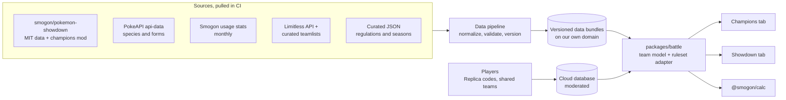

# Battle ecosystem research: Pokémon Champions, Showdown, and data sources (2026-09-28)

Research behind PokeVerse's planned battle hub, which has a **Champions** tab and a **Showdown** tab, and behind the data pipeline that feeds it. It covers how Champions works, what Showdown already supports, which open-source packages and data sources to build on, and the legal limits.

- **As of 2026-09-28.** This domain moves fast: regulations change about every quarter, and ranked seasons every month. Re-check dates before relying on them.
- **Method:** desk research from official announcements, GitHub source code, the npm registry, and community wikis and guides.
- **"(verify)"** marks a fact that rests on a single secondary source, or that sources disagree on.

**Related:** [tech-stack review](../reviews/2026-09-28-tech-stack-review.md) · [device research](2026-09-28-devices.md) · [decisions (ADRs)](../decisions/) · [roadmap](../../specs/roadmap.md)

> **Updates since this snapshot (2026-09-29):** the owner has decided several things since this was written. Tabs are **Pokédex → TCG → Battle → Profile**, with a Champions / Showdown dropdown inside Battle ([OQ-4](../../specs/open-questions.md#oq-4-champions-and-showdown-tab-naming-and-default)). Pokémon images load on the device from the PokeAPI sprite project and are never hosted by us ([ADR-0012](../decisions/ADR-0012-brand-ip-and-assets.md)). Marketplaces get plain links only ([ADR-0009](../decisions/ADR-0009-tcg-data-source.md)). Species use our own keys ([OQ-13](../../specs/open-questions.md#oq-13-canonical-species-key)). Current decisions live in the ADRs and specs, not here.

## Key takeaways

- **Champions is the competitive game now.** It's the official VGC game, required for Championship Points events since 2026-09-01. Regulation M-C runs from 2026-09-08 to 2026-12-01.
- **Stat Points replace EVs:** 66 in total and at most 32 per stat, at level 50 with IVs fixed at 31. The stat formulas are simple, and EV = 8·SP − 4 converts to Scarlet/Violet terms.
- **Split by ruleset, not by platform.** Showdown already hosts "[Gen 9 Champions]" formats, so both tabs should share one team engine.
- **There's no official Champions API,** and Pokémon's Terms of Use forbid automating the game. Regulation rosters, Replica codes, and in-game usage data have to be curated or contributed by users.
- **The open-source stack is usable but uneven.** `@smogon/calc` 0.12.0 supports Champions. The `@pkmn` packages depend on one maintainer and lag by about 3 months, so pull Showdown's MIT-licensed data directly in CI.
- **The TCG data source is ending.** pokemontcg.io goes offline on 2027-03-01. TCGdex (MIT, free, and self-hostable) is the replacement.
- **Fan projects are tolerated, within limits.** "Poké-" names, official artwork, and logos are what draw enforcement and store rejections.

## 1. Pokémon Champions: facts and mechanics

### Release and platforms
- Announced on 2025-02-27. It's developed by The Pokémon Works, a joint venture of The Pokémon Company and ILCA.
- It released on Nintendo Switch and Switch 2 on 2026-04-08, and on iOS and Android on 2026-06-17. Play and saves carry across platforms through a Nintendo Account ([pokemon.com, 2026-06-03](https://www.pokemon.com/us/news/pokemon-champions-comes-to-android-and-ios-on-june-17); [Wikipedia](https://en.wikipedia.org/wiki/Pok%C3%A9mon_Champions)).
- It passed 20M downloads by 2026-08-02. Version 1.2.0 (2026-09-09) added Regulation M-C, an in-game battle log ("View Log"), and "Selection Support" ([Bulbapedia](https://bulbapedia.bulbagarden.net/wiki/Pok%C3%A9mon_Champions)).
- A separate "Pokémon Champions Junior" build ships in Germany and Brazil (2026-09-09), without in-app purchases, recruitment, or the battle pass.

### Business model (context only)
- **Free to start** ([rewards and premium bonuses](https://champions.pokemon.com/en-us/rewards-and-premium-bonuses/)).
- **Starter Pack:** +50 box slots, 30 Teammate Tickets, and 50 Training Tickets.
- **Membership:** $4.99 a month or $49.99 a year. It raises the box from 30 to 1,000 slots and adds 15 battle teams.
- **Premium Battle Pass:** mostly cosmetics. Its Mega Stones can also be bought with VP, the in-game currency.
- **Disagreements between sources:** reported prices for the pack and the pass differ ($6.99 or $9.99) (verify). Sources also disagree on whether Nintendo Switch Online is required for online play (verify).

### Pokémon HOME
- HOME 4.0.0 (2026-04-02) added Champions support.
- Pokémon from HOME can "visit" Champions and later return. Pokémon recruited inside Champions can never go to HOME.
- Nature, ability, moves, and shininess carry over. EVs and IVs are converted to Stat Points, and held items stay behind.
- HOME's Battle Data feature doesn't cover Champions.

### Mechanics that change the team builder
- **Stat Points (SP) replace EVs:** 66 in total, and at most 32 in one stat. Everything is calculated at level 50, with IVs fixed at 31 ([Game8](https://game8.co/games/Pokemon-Champions/archives/538683)).
- **Natures are renamed "Stat Alignment".**
- **Stat formulas,** as implemented in [Showdown's `champions` mod](https://github.com/smogon/pokemon-showdown/tree/master/data/mods/champions):

| Stat | Formula |
|---|---|
| HP | base + SP + 75 |
| Attack, Defense, Sp. Atk, Sp. Def, Speed | (base + SP + 20) × the Stat Alignment modifier |

- **Converting to Scarlet/Violet EVs:** EV = 8·SP − 4, and 0 SP stays 0 EVs. So 1 SP is 4 EVs, and 32 SP is 252 EVs.
- **Why the conversion is exact:** at level 50 with IVs of 31, the main-series HP formula is ⌊(2·base + 31 + ⌊EV/4⌋) / 2⌋ + 60. Substituting EV = 8·SP − 4 makes ⌊EV/4⌋ = 2·SP − 1, which gives exactly base + SP + 75. The same substitution turns the formula for the other stats into (base + SP + 20) × the modifier. So each Stat Point is one point of the final stat, before the alignment modifier.
- **An edge case for converters** (derived from the formula above; verify how Showdown's mod handles it): Scarlet/Violet caps EVs at 510 in total.
  - Converting a full 66-SP spread gives 528 − 4k EVs, where k is the number of stats that have points.
  - Across 3 stats (for example 32/32/2), that's 516 EVs; across 4 stats, 512. Both exceed the cap, so there's no exact Scarlet/Violet equivalent, and a converter has to flag or trim them.
  - Spreads across 5 or 6 stats (508 and 504 EVs) fit.
- **Battle gimmicks:** Mega Evolution only, including the new "Mega Z" forms, and no Terastallization. Future gimmicks are hinted at in art (the "Omni Ring"), with no date (uncertain).
- **Status and PP changes** ([GamesRadar](https://www.gamesradar.com/games/pokemon/pokemon-champions-patches-out-strategies-competitive-players-have-been-using-for-years-but-hey-at-least-freeze-has-finally-been-nerfed/); also implemented in Showdown's mod):
  - Paralysis stops a move 12.5% of the time instead of 25%.
  - Sleep lasts at most 3 turns. Freeze also lasts at most 3 turns, with a 25% chance to thaw each turn.
  - Move PP is fixed at 8, 12, 16, or 20.
- **A limited item pool:** no Life Orb, Choice Band, Choice Specs, or Assault Vest at launch. Regulation M-C added 12 items.
- **Roster:** 186 species at launch. Under M-C there are roughly 208–231 species plus 75–81 Megas; the counts vary by source. PokeAPI's live `champions` Pokédex lists 231.

## 2. Formats, regulations, and official play

### Ranked play
- **Ranked Singles:** bring 3–6 Pokémon and pick 3. **Ranked Doubles:** bring 4–6 and pick 4. Everything is played at level 50.
- **Tiers:** Poké Ball → Great → Ultra → Master → Champion.
- **Seasons** last about a month, and ranks reset each season. Season M-6 runs from 2026-09-09 to 2026-10-07 ([Serebii](https://www.serebii.net/pokemonchampions/rankedbattle/regulationm-c.shtml)).
- **Other modes:** Casual, Private, and Online Competitions.

### Regulations

| Regulation | Dates | Notes |
|---|---|---|
| M-A | 2026-04-08 → 2026-06-17 | The launch regulation. |
| M-B | 2026-06-17 → 2026-09-08 | The Worlds 2026 format. |
| M-C | 2026-09-08 → 2026-12-01 | Adds 24 Pokémon by The Pokémon Company's count (third parties count 29–33), including Rillaboom. New Megas: Salamence, Golisopod, and Baxcalibur, plus Mega Absol Z, Garchomp Z, and Lucario Z. Adds 12 items. |
| After 2026-12-01 | Not announced | |

Sources: [pokemon.com, 2026-09-02](https://www.pokemon.com/us/news/get-ready-for-regulation-set-m-c-in-pokemon-champions); [Victory Road](https://victoryroad.pro/champions-regulations/).

### Official play
- Scarlet/Violet's Regulation I ended on 2026-03-31.
- The first live Championship Points event on Champions was the Indianapolis Regional Championships (2026-05-29 to 05-31).
- Champions has been required for Championship Points events since 2026-09-01 ([pokemon.com, 2026-03-24](https://www.pokemon.com/us/news/play-pokemon-competitions-transition-to-pokemon-champions-on-april-and-may-2026)).
- **Worlds 2026:** 2026-08-28 to 08-30 in San Francisco, playing Regulation M-B doubles on Switch hardware only. 395 players entered the Masters division, and Takuma Yamazaki (Japan) won.
- **Phones at events:** allowed at local events since 2026-09-01. Regionals and above still require a Switch ([Kotaku, 2026-09-02](https://kotaku.com/pokemon-champions-competitive-handbook-mobile-disconnect-2000730505)).
- **Worlds 2027:** Singapore, in August 2027.

### Community resources
- **Damage calculators:**
  - `@smogon/calc` 0.12.0 (2026-09-18) supports Champions and Reg M-C. Internally, Champions is "generation 0" ([repo](https://github.com/smogon/damage-calc)).
  - Others: [Pikalytics](https://www.pikalytics.com/damage-calculator) (a fork of Smogon's), [ChampDex](https://champdex.com/tools/calc), [op.gg](https://op.gg/pokemon-champions/calculator), and the open-source [SebNotFound/champions-calc](https://github.com/SebNotFound/champions-calc).
- **Usage statistics:**
  - The in-game Battle Data screen shows daily usage for ranked battles and online competitions, in singles and doubles. There's no API.
  - Smogon publishes monthly Showdown-ladder usage for Champions formats (`gen9championsou`, `gen9championsvgc2026`, and `gen9championsbattlestadiumsingles`), listed in the data.pkmn.cc index.
  - [Pikalytics](https://www.pikalytics.com/champions) shows ladder, tournament, and "Ranked Battle Data" usage. The source of its ranked data isn't documented.
  - MunchStats reads the in-game Battle Data screens nightly by automating the game (verify).
  - Game8, GameWith, and op.gg also publish usage rankings.
- **Tournaments and teamlists:**
  - [Limitless VGC](https://limitlessvgc.com/).
  - The Limitless online-tournament API at `play.limitlesstcg.com/api` (`game=VGC`; a key is optional) (verify). It only covers tournaments run on Limitless's own platform.
  - [RK9](https://rk9.gg/pairings/) has no public API; community tools scrape its pages.
  - [Victory Road](https://victoryroad.pro/), [Nimbasa City Post](https://www.nimbasacitypost.com/), and the [VGCPastes Repository](https://docs.google.com/spreadsheets/d/1axlwmzPA49rYkqXh7zHvAtSP-TKbM0ijGYBPRflLSWw/), a spreadsheet of pastes and Replica codes.
- **Replica Teams:** a 10-character code (for example `7F8MM 0LD1F`) copies moves, items, ability, and alignment onto Pokémon the player already owns. Curated lists: [Victory Road](https://victoryroad.pro/champions-replica/) and VGCPastes.
- **Meta analysis:** WolfeyVGC and CybertronVGC on YouTube, Victory Road, Nimbasa City Post, and Smogon's Champions forum (Champions OU tiering since 2026-04-11).
- **Reference data:**
  - The [Serebii Champions Pokédex](https://www.serebii.net/pokedex-champions/) and Bulbapedia.
  - [otterlyclueless/pokemon-champions-data](https://github.com/otterlyclueless/pokemon-champions-data): CC BY 4.0 and derived from Showdown, but not updated since April 2026.

### APIs and terms of use
- **Official APIs:** none. There's no team export, Replica codes live only in the game, and HOME exposes nothing.
- **Unofficial sources:**
  - the [championsbattledata.com API](https://github.com/Gheist23/pokemonbattledata) (daily; its source is undocumented)
  - the [wngi2da JSON feed](https://wngi2da.github.io/pokemon-champions-scraper/)
  - the [eurekaffeine scraper](https://github.com/eurekaffeine/pokemon-champions-scraper), which scrapes Pikalytics and MunchStats
  - [champions2paste](https://github.com/emermelada/champions2paste), which turns a screenshot into a Showdown paste with OCR
- **Terms of use:** Pokémon's [Terms of Use (2023-06-15)](https://www.pokemon.com/us/legal/terms-of-use) forbid bots and scripts that automate the service, and forbid downloading "quantities of content to a database". Scraping the game itself carries terms-of-service risk.

## 3. Showdown's Champions support

Showdown has supported Champions since about 2026-04-11. The current formats in [config/formats.ts](https://github.com/smogon/pokemon-showdown/blob/master/config/formats.ts) are all prefixed "[Gen 9 Champions]":

| Kind | Formats |
|---|---|
| Singles | OU, UU, and BSS Reg M-C |
| Doubles | VGC 2026 Reg M-C, plus a best-of-3 version |
| Other | Random Battles, Draft, and Custom |

- Reg M-B is kept in a separate `championsregmb` mod, hidden from the format list.
- **Stat Points go in the `EVs` field** (0–32 each). A paste reads like `EVs: 32 HP / 32 Atk / 2 Spe`, where the numbers are Stat Points.
- Tera is disabled in the validator.
- **What it means for PokeVerse:** the real split is by ruleset, not by platform. A "Showdown" tab can't simply mean "not Champions".

## 4. The Showdown ecosystem

### Repositories and licenses
- **The server and simulator** ([smogon/pokemon-showdown](https://github.com/smogon/pokemon-showdown)) are **MIT**-licensed.
  - Data lives in `data/` and `data/mods/`, and format rules in `config/formats.ts`.
  - JSON copies are served at `play.pokemonshowdown.com/data/pokedex.json` and `moves.json`.
  - The npm package `pokemon-showdown` 0.11.11 (2026-07-28) is aimed at Node servers; its dependencies include mysql2, sockjs, and esbuild.
- **The Showdown client is AGPLv3,** so don't copy its UI code.

### npm packages

Versions are the npm `latest` tags on 2026-09-28.

| Package | Latest | Published | License | What it gives us | Maintenance risk |
|---|---|---|---|---|---|
| `@pkmn/dex`, `@pkmn/data`, `@pkmn/sim`, `@pkmn/mods`, `@pkmn/randoms` | 0.10.11 | 2026-06-18 | MIT | Typed dex and data access, and the simulator. The dex is about 1.8 MB minified, plus about 3.2 MB of learnsets loaded asynchronously. `@pkmn/sim` only ships formats that need no mods, so Champions comes from `@pkmn/mods/champions`; `@pkmn/mods` exports only `champions` and `championsregma`. | **High.** The [pkmn/ps](https://github.com/pkmn/ps) monorepo is effectively maintained by one person. Its last commit (2026-06-18, "champions reg m-a support") leaves it about 3 months behind Showdown on M-B and M-C. |
| `@pkmn/sets` | 5.2.0 | 2025-07-28 | MIT | Paste import and export | Medium: the same maintainer, though the paste format is stable. |
| `@pkmn/smogon` | 0.6.0 | 2026-08-28 | MIT | A client for data.pkmn.cc (you pass in `fetch`) | Medium: the endpoints are "subject to change". |
| `@pkmn/img` | 0.3.4 | 2026-06-02 | MIT | Sprite URL logic | Medium: the same maintainer, who asks you to self-host sprites. |
| `@pkmn/client`, `@pkmn/protocol`, `@pkmn/view` | 0.7.3 | 2026-05-08 | MIT | Battle state and protocol parsing | High, but only needed for a later phase. |
| `@smogon/calc` | 0.12.0 | 2026-09-18 | MIT | Damage calculation, including Champions (as "generation 0"). The core is about 147 KB and the data about 352 KB, minified. | Low: the repository is active. |
| `pokemon-showdown` | 0.11.11 | 2026-07-28 | MIT | The server and simulator | Low: its formats already cover Reg M-C. |
| `@tcgdex/sdk` | 2.9.0 | 2026-04 | MIT | TCG card data (§5) | The service is self-hostable, which limits the risk. |

### Running on React Native
- All these packages say they run in browsers. None states React Native support.
- They're plain JavaScript with no native dependencies, so they should run on Hermes.
- The real risks are parsing multi-MB JSON at startup, the dynamic import of learnsets, and `@pkmn/sim`'s CPU and memory cost.
- This is inferred, not tested, so try it early.

### Smogon usage stats
- **Raw monthly files** live at `smogon.com/stats/YYYY-MM/chaos/<format>-<cutoff>.json`, alongside `moveset/`, `leads/`, and more. The rating cutoffs are 0, 1500, 1630, and 1760, or 1695 and 1825 for OU-style tiers.
- **[data.pkmn.cc](https://github.com/pkmn/smogon/blob/main/API.md)** serves `/sets`, `/stats`, `/analyses`, and `/teams`, each with an `index.json`.
  - Sets and analyses refresh daily, and stats monthly.
  - The endpoints are "subject to change".
  - The Champions data is in `sets/champions*.json` and `stats/gen9champions*.json`.
- **Licensing:** the code is MIT and the aggregate stats are public domain, but **sets and analyses are © Smogon**.

### Team formats
- Showdown has three team formats: export (the human-readable paste), JSON, and packed ([TEAMS.md](https://github.com/smogon/pokemon-showdown/blob/master/sim/TEAMS.md)).
- The beta client's export layout differs slightly, so parse both.

### PokéPaste
[Source](https://github.com/felixphew/pokepaste), BSD-3-licensed.
- `GET /{16-hex-id}/json` returns `{paste, title, author, notes}`, and `/raw` returns plain text. Both allow cross-origin requests.
- `POST /create`, with the form fields `paste`, `title`, `author`, and `notes`, redirects (303) to the new paste. It doesn't allow cross-origin requests, so call it from a server or natively.
- **Maintenance risk:** [issue #329](https://github.com/felixphew/pokepaste/issues/329) (2026-09-14) asks whether the maintainer is still active, and offers to take over. There's been no reply.

### Replays, ladder, and user APIs
Documented in [WEB-API.md](https://github.com/smogon/pokemon-showdown-client/blob/master/WEB-API.md):
- `replay.pokemonshowdown.com/<id>.json`, `.log`, and `.inputlog`.
- `replay.pokemonshowdown.com/search.json?user=&user2=&format=&before=`, which returns 51 results per page (paged by 50).
- `pokemonshowdown.com/ladder/<format>.json`, `/users/<name>.json`, and `/news.json`.
- All of them allow cross-origin requests. No rate limits are published, and the docs ask you not to scrape the HTML pages.

### Accounts and "Login with Showdown"
- **Saved teams generally aren't accessible to third parties** (confirmed from the source code):
  - Teams live in the browser's localStorage.
  - Users can optionally upload up to 2,000 teams and share them via `psim.us/t/<id>[-<password>]` ([teams.ts](https://github.com/smogon/pokemon-showdown/blob/master/server/chat-plugins/teams.ts)).
  - The login server's `getteams` call needs the user's own Showdown session and checks the calling domain. `getteam` (by ID and password) and `searchteams` (public teams only) are callable but undocumented ([actions.ts](https://github.com/smogon/pokemon-showdown-loginserver/blob/master/src/actions.ts)).
- **"Login with Showdown" exists** ([OAUTH.md](https://github.com/smogon/pokemon-showdown-loginserver/blob/master/OAUTH.md)):
  - It's OAuth2-like, but not standard. You request a `client_id` through a Google Form, and register one origin.
  - `/api/oauth/authorize` returns an assertion and a token that's valid for 14 days. `/api/oauth/api/getassertion` and `/api/oauth/api/refreshtoken` extend it.
  - It only logs users into the battle server (`wss://sim3.psim.us/showdown/websocket`). It doesn't give access to their teams.
  - A mobile app probably needs a web callback page that deep-links back into the app (verify).

## 5. Data sources

### PokeAPI
- **REST v2** is statically hosted, with no rate limit since 2018-11. The fair-use policy says to "locally cache resources", and warns of permanent IP bans ([docs](https://pokeapi.co/docs/v2)).
- **GraphQL `v1beta2`** at `graphql.pokeapi.co/v1beta2` (since 2025-06) allows 100 calls per hour per IP, POST only, with a daily reboot at 01:00 UTC. The old `v1beta` was retired in summer 2025.
- **Self-hosting** is supported with Docker Compose or Kubernetes (BSD-3), and the static JSON is in the `PokeAPI/api-data` repository. The project is actively maintained.
- **Champions coverage:** it has a `champions` version group and Pokédex (231 species), and forms like `garchomp-mega-z`. It doesn't model Stat Points.
- **Sprites:** the sprites repository is CC0 as a repository, but the images are **© The Pokémon Company**.

### Pokémon TCG API (pokemontcg.io): offline on 2027-03-01
- Now part of Scrydex, and **deprecated. It goes offline on 2027-03-01.** New registrations are closed, and existing keys keep working until then. The notice was added on 2026-09-17 ([pokemon-tcg-data README](https://github.com/PokemonTCG/pokemon-tcg-data)).
- **Rate limits:** 20,000 requests a day with a key; 1,000 a day and 30 a minute without one (verify).
- Cards include TCGplayer (USD) and Cardmarket (EUR) price blocks.
- The static JSON repository still gets new sets, but it has no license file.

### Scrydex
- [Scrydex](https://scrydex.com/) is paid only: Starter at $29 a month (5k credits), Growth at $99 (50k), Professional at $399 (250k), or Enterprise. There's no free tier.
- IDs from the old pokemontcg.io API still work.

### TCGdex
- Free, no key, MIT-licensed, multilingual, and self-hostable with Docker ([repo](https://github.com/tcgdex/cards-database)). The JS SDK is `@tcgdex/sdk` 2.9.0 (2026-04).
- Its server code shows that prices come from the tcgcsv.com mirror of TCGplayer, and from Cardmarket's public price-guide JSON.

### Card prices
- TCGplayer is "no longer granting new API access" ([docs](https://docs.tcgplayer.com/docs/getting-started)).
- Cardmarket's API isn't accepting new applications (verify). Its daily price guide and product catalogue have been free downloads since about 2024-06, but they aren't served with cross-origin headers, so fetch them in the pipeline rather than from the app.
- [tcgcsv.com](https://tcgcsv.com/) is an unofficial daily mirror of TCGplayer prices.

## 6. Legal and IP

### No license covers fan apps
- Pokémon's [legal information page](https://www.pokemon.com/us/legal/information) grants nothing "beyond a personal, noncommercial home use".
- Nintendo's content guidelines (2024-09-02) cover videos and screenshots, not apps (verify).

### Enforcement precedents
- **[Pokédroid (2011)](https://nolanlawson.com/2011/05/26/on-pokedroids-removal/):** pulled at The Pokémon Company International's request, on copyright grounds and because it competed with the official guides.
- **[Apple, 2024-11](https://developer.apple.com/forums/thread/768539):** a Pokémon card app was rejected under guideline 4.1 "Copycats", and told to remove Pokémon names and screenshots from its listing.
- **Takedowns and lawsuits:** Relic Castle was taken down by a DMCA notice in 2024, and The Pokémon Company won a 2025 lawsuit against a copycat app (verify both).
- **When they act:** The Pokémon Company's former chief legal officer said they typically act once a fan project gets funded or visible ([Dexerto, 2024-03](https://www.dexerto.com/pokemon/former-pokemon-lawyer-reveals-no-one-likes-suing-fan-projects-2592964/)).
- **Trademarks:** Nintendo opposes "POKE"-prefixed marks, such as POKÉ GO (2017) and POKEPHYSIQUE (a default win in 2026-04) (verify).

### What gets tolerated
- Showdown (non-commercial since 2011), Smogon, Bulbapedia, and Serebii.
- Commercial guide sites such as Game8 and op.gg.
- [Pikalytics on iOS](https://apps.apple.com/us/app/pikalytics-battle-strategy/id1511370166): a paid app ($0.99) that calls itself an "unofficial, third-party fan application", with sprites "courtesy of the Smogon Sprite Project".

### App store rules
- **Apple** ([App Review Guidelines](https://developer.apple.com/app-store/review/guidelines/)):
  - 4.1(c): no other brand in your app's name or icon.
  - 5.2.1: no protected third-party IP without permission.
  - 5.2.2: be able to show permission to use content from third-party services "upon request".
- **Google Play** ([IP policy](https://support.google.com/googleplay/android-developer/answer/9888072)): bans marketing images taken from video games, and fan art that can't be told apart from the original.

### Asset licensing
- smogon/sprites has no license.
- PMD Sprite Collab sprites are CC BY-NC (no commercial use).
- Smogon's sets and analyses are © Smogon.

### What this means for PokeVerse
- **Highest risk:** official artwork, 3D renders, logos, or a Poké Ball in the icon, and "Pokémon" or "Poké-" in the app name. The working title "PokeVerse" is likely to draw scrutiny, and it shouldn't be registered as a trademark. A store-safe name only matters for store submission ([ADR-0012](../decisions/ADR-0012-brand-ip-and-assets.md)).
- **Medium risk:** sprites in store builds. Get permission, as Pikalytics' credit to the Smogon Sprite Project suggests it did, or keep the store app text- and type-icon-first.
- **Stay non-commercial:** PokeVerse is a non-profit project. Never charge for access to Pokémon content.
- **Say what it is:** include an "unofficial fan project, not affiliated with Nintendo, Game Freak, Creatures, or The Pokémon Company" disclaimer. The web app is the lower-risk fallback if a store rejects the app.
- **Keep media out of the repo:** fetch sprites at runtime or build them in the pipeline, so the project's license covers only its own code.
- **Collect data politely:** don't automate the game. Cache PokeAPI responses, and keep request volumes low on Showdown, PokéPaste, and data.pkmn.cc. Run third-party ingestion in CI, and serve the results from our own domain.

## 7. Recommendations

### One team engine, two tabs

- **Keep the two tabs:** **Champions** (the default) and **Showdown** (Scarlet/Violet and Smogon), on one shared team engine, `packages/battle` ([ADR-0008](../decisions/ADR-0008-battle-engine.md)).
- **A ruleset adapter** handles Stat Points vs EVs and IVs, Mega vs Tera, item pools, and bring-and-pick rules. Both tabs share one editor, one calculator, and one stats viewer.
- **One Champions data layer for both tabs,** because Showdown hosts Champions formats too.

### Champions tab, first release
- **A regulation hub:** legal Pokémon, Megas, and items, plus the dates and the season calendar. It's backed by a hand-curated JSON file (sourced from pokemon.com, Victory Road, and Serebii), updated about quarterly for regulations and monthly for seasons.
- **Rules, legality, and learnsets,** extracted automatically from Showdown's `champions` mod in CI, and cross-checked against Serebii and Bulbapedia.
- **A team builder** with a Stat Point and Stat Alignment editor, a live stat preview, and legality checks.
- **A bring-and-pick planner:** in Singles, bring up to 6 and pick 3; in Doubles, bring up to 6 and pick 4.
- **A damage calculator:** `@smogon/calc`, with Champions as generation 0.
- **Meta:**
  - usage from Smogon's Champions ladder stats
  - our own tournament usage, computed from Limitless API data and curated teamlists
  - "meta picks and builds" pages for each Pokémon
  - links out to Pikalytics and MunchStats for in-game data, or a partnership request
- **A Replica Team code library:** submitted by users and curated. Each entry records the code, the paste, the regulation, the source, and the date, and community voting prunes dead codes.
- **Export to a Showdown paste.** For Showdown's Champions formats, keep the raw Stat Points on the `EVs:` line. For Scarlet/Violet, convert with EV = 8·SP − 4, and flag spreads that exceed 510 EVs.
- **Importing teams from the game:** start with manual entry. Screenshot OCR, as champions2paste does, is a stretch feature.

### Showdown tab, first release
- **Data:**
  - `@pkmn/dex` and `@pkmn/data`, pinned to exact versions.
  - Compact per-format JSON generated at build time, rather than shipping the whole dex to phones.
  - A CI job that pulls directly from smogon/pokemon-showdown (MIT), to cover the lag in the `@pkmn` packages.
- **A Scarlet/Violet team builder** with EVs, IVs, and Tera.
- **Paste import and export** with `@pkmn/sets`, handling both the regular and the beta-client layouts.
- **PokéPaste:** import via `/json`, and export via `/create`, called from our server.
- **Smogon usage and sets** for each format, via `@pkmn/smogon` against data.pkmn.cc, cached through our own backend. Credit Smogon, and get permission before republishing sets and analyses.
- **The damage calculator,** shared with the Champions tab.
- **"Test on Showdown":** copy the team, and open Showdown.
- **Later, in phases:**
  1. Local simulation with `@pkmn/sim`: in a web worker on the web, or on the backend for mobile.
  2. Optionally, in-app play through Showdown's OAuth, using `@pkmn/client` and `@pkmn/protocol`. Don't copy the AGPL client's UI code.

## 8. Gaps with no API

These need curation, user contributions, or a link out. Scraping isn't the plan.

| Gap | Why there's no API | Approach |
|---|---|---|
| In-game Battle Data (usage) | It exists only in the game, with no export | Link out to sites that publish it. Don't automate the game. |
| Replica code validation | Codes only resolve inside the game | User reports and votes, with the source and date recorded |
| Machine-readable regulation rosters and item lists | Published as articles and images | Curated JSON in the repo, reviewed by pull request and cross-checked against Showdown's mod |
| RK9 teamlists and the Limitless VGC site | No public API. Limitless's API covers only its own online tournaments. | Curated teamlists, plus the Limitless API where it applies |
| HOME data, player boxes, and in-game battle logs | Not exposed | Manual entry, with OCR later |
| Showdown users' saved teams | Stored in the browser; the login server checks the calling domain | Paste import and PokéPaste links |
| Pikalytics data | No public API, and its ranked data source is undocumented | Link out, or ask about a partnership |
| TCGplayer's official price API | Closed to new users | Cardmarket's price guide or the tcgcsv.com mirror, fetched in the pipeline |

## Sources

- **Pokémon Champions:**
  - [pokemon.com: Champions comes to Android and iOS on June 17](https://www.pokemon.com/us/news/pokemon-champions-comes-to-android-and-ios-on-june-17)
  - [pokemon.com: Regulation Set M-C](https://www.pokemon.com/us/news/get-ready-for-regulation-set-m-c-in-pokemon-champions)
  - [pokemon.com: Play! Pokémon competitions move to Champions](https://www.pokemon.com/us/news/play-pokemon-competitions-transition-to-pokemon-champions-on-april-and-may-2026)
  - [champions.pokemon.com: rewards and premium bonuses](https://champions.pokemon.com/en-us/rewards-and-premium-bonuses/)
  - [Wikipedia](https://en.wikipedia.org/wiki/Pok%C3%A9mon_Champions) · [Bulbapedia](https://bulbapedia.bulbagarden.net/wiki/Pok%C3%A9mon_Champions) · [Game8: Stat Points](https://game8.co/games/Pokemon-Champions/archives/538683)
  - [GamesRadar: status changes](https://www.gamesradar.com/games/pokemon/pokemon-champions-patches-out-strategies-competitive-players-have-been-using-for-years-but-hey-at-least-freeze-has-finally-been-nerfed/) · [Kotaku: phones at events](https://kotaku.com/pokemon-champions-competitive-handbook-mobile-disconnect-2000730505)
  - [Serebii: Regulation M-C ranked](https://www.serebii.net/pokemonchampions/rankedbattle/regulationm-c.shtml) · [Serebii Champions Pokédex](https://www.serebii.net/pokedex-champions/)
  - [Victory Road: regulations](https://victoryroad.pro/champions-regulations/) · [Victory Road: Replica Teams](https://victoryroad.pro/champions-replica/) · [Victory Road](https://victoryroad.pro/) · [Nimbasa City Post](https://www.nimbasacitypost.com/)
  - [Limitless VGC](https://limitlessvgc.com/) · [RK9 pairings](https://rk9.gg/pairings/) · [VGCPastes Repository](https://docs.google.com/spreadsheets/d/1axlwmzPA49rYkqXh7zHvAtSP-TKbM0ijGYBPRflLSWw/)
  - Calculators: [smogon/damage-calc](https://github.com/smogon/damage-calc) · [Pikalytics](https://www.pikalytics.com/damage-calculator) · [ChampDex](https://champdex.com/tools/calc) · [op.gg](https://op.gg/pokemon-champions/calculator) · [SebNotFound/champions-calc](https://github.com/SebNotFound/champions-calc)
  - Usage and data: [Pikalytics Champions](https://www.pikalytics.com/champions) · [otterlyclueless/pokemon-champions-data](https://github.com/otterlyclueless/pokemon-champions-data) · [Gheist23/pokemonbattledata](https://github.com/Gheist23/pokemonbattledata) · [wngi2da feed](https://wngi2da.github.io/pokemon-champions-scraper/) · [eurekaffeine scraper](https://github.com/eurekaffeine/pokemon-champions-scraper) · [champions2paste](https://github.com/emermelada/champions2paste)
- **Showdown and Smogon:**
  - [smogon/pokemon-showdown](https://github.com/smogon/pokemon-showdown) · [config/formats.ts](https://github.com/smogon/pokemon-showdown/blob/master/config/formats.ts) · [champions mod](https://github.com/smogon/pokemon-showdown/tree/master/data/mods/champions) · [sim/TEAMS.md](https://github.com/smogon/pokemon-showdown/blob/master/sim/TEAMS.md) · [server/chat-plugins/teams.ts](https://github.com/smogon/pokemon-showdown/blob/master/server/chat-plugins/teams.ts)
  - [Client WEB-API.md](https://github.com/smogon/pokemon-showdown-client/blob/master/WEB-API.md) · [Login server actions.ts](https://github.com/smogon/pokemon-showdown-loginserver/blob/master/src/actions.ts) · [Login server OAUTH.md](https://github.com/smogon/pokemon-showdown-loginserver/blob/master/OAUTH.md)
  - [pkmn/ps](https://github.com/pkmn/ps) · [pkmn/smogon API.md (data.pkmn.cc)](https://github.com/pkmn/smogon/blob/main/API.md)
  - [PokéPaste](https://github.com/felixphew/pokepaste) · [PokéPaste issue #329](https://github.com/felixphew/pokepaste/issues/329)
- **Game and TCG data:**
  - [PokeAPI docs](https://pokeapi.co/docs/v2)
  - [pokemon-tcg-data (deprecation notice)](https://github.com/PokemonTCG/pokemon-tcg-data) · [Scrydex](https://scrydex.com/) · [TCGdex cards database](https://github.com/tcgdex/cards-database)
  - [TCGplayer API docs](https://docs.tcgplayer.com/docs/getting-started) · [tcgcsv.com](https://tcgcsv.com/)
- **Legal and store policy:**
  - [Pokémon Terms of Use](https://www.pokemon.com/us/legal/terms-of-use) · [Pokémon legal information](https://www.pokemon.com/us/legal/information)
  - [On Pokédroid's removal](https://nolanlawson.com/2011/05/26/on-pokedroids-removal/) · [Apple Developer Forums thread 768539](https://developer.apple.com/forums/thread/768539) · [Dexerto: former Pokémon lawyer](https://www.dexerto.com/pokemon/former-pokemon-lawyer-reveals-no-one-likes-suing-fan-projects-2592964/)
  - [Pikalytics on the App Store](https://apps.apple.com/us/app/pikalytics-battle-strategy/id1511370166)
  - [Apple App Review Guidelines](https://developer.apple.com/app-store/review/guidelines/) · [Google Play IP policy](https://support.google.com/googleplay/android-developer/answer/9888072)
