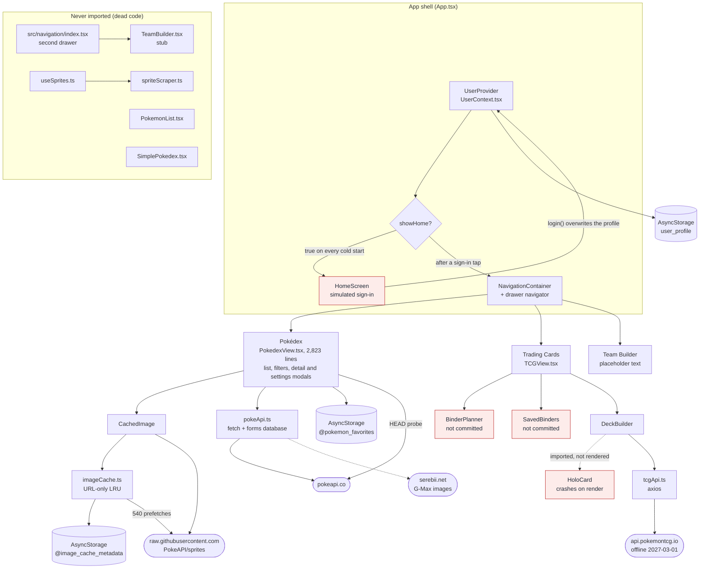
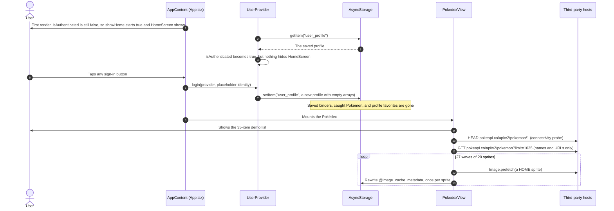
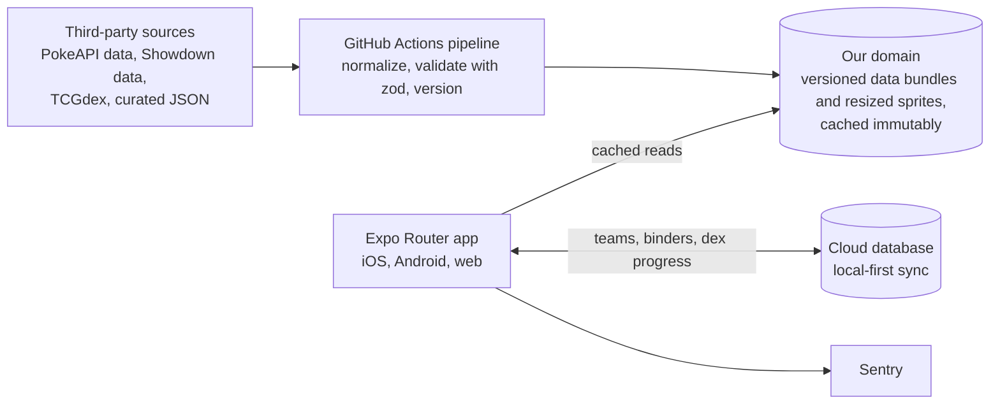

# PokeVerse tech-stack review (2026-09-28)

An end-to-end review of PokeVerse's code, architecture, tests, tooling, and docs: what works, what's broken, where the stack should go, and in what order to fix things.

> **A snapshot, not a verdict.** Findings describe `main` as of 2026-09-28 (last commit: "Rename CLAUDE.md to AGENTS.md", 2026-09-21). More local work, including `BinderPlanner.tsx` and `SavedBinders.tsx`, is about to be pushed from another machine, so some findings will change when it lands.

**Related:** [interview guide](2026-09-28-chief-of-staff-interview.md) · [battle ecosystem research](../research/2026-09-28-battle-ecosystem.md) · [device research](../research/2026-09-28-devices.md) · [architecture overview](../architecture/overview.md) · [roadmap](../../specs/roadmap.md) · [decisions (ADRs)](../decisions/)

> **Updates since this snapshot (2026-09-29 and 2026-09-30):** the owner has decided several things since this was written. Tabs are **Pokédex → TCG → Battle → Profile**, with a Champions / Showdown dropdown inside Battle ([OQ-4](../../specs/open-questions.md#oq-4-champions-and-showdown-tab-naming-and-default)). Pokémon images load on the device from the PokeAPI sprite project and are never hosted by us ([ADR-0012](../decisions/ADR-0012-brand-ip-and-assets.md)). Marketplaces get plain links only ([ADR-0009](../decisions/ADR-0009-tcg-data-source.md)). Species use our own keys ([OQ-13](../../specs/open-questions.md#oq-13-canonical-species-key)). The phases were reordered: TCG v2 is now P3, the battle hub P4, and accounts and sync P5 ([roadmap](../../specs/roadmap.md)), so the phase numbers below are the old ones. Current decisions live in the ADRs and specs, not here. **The pending work landed on 2026-09-29** (PRs #31–#36): F1 is fixed, F6 is fixed for SDK 49's webpack build (which now deploys a GitHub Pages preview), and F3, F7, F18, and F22 are partly fixed (HoloCard imports `Text` but still calls a hook inside a helper; the suites and `tsc --noEmit` pass in CI, but there's no lint, format script, or `jest-expo` yet, and the `any`s remain; `tcgApi` gained a timeout, retries, and a silent sample-data fallback, but the PokeAPI calls didn't). Still open: F2, F4, F5, F8–F17, F19–F21, and F23–F28.

## Contents

1. [Scope and method](#1-scope-and-method)
2. [Executive verdict](#2-executive-verdict)
3. [What's working well](#3-whats-working-well)
4. [Findings](#4-findings)
5. [Current stack vs target](#5-current-stack-vs-target)
6. [Architecture today](#6-architecture-today)
7. [Data flow and scalability](#7-data-flow-and-scalability)
8. [Tests, tooling, and docs](#8-tests-tooling-and-docs)
9. [Recommended sequence](#9-recommended-sequence)
- [Appendix A: PokedexView split plan](#appendix-a-pokedexview-split-plan)
- [Sources](#sources)

## 1. Scope and method

- **What was reviewed:**
  - every source file: `App.tsx`, `index.ts`, and everything in `src/`
  - the configuration: `package.json`, `package-lock.json`, `app.json`, `babel.config.js`, `metro.config.js`, `jest.config.js`, `tsconfig.json`, `tailwind.config.js`, `.prettierrc`, and `.gitignore`
  - all 5 test suites, `scripts/`, the README, AGENTS.md, everything in `docs/`, and `packages/design`
- **How:** a static review. Nothing was installed, built, run, or tested, and no device was used.
  - `node_modules` was absent, so versions come from `package-lock.json`.
  - `PokedexView.tsx` was read line by line through the component (lines 1–2044), and its StyleSheet (2045–2821) was scanned.
  - Counts (console calls, `any`s, hooks) come from text searches over non-test files.
  - Runtime behavior is inferred from the code. Anything marked **(verify)** depends on library internals or on a single secondary source, and should be confirmed by running it.
- **References:** `path:line` points at `main` on 2026-09-28. Commits are cited by message and date.
- **Severity levels:**

| Level | Meaning |
|---|---|
| Critical | Blocks the build or loses user data |
| High | Crashes, shows wrong data, or blocks a target platform |
| Med | A correctness, maintainability, or UX problem with a limited blast radius |
| Low | Polish and hygiene |
| Deadline | An external date forces the work |
| Risk | Not a bug today, but a likely problem if ignored |

## 2. Executive verdict

**The root cause is a missing feedback loop.** Nothing checks `main` against reality. There's no CI, the tests can't pass as configured, and there's no typecheck or lint script. One CI job running `tsc`, `jest`, and `expo export` would have caught F1, F3, and F7 the day they landed. The docs drifted for the same reason: nothing compared them with the code.

**What that means today**
- `main` doesn't bundle on any platform (F1), and the sign-in screen overwrites the saved profile on every cold start (F2).
- The Pokédex, the one working pillar, shows wrong data. Its type filter runs on an 11-entry demo map (F4), and failed requests render invented stats (F15).
- The stack is 8 SDK releases behind (F8), the web build can't bundle (F6), and the TCG data source goes offline on 2027-03-01 (F11).

None of this reflects a lack of skill. The domain modeling, accessibility work, motion, and design system (§3) are better than most hobby apps. The gaps come from shipping without guardrails.

**The moves that matter, in order**
1. **Make `main` green, and keep it green,** with CI gates. (P0)
2. **Modernize:** Expo SDK 57 now, then SDK 58 as soon as it's stable. SDK 58 is built for iOS 27 and iPhone Duo. (P0, then P2)
3. **Rebuild navigation on Expo Router:** one codebase for iOS, Android, and web, with URLs and deep links. Its native stack and tabs adapt to iPhone Duo, iPad, and foldables for free. (P1)
4. **Move data off the client:** versioned data bundles built in CI and served from our own domain. No runtime fan-out to third-party APIs, no demo data hiding failures, and offline-first. (P1)
5. **Make the battle hub the wedge:** Champions first (new, and under-served on mobile), compatible with Showdown, on one shared team engine. (P3)
6. **Add real accounts** on one backend, with local-first sync. (P4)
7. **Treat delight as a system:** design tokens, motion, and haptics, plus one "wow" moment per device, such as a binder spread across the fold or a DS-style tabletop battle mode. (P2, P6)
8. **Keep brand and data clean:** a store-safe name, attribution, and a new TCG data source before 2027-03-01. (P5, P6)

## 3. What's working well

Worth keeping through every refactor:

- **Real domain knowledge.**
  - A sprite-availability matrix per game version (`PokedexView.tsx:451-478`, `:638-676`), and typed, pure sprite helpers (`pokeApi.ts:470-678`).
  - A hand-built forms database of 18 species and 52 forms (`pokeApi.ts:703-1673`). Spot checks (Deoxys, Kyurem, Rotom, and the Galarian birds) were accurate.
- **Accessibility care, which is rare in hobby apps:** roles, labels, hints, selected states, and 44-pt touch targets (for example `App.tsx:25-31`, `:204-210`, and `PokedexView.tsx:1278-1281`).
- **Motion on the UI thread:** Reanimated stat bars and press feedback (`PokedexView.tsx:183-246`). HoloCard's gesture setup runs a tap alongside a race of pan, pinch, and rotation (`HoloCard.tsx:199-203`), a concept that fits the "delight" goal.
- **Product taste:** a real design-system spec in `packages/design`. It has 18 type colors, 6 stat colors, pixel and display fonts, radii and shadows, 22 preview cards, and a clickable UI kit.
- **Good habits:** decision journaling (the decision trees in `docs/DEVELOPER_LOG.md`), and tests that spell out intended behavior (the 15 BinderPlanner cases).
- **Solid building blocks:**
  - UserContext's domain model, `CaughtPokemon` and `SavedBinder` (`UserContext.tsx:23-48`).
  - DeckBuilder's immutable, functional state updates.
  - A typed TCG client with a single axios instance and no hardcoded key.
  - A virtualized FlatList for the 1,025-row list.
  - No secrets anywhere in the repository.

## 4. Findings

F1–F12 are the headline findings. F13–F28 are the other High and Med items. Evidence points at `main` on 2026-09-28; "U1"–"U8" are the steps of the SDK 57 upgrade branch (§9).

| ID | Sev | Area | Finding | Evidence | Recommendation |
|---|---|---|---|---|---|
| F1 | Critical | Build | `main` can't bundle on any platform. `TCGView` imports `BinderPlanner` and `SavedBinders`, which were never committed (only `BinderPlanner.test.tsx` is in history), and `App.tsx` imports `TCGView`. | `src/components/tcg/TCGView.tsx:11,13`; `App.tsx:14` | Push the two files from the machine that has them; don't stub them. Add CI that runs `expo export` for web, Android, and iOS, so an unresolved import can't land again. |
| F2 | Critical | Data | Saved data is overwritten on every cold start. `showHome` is set before storage finishes loading, so it always starts `true`, and the effect only ever sets it to `true`. Every sign-in button then builds a new profile with empty arrays and a new id. Sign Out deletes the profile. Everything in `user_profile` is lost, including binders the upcoming binder screens save. Pokédex hearts survive only because they use a separate key. | `App.tsx:121`, `:130-134`; `UserContext.tsx:161-194` | Wait for storage to load before choosing a screen. Make sign-in load an existing profile or create one, and make Sign Out keep local data. Add a relaunch regression test (U4). |
| F3 | High | TCG | HoloCard crashes on first render. `<Text>` isn't imported, and `useAnimatedStyle` is called inside the `renderHoloEffect` helper, which breaks the Rules of Hooks. No committed screen renders it yet (DeckBuilder imports it but doesn't use it). The binder screens will, because their tests mock it. | `HoloCard.tsx:3`, `:304`, `:364`; `DeckBuilder.tsx:13` | Import `Text`, move the hook into the component body, and add a render test (U2). Later, drive every card from one shared DeviceMotion hook. |
| F4 | High | Pokédex | The type filter and the card colors use an 11-entry demo type map that defaults to Electric. "Fire" returns 3 Pokémon (Charizard, Typhlosion, Ho-Oh); "Electric" returns about 1,014. The list request returns only names and URLs, so real types are never available. | `PokedexView.tsx:330-363`, used at `:307`, `:319`, `:715`, `:1104` | Ship a dex index with real types from the data pipeline ([ADR-0004](../decisions/ADR-0004-static-game-data-pipeline.md), P1). Until then, mark the type filter unavailable rather than show wrong results. |
| F5 | High | Performance | The "LRU image cache" stores URLs, not images. `get()` returns the URL it was given. Every hit, miss, and eviction rewrites the whole metadata JSON. `size` is never set, so there's no byte limit, and `initialize()` can run twice concurrently. `preloadBatch` prefetches 540 full-size HOME sprites on every launch and refresh without checking what's cached. The "~38 MB" figure is a comment, not a measurement. | `src/utils/imageCache.ts:45`, `:67-83`, `:129-169`, `:300-313`; `PokedexView.tsx:845-856` | Replace `imageCache.ts` and `CachedImage.tsx` with expo-image (disk cache, `cachePolicy`, prefetch). Prefetch only visible rows, and use small list icons built by the pipeline (P1). |
| F6 | High | Web | The web build can't bundle. `react-native-web` isn't installed (only `react-dom` 18.2.0 is), and `app.json` has no web config. The Metro log committed on `main` recorded `Unable to resolve "react-native-web/dist/exports/SafeAreaView" from "App.tsx"`. Sign Out is also broken on web (F19). | `package.json`; `expo.log` (on `main`) | Add `react-native-web`, `react-dom`, and `@expo/metro-runtime` at SDK 57 versions (U3), and gate CI on `expo export --platform web`. |
| F7 | High | Quality | The tests can't pass as configured (predicted from reading; not run). The preset is `react-native` (jest-expo isn't installed), `transformIgnorePatterns` is too narrow, and the setup file sits inside `__tests__` with no `testMatch`. Two suites import the missing files, and the axios and gesture mocks are broken. There's no CI, and no typecheck, lint, or format script. `.prettierrc` isn't valid JSON or YAML. | `jest.config.js`; `src/__tests__/setup.js`; `src/**/__tests__/`; `package.json` scripts; `.prettierrc:1` | Move to the `jest-expo` preset with an explicit `testMatch` (U5). Add typecheck, lint, and format scripts (U6), then CI (U7). See §8. |
| F8 | High | Platform | The stack is 8 SDK releases behind: Expo 49.0.23, React Native 0.72.10, and React 18.2.0. The app stores' Expo Go only runs the latest SDK. SDK 55 removed the legacy architecture, which this app still relies on. | `package.json`; `package-lock.json`; `app.json:9-12` | Jump straight to SDK 57 ([ADR-0002](../decisions/ADR-0002-expo-sdk-upgrade-path.md), P0), then to SDK 58 once it's stable (P2). |
| F9 | Med | Accounts | Sign-in is simulated. The Apple, Google, and Facebook buttons create placeholder identities (`user@<provider>.com` and a generated avatar URL), and email sign-in accepts any string. The copy promises Terms and a Privacy Policy that don't exist, and says guest data isn't saved, which is false. Fake social buttons are also an app-review risk. | `HomeScreen.tsx:28-41`, `:121-123`, `:204-206` | Until real accounts ship ([ADR-0003](../decisions/ADR-0003-backend-and-auth.md), P4), present sign-in honestly as a local profile, and remove promises the app can't keep. |
| F10 | Med | Maintainability | `PokedexView.tsx` is 2,823 lines, with 25 `useState` hooks and a filtered list derived inside an effect. There's no `useMemo`, `useCallback`, or `React.memo` anywhere in the app. FlatList rows are inline and unmemoized, keyed by `${name}-${index}`, with no `getItemLayout`. There's also a second, typed drawer navigator that nothing imports, 4 dead modules, and two favorites stores (F27). | `PokedexView.tsx:489-524`, `:678`, `:697-739`, `:1389-1428`; `src/navigation/index.tsx`; `src/components/PokemonList.tsx`, `SimplePokedex.tsx`; `src/hooks/useSprites.ts`; `src/utils/spriteScraper.ts` | Prune the dead code (U1). Split PokedexView as in Appendix A, behind characterization tests (P1). |
| F11 | Deadline | TCG data | pokemontcg.io is deprecated and goes offline on 2027-03-01. Its notice, added 2026-09-17, says new registrations are closed and existing keys work until then. The app calls it without a key. | `src/api/tcgApi.ts:4-9`; [pokemon-tcg-data README](https://github.com/PokemonTCG/pokemon-tcg-data) | Move to TCGdex through the data pipeline by 2027-01-31 ([ADR-0009](../decisions/ADR-0009-tcg-data-source.md), P5). |
| F12 | Risk | Brand/IP | The "Poké-" prefix in "PokeVerse" invites app-store rejection (Apple guidelines 4.1(c) and 5.2.1) and trademark opposition: Nintendo opposes "POKE"-prefixed marks. | `app.json:3`; [battle ecosystem research, §6](../research/2026-09-28-battle-ecosystem.md#6-legal-and-ip) | Choose a store-safe name and domain before any store submission ([ADR-0012](../decisions/ADR-0012-brand-ip-and-assets.md)). Keep the unofficial-fan-project disclaimer, and keep Pokémon media out of the repo (F28). |
| F13 | High | State | UserContext rebuilds its value object on every render, so every consumer re-renders. Each update reads `user` from a stale closure, so rapid updates overwrite each other. There's no hydrated flag. Write errors are swallowed, yet sign-in still marks the user authenticated. There's one global profile, not one per user. | `UserContext.tsx:131-159`, `:183`, `:196-270`, `:284-298` | Use a small store (a reducer or Zustand) with functional updates and a `hydrated` flag. Memoize the value, and surface write failures ([ADR-0007](../decisions/ADR-0007-state-and-data-fetching.md)). |
| F14 | High | Errors | There's no error boundary anywhere, and no crash reporting. One render error, like F3, takes down the whole app and nobody hears about it. | No `ErrorBoundary` or `componentDidCatch` in `App.tsx` or `src/` | Add a root error boundary now, per-route boundaries with Expo Router, and Sentry (P1). |
| F15 | High | Data honesty | The app invents data when the network fails. Every start and every pull-to-refresh first shows a hardcoded 35-item demo list. A failed detail request renders a made-up Pokémon: unknown names become id 1, and every Pokémon is 4.0 m and 6.0 kg with Pikachu's stats and abilities and synthesized sprite URLs. A connectivity probe also pings PokeAPI (and httpbin.org) on every mount. | `PokedexView.tsx:763-783`, `:786-832`, `:922-1128` (notably `:936`, `:940-941`, `:1104-1110`) | Delete the demo data and the probe. Show honest loading, error, and empty states with a retry, and ship a bundled dex index for offline use ([ADR-0004](../decisions/ADR-0004-static-game-data-pipeline.md), P1). |
| F16 | Med | Pokédex | Detail requests race. The Pokémon, species, and evolution data load in sequence, with no cancellation and no guard against out-of-order responses. Two quick taps can show one Pokémon's species or evolution data next to another's. | `PokedexView.tsx:870-921` | Add a `usePokemonDetail` hook on TanStack Query, keyed by id, which brings cancellation and caching. Request lighter payloads (P1). |
| F17 | Med | Observability | 74 `console.*` calls ship to production: 33 `log`, 16 `warn`, and 25 `error`. PokedexView has 37, imageCache 12, and tcgApi 10. Some sit on hot paths, such as every card press and every preloaded sprite. The test setup silences `console.warn` and `console.error`, which hides real errors. | Text search of `App.tsx` and `src/` (non-test files); `src/__tests__/setup.js:90-91` | Add a small logger that's silent in production and feeds Sentry breadcrumbs. Turn on the `no-console` lint rule, and stop silencing the console in tests (U5, U6). |
| F18 | Med | Types | There are 32 explicit `any`s: PokedexView 14, pokeApi 10, App 2, useSprites 2, and one each in tcgApi, UserContext, HoloCard, and SimplePokedex. Nothing is validated at runtime: API responses and stored JSON are trusted as-is, with no schema or version. `tsc --noEmit` would fail today. | `pokeApi.ts:344-408`; `UserContext.tsx:141-145`, `:166` | Add zod schemas at the network and storage boundaries, a `no-explicit-any` lint rule, and a typecheck in CI (U6, U7, P1). |
| F19 | High | Web | Sign Out is a two-button `Alert.alert`, which does nothing on web, so web users can't sign out. Sign-in errors and validation messages also use `Alert`. | `App.tsx:65-84`; `HomeScreen.tsx:39`, `:45`, `:56`, `:67` | Use a cross-platform confirmation, such as an in-app dialog or sheet (U4). |
| F20 | Med | UX | 11 `Haptics.impactAsync` calls are neither awaited nor caught, and the `enableHaptics` preference is never read. Where haptics aren't available, such as on web, the calls may reject unhandled (verify on SDK 57). | `PokedexView.tsx:249`, `:284`, `:567`, `:586`, `:1271`, `:1321`, `:1352`, `:1483`, `:1632`, `:1649`, `:1684`; `UserContext.tsx:95` | Add one `haptics` helper that checks the platform and the user's preference, and swallows errors (P1). |
| F21 | Med | Layout | The app is locked to portrait and uses fixed sizes. Android 17 ignores orientation and resizability restrictions on large screens (sw600dp and up), and iOS 27 makes iPhone apps resizable, so the lock won't hold on a Fold's inner screen or on iPhone Duo. HoloCard reads the window width once, at module load. The detail sprite is a fixed 200×200, and form cards are 140 wide. The single-column list stretches on desktop. | `app.json:6`; `HoloCard.tsx:25`; `PokedexView.tsx:2444-2445`, `:2746` | Remove the lock (P1). Size from the window, not the device: `useWindowClass()` and adaptive components ([ADR-0011](../decisions/ADR-0011-adaptive-layouts-and-foldables.md), P2). See the [device research](../research/2026-09-28-devices.md). |
| F22 | Med | Networking | There are two HTTP clients and no resilience. PokeAPI calls use `fetch`, while tcgApi (and the dead scraper) use axios. Neither sets timeouts, retries, or cancellation, so spinners can spin forever. | `pokeApi.ts:344-408`; `tcgApi.ts:7-9` | Use one small fetch wrapper (a timeout plus `AbortController`) under TanStack Query, and drop axios ([ADR-0007](../decisions/ADR-0007-state-and-data-fetching.md), P1). |
| F23 | Med | TCG | tcgApi builds queries by raw interpolation (`q=name:*${name}*`), with no quoting or encoding, so multi-word names break. `searchCards` is fixed at `pageSize=30`, and `getCardsBySet` ignores `totalCount`, so it returns only the first page. 9 of its 11 exports are unused, including a quality score that gives +6 to any name containing "v". | `tcgApi.ts:121-140`, `:261` | Mostly moot after the TCGdex move (F11). Until then, encode and quote queries, and page through `totalCount`. |
| F24 | Med | Pokédex | Forms and sprite variants are wrong. The auto-selected base form's sprite overrides the version, shiny, back, and female toggles. Choosing a form never changes the displayed types, stats, or abilities, even though its accessibility hint promises "different stats and abilities". Gender differences are hardcoded to three species (`[25, 130, 212]`). | `PokedexView.tsx:632`, `:882-883`, `:1489`, `:1539-1548`, `:1699-1712`, `:1824-1876` | Derive what's displayed from the species and the form, in `usePokemonDetail`. Read gender differences from PokeAPI's data, for example `has_gender_differences` (P1). |
| F25 | Med | Pokédex | The evolution chain is wrong for many species. Stages are sorted by dex number, so Pichu (#172) appears after Raichu (#26). Branching evolutions are flattened into one line. Each arrow shows the requirement of the stage before it, one step off. | `PokedexView.tsx:144`, `:166`, `:1786-1803` | Parse the chain as a tree (`utils/evolution.ts`), render the branches, and add fixture tests for Pichu, Eevee, and Wurmple (P1). |
| F26 | Med | Navigation | Navigation is drawer-only, with modals and a hand-rolled mode switcher. There are no deep links or web URLs. The TCG switcher unmounts inactive views, which loses their state. Detail and settings are `Modal`s inside PokedexView, and the sign-in gate sits outside `NavigationContainer`. The settings button is a custom JavaScript header view, which won't move to iPhone Duo's vertical bars. | `App.tsx:22-36`, `:136-141`, `:146-181`; `TCGView.tsx:15-18`, `:94-96`; `PokedexView.tsx:1431-1880`, `:1883-1986` | Move to Expo Router, with a native stack, Native Tabs, and header buttons as native bar items ([ADR-0001](../decisions/ADR-0001-universal-app-expo-router.md), P1). |
| F27 | Med | Storage | Storage has no schema. There's one global `user_profile` JSON blob, with email and name in plaintext (and in `localStorage` on web). There are two favorites stores in different shapes: `@pokemon_favorites` holds numbers, and `user_profile.favorites` holds strings. A phantom `@image_cache_<url>` key is removed but never written. There's no version and no migrations, and the sprite style and filters aren't persisted. | `UserContext.tsx:100`, `:141`, `:154`, `:188`; `PokedexView.tsx:92`, `:514`, `:532`, `:546`; `imageCache.ts:5`, `:182` | Use versioned stores with migrations, and one source for favorites. See the [data model](../architecture/data-model.md) (P1, P4). |
| F28 | Med | IP/ToS | Terms-of-service and asset exposure. `scripts/pokemon_sprites.py` scrapes pokemondb.net with a spoofed browser User-Agent. The dead `spriteScraper.ts` probes several fan sites. The forms data hotlinks Serebii's G-Max images. Two Pokémon sprite PNGs are committed. | `scripts/pokemon_sprites.py:17`; `src/utils/spriteScraper.ts:267-268`; `pokeApi.ts:769` (and similar); `pokemon_sprites_organized/bulbasaur/red-blue/normal/bulbasaur.png`; `packages/design/assets/sprites/bulbasaur-rb.png` | Delete the scraper and the scripts (U1). Build sprites in the pipeline, with attribution. Decide how the design previews show sprites without committing them ([ADR-0012](../decisions/ADR-0012-brand-ip-and-assets.md)). |

### Lower-severity items

- **Pokédex:**
  - `cleanPokemonName` replaces only the first hyphen (`PokedexView.tsx:88`).
  - `extractPokemonIdFromUrl` falls back to id 1 when parsing fails (`pokeApi.ts:353-356`), and list deduplication is O(n²) with a 25-alternative regex (`pokeApi.ts:372-386`).
  - Search matches only name and number, although the README on `main` advertised search by type.
- **App shell:**
  - gesture-handler is imported twice (`App.tsx:1`, `:8`).
  - `marginTop: StatusBar.currentHeight` under a drawer header double-offsets content on Android (`App.tsx:195-198`).
  - SafeAreaViews are nested (`App.tsx:39` wraps `PokedexView.tsx:1233`), and the settings visibility is prop-drilled from `App.tsx`.
  - `userInterfaceStyle` is `"light"` (`app.json:8`), so there's no dark mode.
- **Dependencies:**
  - `ms`, `requireg`, and `expo-status-bar` are unused, and Picker is imported but never rendered (`PokedexView.tsx:27`).
  - `@testing-library/jest-native` is installed but never registered, and the `@babel/plugin-*` devDependencies are unused.
  - `@expo/cli` and `@react-native-community/cli` are pinned to `latest`. The lockfile resolved them to 0.24.20 and 20.0.0, which don't match SDK 49.
  - NativeWind pulls a nested `react-native-reanimated@4.0.2` into the lockfile (`package-lock.json:18873`).
- **Tooling:**
  - `metro.config.js` replaces `rewriteRequestUrl` to force `http://localhost:8081/` without chaining Expo's default. That conflicts with the `--port 8082` in `docs/RUN_ANDROID.md`, and with device and tunnel setups.
  - `scripts/test.py` is a fragment that references undefined names and can't run.
  - `scripts/dev-reset.sh` is bash-only. It runs `watchman watch-del-all`, which clears every project, and `npm cache clean --force`.
- **Features:**
  - DeckBuilder has no deck rules (60 cards, the 4-copy limit, ACE SPEC, or format legality), no card images, and no persistence.
  - TeamBuilder is an unwired stub whose StyleSheet is empty (`TeamBuilder.tsx:154-156`).
- **Repo hygiene:**
  - The README on `main` links an MIT LICENSE that doesn't exist.
  - Machine-specific files were tracked: `.claude/settings.local.json`, `expo.log`, and docs containing local absolute paths. This docs pass untracks or scrubs them.

## 5. Current stack vs target

Versions were checked on npm and in Expo's `bundledNativeModules` on 2026-09-28. "Now" is what `package-lock.json` resolves on `main`.

| Area | Now | Target | Notes |
|---|---|---|---|
| Expo SDK | 49 (`expo` 49.0.23) | **57** now (57.0.25), then **58** | The SDK 58 beta came out on 2026-09-15. It's built for iOS 27: the scene-based lifecycle, and Xcode 27's Device Hub. |
| React Native / React | 0.72.10 / 18.2.0 | 0.86.3 / 19.2.3 (SDK 57) | React 19: `useRef()` needs an argument, and `defaultProps` and `propTypes` are gone. |
| New Architecture | Off, which is SDK 49's default. The `newArchEnabled: false` and `turboModules: false` keys in `app.json` have no effect on SDK 49 (verify). | Always on | SDK 55 removed the legacy architecture and the opt-out. |
| Navigation | React Navigation 6 (drawer 6.7.2, native 6.1.18) | Navigation 7 during the upgrade, then Expo Router (~57.0.23) with a native stack and Native Tabs | Gives URLs and deep links. Native bars move to the side on iPhone Duo and adapt on iPad. |
| Styling | NativeWind 4.1.23 and Tailwind 3.4.17, installed but unused; hex values hardcoded | Tailwind v4 via Uniwind 1.x (1.12.0) or NativeWind 5 (5.0.0-rc.0), fed by `@pokeverse/tokens` | Remove NativeWind now, and choose after a 1-day spike ([ADR-0006](../decisions/ADR-0006-styling-and-tokens.md)). |
| Motion / gestures | Reanimated 3.3.0 / gesture-handler 2.12.1 | Reanimated 4.5.1 with worklets 0.10.1 / gesture-handler ~2.32.0 | Reanimated 4 adds CSS-style transitions. `Extrapolate` becomes `Extrapolation` (`HoloCard.tsx:9`). |
| Lists | FlatList, unmemoized | FlashList 2 (2.0.2 in SDK 57) or LegendList 3 | Memoized rows and stable keys either way. |
| Images | RN `Image` plus a URL "LRU" | expo-image (~57.0.5) | A real disk cache, prefetch, blurhash placeholders, and transitions. |
| Server state | Ad-hoc `fetch` and axios 1.8.4 | TanStack Query 5 (5.104.0), persisted | Retries, timeouts, cancellation, and an offline cache. |
| Client state | 1 Context, plus 25 `useState` hooks in one component | Zustand 5 (5.0.15) | Functional updates, and selectors that avoid re-renders. |
| Storage | AsyncStorage 1.18.2, one JSON blob | MMKV 4 (4.3.2) and expo-sqlite (~57.0.3) | Versioned schemas with migrations. |
| Validation | None | zod 4 | At the network and storage boundaries. |
| Testing | Jest 29.7 and React Native Testing Library 12.9 on the `react-native` preset (broken) | jest-expo (~57.0.5), React Native Testing Library, Maestro, and Playwright at several viewports | See the [test strategy](../testing/test-strategy.md). |
| Tooling / CI | None; invalid `.prettierrc` | ESLint (`eslint-config-expo`, react-hooks rules) and Prettier; GitHub Actions; EAS Build, Update, and Workflows | |
| Monitoring | None | Sentry (`@sentry/react-native`) | Tracks the crash-free budget (§7.5). |
| Web | `react-dom` only | react-native-web (~0.21.0) and `@expo/metro-runtime`; a static export | Mobile browser first, then desktop. |
| Accounts | Simulated | Firebase Auth (Apple, Google, email link) with Firestore and local-first sync (Proposed, [ADR-0003](../decisions/ADR-0003-backend-and-auth.md)) | Alternatives on record: Supabase, Clerk with Firestore, and AWS Amplify Gen 2. |
| Hosting | None | A static web export on Firebase Hosting (Netlify as runner-up); data and sprites on a CDN such as Cloudflare R2, behind our own domain (Proposed, [ADR-0005](../decisions/ADR-0005-web-hosting.md)) | Some vendor dashboards may be unreachable from restricted networks. Prefer vendors every maintainer can reach. |
| TCG data | pokemontcg.io v2, keyless | TCGdex (MIT; `@tcgdex/sdk` 2.9.0) through the pipeline | Prices from Cardmarket's price guide or the tcgcsv.com mirror. TCGplayer's API is closed to new users. |
| Battle data | None | `@pkmn/*` 0.10.11, `@smogon/calc` 0.12.0, and Showdown's `champions` mod, pulled in CI | `@smogon/calc` models Champions as "generation 0". `@pkmn` lags behind Regulations M-B and M-C. |
| Node | Not pinned (no `.nvmrc`, no `engines`) | 24 LTS in `.nvmrc`, `engines`, and CI | Expo supports Node 20.19.4+, 22.13+, and 24.3+. |

## 6. Architecture today

**Shape of the app**
- **One process, no backend.** Every install talks straight to third-party hosts, and all state lives in 3 AsyncStorage keys.
- **One screen does most of the work.** PokedexView owns fetching, caching, filtering, favorites, sprite selection, and two modals.
- **Navigation is a drawer.** Pokémon detail and settings are modals, TCG modes are a `useState` switcher, and the sign-in gate is a conditional render outside navigation (F26).

**Hosts contacted at runtime**

| Host | Used for | Status on `main` |
|---|---|---|
| pokeapi.co | The list, detail, species, and evolution data, plus a HEAD probe on every Pokédex mount | Live |
| raw.githubusercontent.com (PokeAPI/sprites) | Every sprite, plus 540 prefetches per launch | Live |
| www.serebii.net | G-Max form images (hotlinked) | Live |
| httpbin.org | A fallback connectivity probe | Only if the PokeAPI probe fails |
| api.pokemontcg.io | DeckBuilder's card search | Live; offline from 2027-03-01 |
| images.pokemontcg.io | Card images in HoloCard | Built, not rendered yet |
| api.dicebear.com | The placeholder avatar URL | Stored, never requested |
| pokemondb.net and other fan sites | The scraper script and the dead scraper code | Dev script and dead code only |

## 7. Data flow and scalability

### 7.1 Cold start today

### 7.2 What each action costs

| Action | Network | Storage | Notes |
|---|---|---|---|
| Cold start (Pokédex mount) | 1 HEAD probe (plus httpbin.org if it fails), 1 list request, and 540 sprite prefetches | 540 full rewrites of `@image_cache_metadata`, plus a rewrite for each expired entry | A `console.log` per sprite. On web, AsyncStorage is synchronous `localStorage`, so each rewrite blocks the main thread. |
| Each list row that mounts | 1 sprite request (the platform image cache may serve it) | 1 metadata rewrite, whether it's a hit or a miss | `CachedImage` renders nothing until its storage round-trip completes. |
| Opening a detail | 3 sequential, uncached requests: `/pokemon/{name}` (which includes the full `moves` array), `/pokemon-species/{id}`, and the evolution chain | None | A failure renders invented data (F15). |
| Pull to refresh | The list request and all 540 prefetches again | 540 rewrites again | The demo list flashes first. |
| TCG search | `GET /cards?q=name:*…*&pageSize=30`, keyless | None | Subject to per-IP limits (below). |

Two details make the storage cost worse than it looks:
- **Each rewrite serializes the whole map.** The map holds up to 750 entries, so a launch costs O(n) per write and O(n²) in total.
- **At capacity, every `set()` evicts first** (`imageCache.ts:156-158`), even when the URL is already cached. So each prefetch then costs two full rewrites: one for the eviction and one for the insert.

### 7.3 What breaks at scale

Today the bottleneck is other people's servers, multiplied by every install.

- **Sprites:** 540 full-size prefetches from `raw.githubusercontent.com` on every launch, which is tens of MB on cellular when the platform's HTTP cache is cold (an estimate; measure it). At 10,000 daily users that's about **5.4 million raw GitHub requests a day** in the worst case. That host isn't meant to be an app CDN, and it limits heavy unauthenticated use (verify the current limits).
- **PokeAPI:** 3 uncached calls per detail view, and a full refetch on every pull-to-refresh. PokeAPI's [fair-use policy](https://pokeapi.co/docs/v2) asks clients to cache resources locally, and warns of permanent IP bans.
- **pokemontcg.io:** keyless use is limited to about 1,000 requests a day and 30 a minute per IP (verify), and the service shuts down on 2027-03-01.
- **Shared IPs:** mobile carriers often put many phones behind one public IP address, so per-IP limits and bans can hit many users at once (verify).
- **Main-thread jank on web,** from the synchronous `localStorage` write storm (§7.2).

### 7.4 The target: static data on a CDN

- Game data is compiled in CI, versioned, and cached indefinitely, so the app makes no runtime calls to third-party APIs. The full target architecture is in the [architecture overview](../architecture/overview.md); the pipeline decision is [ADR-0004](../decisions/ADR-0004-static-game-data-pipeline.md).
- Static data on a CDN serves millions of users for roughly $0. User writes (teams and binders) are tiny, and server compute is rare.

| Scale | What changes |
|---|---|
| 1k MAU | Free tiers everywhere. |
| 10k MAU | Data and sprites come from the CDN with immutable caching. Local-first keeps database reads low: probably under about $25 a month (check with the vendor's pricing calculator). |
| 100k MAU | Usage data is precomputed as JSON. Add per-user rate limits, App Check, budget alerts, Remote Config kill switches, and staged EAS Update rollouts. |
| Viral spike | The CDN absorbs it. Cap Cloud Functions' maximum instances, and use feature flags to switch off expensive paths. |

**Open-source perks:** GitHub Actions is free for public repositories, so CI and the data pipeline cost nothing. Sentry and Netlify run open-source programs; check whether the project qualifies.

### 7.5 Delight budgets

The quality bar ("immersive, and genuinely nice to use") needs numbers to be testable:

| Budget | Target |
|---|---|
| Cold start | Under 2 s on a mid-range Android phone |
| Scrolling | 120 fps on ProMotion displays |
| Pokédex search | Under 50 ms |
| Stability | At least 99.5% crash-free sessions |
| Web | LCP under 2.5 s on 4G |

None of these is measured today; there's no monitoring or performance tooling (F14).

## 8. Tests, tooling, and docs

### 8.1 Tests

All the tests were added in one commit ("Add user authentication and complete TCG collection features", 2026-01-18): 5 suites and 54 tests, all for TCG or UserContext.

| Suite | Kind | Tests | Mocking |
|---|---|---|---|
| `src/__tests__/integration/TCGFlow.test.tsx` | Integration: TCGView inside NavigationContainer and UserProvider | 7 | tcgApi auto-mocked; HoloCard stubbed |
| `src/api/__tests__/tcgApi.test.ts` | Unit | 11 | A local `jest.mock('axios', factory)` |
| `src/components/tcg/__tests__/BinderPlanner.test.tsx` | Component | 15 | tcgApi mocked; HoloCard stubbed |
| `src/components/tcg/__tests__/HoloCard.test.tsx` | Component smoke tests | 11 | The global setup mocks |
| `src/contexts/__tests__/UserContext.test.tsx` | Context | 10 | The official AsyncStorage mock, plus a harness |

**Why `npm test` can't pass today** (predicted from reading; not run)
1. The preset is `react-native`, not `jest-expo`, which isn't installed.
2. `transformIgnorePatterns` is too narrow. Packages such as `expo-font`, `expo-modules-core`, AsyncStorage, Picker, safe-area-context, and screens aren't transformed, so imports like `@expo/vector-icons` → `expo-font` fail with "Cannot use import statement outside a module".
3. `src/__tests__/setup.js` matches Jest's default `**/__tests__/**` pattern, and there's no `testMatch`, so Jest treats it as a suite and fails it for containing no tests.
4. The BinderPlanner and TCGFlow suites fail at import, because of the missing files (F1).
5. The tcgApi suite's axios mock only provides `create`, but the tests call `mockedAxios.get.mockResolvedValueOnce`, so `get` is undefined. Only the 3 `getBestImageUrl` tests can pass.
6. **The HoloCard suite:**
   - The component itself crashes (F3).
   - The gesture mock can't chain: `Tap: () => ({onBegin: jest.fn(), onEnd: jest.fn()})` returns `undefined` from `.onBegin(...)`.
   - The tests look for testIDs (`card-image`, `holo-card-container`) that the component doesn't set.
   - They use `container`, which React Native Testing Library 12 no longer returns.
7. The UserContext suite calls `getByTestId(...).props.onPress()` on host views, which should fail about 7 of its 10 tests; `fireEvent.press` is the fix.
8. **Weak assertions:**
   - `not.toThrow` wrappers, and `if (saveButton) {...}` blocks that pass without checking anything.
   - Flaky timing checks (`< 100ms`, `< 2000ms`).
   - The silenced `console.error` hides real failures (F17).

**Coverage gaps**
- **Partly covered:** tcgApi (6 of 11 exports), UserContext (nothing for catching, releasing, or `updateProfile`), HoloCard (smoke tests only), and DeckBuilder and TCGView (through the integration test).
- **Untested:** PokedexView (2,823 lines) and pokeApi (1,699 lines: the dedupe regex, `getSprite`, `getBestQualitySprite`, and the forms database). Also HomeScreen, imageCache (an easy pure-logic target), App.tsx, CachedImage, and the dead modules.
- **No other kinds of test:** no end-to-end tests, snapshots, or coverage threshold.
- **Manual checklists:** `docs/TEST_CASES.md` (TC-001 to TC-083) and `docs/TCG_TEST_CASES.md` (108 cases). The TCG checklist cites Detox and Flipper, neither of which is installed.
- **Neither Critical bug has a test.** F1 and F2 are exactly what a bundle smoke test and a relaunch test would catch.

The plan for fixing this is in the [test strategy](../testing/test-strategy.md).

### 8.2 Tooling

| Tool | State on `main` | Target |
|---|---|---|
| TypeScript | `strict: true` via `expo/tsconfig.base` (good), but no typecheck script, and it wouldn't pass (F18) | `npm run typecheck` in CI |
| ESLint | None | `eslint-config-expo` with react-hooks rules, via `npx expo lint` |
| Prettier | Installed, but `.prettierrc` starts with a `//` comment, so it isn't valid JSON or YAML; no format script | A valid config and a `format` script |
| Babel | Minimal: `babel-preset-expo` plus the Reanimated plugin, last (good); unused `@babel/plugin-*` devDependencies | Drop the unused plugins |
| Metro | A custom `rewriteRequestUrl` that forces `localhost:8081` | Expo's defaults |
| Tailwind / NativeWind | The NativeWind preset with an empty theme; the content glob includes a nonexistent `./components`; `global.css` is never imported | Remove now; decide in [ADR-0006](../decisions/ADR-0006-styling-and-tokens.md) |
| CI | None | GitHub Actions: `npm ci`, `expo-doctor`, typecheck, lint, tests, and `expo export` for web, Android, and iOS |
| EAS | No `eas.json` | Build and Update profiles with channels |
| Node version | Not pinned | `.nvmrc` and `engines` set to 24 LTS |
| Line endings | No `.gitattributes`; LF/CRLF warnings on Windows | A `.gitattributes` file |
| `.gitignore` | Ignored `.claude/` and `CLAUDE.md` although both were tracked; no `coverage/` entry | Narrow ignores (fixed in this docs pass) |

### 8.3 Docs

**Docs vs code on `main`**

| Feature | The docs said | The code shows |
|---|---|---|
| Pokédex | "Fully Featured" (README) | Mostly present, but the type filter runs on demo data (F4). |
| Load all 1,025 plus the LRU cache | Done | Present, but the cache only stores metadata (F5). |
| Android | "Validated on iOS and Android" (README); "Validated app runs correctly on Android emulator (API Level 33)" (DEVELOPER_LOG) | Manual testing only. |
| Auth | "Add user authentication" (commit message) | Simulated. HomeScreen's own comment says "For now, we'll simulate the login". |
| TCG | README: "Coming Soon" and "In development"; the commit: "complete TCG collection features" | DeckBuilder and HoloCard exist; BinderPlanner and SavedBinders are missing. Most of the TCG plan's 6 phases are unbuilt: no prices, drag and drop, wishlist, sharing, or Redux. |
| Team Builder | Planned | A "Coming Soon" label and an unwired stub. |
| Web | "Great for quick testing and development" (README) | Doesn't bundle (F6). |

**Dates and decisions that drifted**
- **Dates:** DEVELOPER_LOG headings say [2025-12-14], [2025-12-19], and [2025-12-22], but the file was first committed on 2025-08-21. The TCG plan says "Created: 2025-12-19", but it was added on 2025-09-19. Git history is the authority for dates.
- **Rationale that went stale:**
  - The New Architecture was disabled because it "prevents Fast Refresh issues" (DEVELOPMENT.md), a workaround that SDK 55 made impossible to keep.
  - NativeWind was effectively abandoned ("Remove NativeWind plugin") but is still installed.
  - AsyncStorage was chosen for favorites because Context had "Re-render performance issues". UserContext was added later, which created a second favorites store.
  - The cache analysis recommended 500 entries, but 750 were implemented. The docs say 10 concurrent preloads, but the code uses 20.
  - The TCG plan counts on pokemontcg.io's "Free tier: 20,000 requests/day", which needs an API key the code doesn't send. It plans Redux Toolkit and RTK Query, which were never adopted, and its binder grid sizes (`4x5`, `5x4`) don't match the code's (`4x3`, `5x5`).
- **Instructions that stopped working:** the Expo Go instructions (the app stores' Expo Go only runs the latest SDK), and paths from one developer's machine in the Android docs (scrubbed in this docs pass).

**Standard docs that were missing**
- A PRD and a data model, API contracts, a CI/CD and release runbook, a test strategy, and an SDK upgrade plan.
- A privacy policy and Terms of Service (both referenced in the UI).
- LICENSE (referenced in the README), CHANGELOG, CONTRIBUTING, and SECURITY.
- A note on Pokémon IP and asset attribution.
- **Partial:** ADRs (decision trees embedded in the DEVELOPER_LOG), and an architecture sketch.

This docs pass adds most of these: [architecture](../architecture/overview.md), [data model](../architecture/data-model.md), [device layouts](../architecture/device-layouts.md), [ADRs](../decisions/), the [PRD](../../specs/PRD.md), the [roadmap](../../specs/roadmap.md), [open questions](../../specs/open-questions.md), the [test strategy](../testing/test-strategy.md), and the contributor docs.

## 9. Recommended sequence

The phases below are tracked in the [roadmap](../../specs/roadmap.md), and the decisions behind them in the [ADRs](../decisions/).

| Phase | Theme | Outcomes | Gate | Findings addressed |
|---|---|---|---|---|
| **P0 (now)** | Stabilize and modernize | Docs and agents; SDK 57; the critical bugs fixed; tests and CI | CI green for the web, Android, and iOS bundles | F1, F2, F3, F6, F7, F8, F10 (pruning), F13 (hydration), F17 (lint), F18 (typecheck), F19, F28 (scripts) |
| P1 | Foundation | A monorepo; Expo Router with Native Tabs; tokens and the styling ADR; **data pipeline v1** (a dex index with real types); expo-image; TanStack Query; PokedexView split; honest errors; Sentry; a web deploy | A web preview is live, and the Pokédex is correct and usable offline | F4, F5, F10, F13, F14, F15, F16, F17, F18, F20, F21 (the lock), F22, F24, F25, F26, F27 |
| P2 | iOS 27 and devices | SDK 58; the scene lifecycle; native header items; a `fold-aware` module; adaptive screens; device QA | The iPhone Duo and Fold checklists pass | F21 |
| P3 | Battle hub v1 (saved locally) | A shared team engine, the Champions tab, and the Showdown tab | The legality and calculator suites pass, and pastes round-trip intact | — |
| P4 | Accounts and sync | Firebase Auth, Firestore, local-first sync, account deletion, a privacy policy and ToS, and an age gate | The security-rules tests pass, and sign-in works end to end on all 3 platforms | F9, F27 |
| P5 | TCG v2 | The move to TCGdex; the binder planner; holo effects from one DeviceMotion hook; binder spreads | **Off pokemontcg.io by 2027-01-31** | F11, F23 |
| P6 | Delight and launch | Motion, haptics, and sound; Live Activities and widgets; accessibility; performance budgets; a store-safe brand; a beta | The budgets are met, and app review passes | F12 |

- **Why P3 comes before P4:** people sign up for value. Teams are the thing worth syncing, and local-first storage means nothing is lost before sync ships.
- **P2 can overlap the end of P1.** P5 has an external deadline, so don't let it slip.

**P0 in detail: the `chore/expo-sdk-57` branch** (it waits until the uncommitted TCG files are pushed)

| Step | Work |
|---|---|
| U1 | Prune: remove the dead modules and scripts (F10, F28) and the unused dependencies. Re-scan usages after the push first. |
| U2 | Fix HoloCard's `Text` import and hook order (F3), and wire in the pushed TCG files. |
| U3 | Upgrade to SDK 57 in one jump: React 19, Reanimated 4, React Navigation 7, and the web dependencies (F6, F8). Clean `app.json` and reset `metro.config.js`. |
| U4 | Fix the cold-start wipe (F2): wait for storage, load or create on sign-in, keep data on sign-out, and use a web-safe confirmation (F19). |
| U5 | Get the tests running on `jest-expo` (F7). |
| U6 | Lint, typecheck, and format scripts; `.gitattributes`; `.nvmrc` (F7, F17, F18). |
| U7 | A CI workflow: `npm ci`, `expo-doctor`, typecheck, lint, tests, and `expo export` for web, Android, and iOS. |
| U8 | Migration notes in `docs/migrations/expo-sdk-57-upgrade.md`. |

**Decisions on record** (in [docs/decisions/](../decisions/)): [ADR-0001](../decisions/ADR-0001-universal-app-expo-router.md) Expo Router universal app · [ADR-0002](../decisions/ADR-0002-expo-sdk-upgrade-path.md) upgrade path (Accepted) · [ADR-0003](../decisions/ADR-0003-backend-and-auth.md) backend · [ADR-0004](../decisions/ADR-0004-static-game-data-pipeline.md) data pipeline · [ADR-0005](../decisions/ADR-0005-web-hosting.md) hosting · [ADR-0006](../decisions/ADR-0006-styling-and-tokens.md) styling · [ADR-0007](../decisions/ADR-0007-state-and-data-fetching.md) state management · [ADR-0008](../decisions/ADR-0008-battle-engine.md) battle engine · [ADR-0009](../decisions/ADR-0009-tcg-data-source.md) TCG data · [ADR-0010](../decisions/ADR-0010-monorepo.md) monorepo · [ADR-0011](../decisions/ADR-0011-adaptive-layouts-and-foldables.md) adaptive layouts · [ADR-0012](../decisions/ADR-0012-brand-ip-and-assets.md) brand and IP · [ADR-0013](../decisions/ADR-0013-agent-tooling.md) agent tooling (Accepted). The rest are Proposed.

**Still to confirm with the maintainer** (tracked in [open questions](../../specs/open-questions.md))
- The backend: Firebase, or Supabase, Clerk, or Amplify ([OQ-1](../../specs/open-questions.md#oq-1-final-backend-pick)).
- The styling library ([OQ-2](../../specs/open-questions.md#oq-2-styling-library)).
- A store-safe brand name and domain, only needed for app-store submission ([OQ-3](../../specs/open-questions.md#oq-3-store-safe-brand-name-and-domain)).
- The Champions and Showdown tab names, and which one is the default ([OQ-4](../../specs/open-questions.md#oq-4-champions-and-showdown-tab-naming-and-default)).
- Adding the LICENSE file; MIT is planned ([OQ-5](../../specs/open-questions.md#oq-5-license)).
- How Smogon's sets and analyses may be used and credited ([OQ-6](../../specs/open-questions.md#oq-6-smogon-sets-and-analyses-permission)).

This is a non-profit project, so none of these involve monetization.

## Appendix A: PokedexView split plan

Line ranges refer to `src/components/pokedex/PokedexView.tsx` on `main` (2026-09-28).

| Lines | What's there | Target | Notes |
|---|---|---|---|
| 53–81, 91–92 | The types list, generation ranges, and favorites key | `constants/pokedex.ts` | The generation ranges are duplicated in `imageCache.ts:11-21`; keep one copy. |
| 83–109, 2006–2043 | Name and description formatting, stat names, and type colors | `utils/format.ts`, `theme/typeColors.ts` | Type colors should come from `@pokeverse/tokens`. |
| 111–167 | `parseEvolutionChain` | `utils/evolution.ts` | Rewrite it as a tree (F25). |
| 169–215 | `getStatColor` and `AnimatedStatBar` | `StatBar.tsx` | |
| 217–327 | `AnimatedPokemonCard` and the card colors | `PokemonRow.tsx` | Memoized, with real types (F4). |
| 329–449 | Demo types, stats, and abilities | Delete | F4, F15 |
| 451–478, 626–676 | Game versions, the capability matrix, and the gender list | `constants/spriteVersions.ts` | Good domain knowledge; keep it. |
| 529–562 | Loading, saving, and toggling favorites | `useFavorites` | One store (F27). |
| 564–594, 1389–1428, 1988–2001 | Refresh, scroll-to-top, and the FlatList | `PokedexList.tsx`, `ScrollToTopButton.tsx` | FlashList with stable keys. |
| 596–624 | Mini sprite URLs | `utils/spriteUrls.ts` | Point at pipeline-built icons later. |
| 680–695, 763–868 | Startup, the network probe, the demo list, and preloading | A `usePokemonIndex` query | Delete the probe and the demo list. |
| 697–739 | Filters (derived state set in an effect) | `usePokedexFilters` (`useMemo`) | |
| 741–761, 1131–1230 | Sprite-option resets and current-sprite selection | `useSpriteSelection` | |
| 870–1129 | Detail loading, with invented fallback data at 922–1128 | `usePokemonDetail` (cancellable) | F15, F16 |
| 1234–1387 | The search bar and the type and generation filter bars | `SearchBar`, `TypeFilterBar`, `GenerationFilterBar` | |
| 1430–1880 | The detail modal | `PokemonDetailScreen` (a route) | Split into the sections below. |
| ↳ 1465–1536 | Forms | `FormsSelector` | F24 |
| ↳ 1538–1548 | Sprite | `SpriteView` | |
| ↳ 1550–1612 | Version picker | `VersionPicker` | |
| ↳ 1614–1697 | Display toggles | `SpriteToggles` | |
| ↳ 1699–1712 | Types | `TypeBadges` | |
| ↳ 1714–1753 | Pokédex data | `DexInfo` | |
| ↳ 1755–1813 | Evolution | `EvolutionChain` | F25 |
| ↳ 1815–1822 | Physical data | `PhysicalData` | |
| ↳ 1824–1862 | Base stats | `BaseStats` | |
| ↳ 1864–1876 | Abilities | `Abilities` | |
| 1882–1986 | The settings modal | `PokedexSettingsScreen` (a route) | Persist the sprite style. |
| 2045–2821 | The StyleSheet (about 777 lines) | Co-located with each component | |

Section component names are suggestions.

**How to split it safely**
1. **Write characterization tests first:**
   - filter results on a fixture list
   - detail rendering from fixture responses
   - favorites surviving a reload
2. **Extract one module per commit,** keeping behavior identical and CI green at every step.
3. **Change behavior in separate commits:** deleting the demo data, the real type index, and the evolution tree.
4. **Add a Maestro flow for the golden path** (browse, search, open a detail, favorite), and compare screenshots before and after.

## Sources

- **Game and TCG data:**
  - [PokeAPI docs and fair-use policy](https://pokeapi.co/docs/v2)
  - [pokemon-tcg-data (deprecation notice)](https://github.com/PokemonTCG/pokemon-tcg-data)
  - [TCGdex cards database](https://github.com/tcgdex/cards-database)
- **Expo:**
  - [SDK 57 changelog](https://expo.dev/changelog/sdk-57)
  - [SDK 58 beta](https://expo.dev/changelog/sdk-58-beta)
  - [SDK 55 changelog](https://expo.dev/changelog/sdk-55)
  - [Native tabs](https://docs.expo.dev/router/advanced/native-tabs/)
- **Platforms:**
  - [Android 17](https://developer.android.com/about/versions/17)
  - [Preparing your app for iPhone Duo](https://developer.apple.com/documentation/technologyoverviews/preparing-your-app-for-iphone-duo)
- **Store rules:** [Apple App Review Guidelines](https://developer.apple.com/app-store/review/guidelines/)
- **More detail:** the [battle ecosystem research](../research/2026-09-28-battle-ecosystem.md) and the [device research](../research/2026-09-28-devices.md) carry the full source lists.
