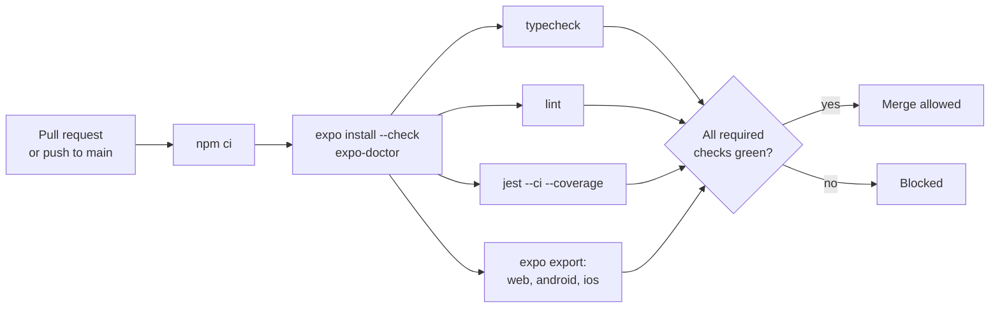

# Test strategy

- **As of:** 2026-09-28. Updated on 2026-09-29 for the new phase order, and with tests for the collection, dex progress, valuation, CSV, and search. Updated on 2026-09-30, after the suites started running in CI: a note at the top of §1, progress in §2, today's CI versus the plan in §5, and §8's checklist notes.
- **Status:** §1 describes `main` on 2026-09-28, with a note on what changed since. §2 is the P0 repair (step U5 of the SDK 57 upgrade). §3 onward is the target for P1 and later.
- **Related:** [architecture overview](../architecture/overview.md) · [data model](../architecture/data-model.md) · [device layouts](../architecture/device-layouts.md) · [roadmap](../../specs/roadmap.md) · manual checklists [TEST_CASES.md](../TEST_CASES.md) and [TCG_TEST_CASES.md](../TCG_TEST_CASES.md)

## Principles

- **Tests prove what users rely on:** saved data survives, the Pokédex is correct, teams are legal, and every screen works on every window size.
- **Pure domain logic first.** It's the cheapest to test and where the hardest bugs hide: stat formulas, legality, migrations, and layout math.
- **Honest assertions only.** Every test can fail. No `if (element)` guards, no `not.toThrow` wrappers standing in for a check, no timing thresholds.
- **CI is the definition of "works".** Nothing merges unless typecheck, lint, tests, and `expo export` for web, Android, and iOS pass ([§5](#5-ci-gates)).
- **Every bug fix ships with a test** that fails before the fix.

## Contents

1. [Current state](#1-current-state-2026-09-28)
2. [Fixing the existing suites](#2-fixing-the-existing-suites)
3. [The test pyramid](#3-the-test-pyramid)
4. [Layers in detail](#4-layers-in-detail)
5. [CI gates](#5-ci-gates)
6. [Device test matrix](#6-device-test-matrix)
7. [Accessibility testing](#7-accessibility-testing)
8. [Manual checklists](#8-manual-checklists)
9. [Fixtures and test data](#9-fixtures-and-test-data)

---

## 1. Current state (2026-09-28)

> **Update (2026-09-30): the suites have run in CI since 2026-09-29.** The maintainer's changes landed that day (PRs #31–#36). `.github/workflows/ci.yml` runs `npm run test:coverage -- --ci --passWithNoTests` and `npx tsc --noEmit` on every push and pull request to `main`, and both are green ([§5](#5-ci-gates)). What changed:
> - **Types:** 17 TypeScript errors were fixed, so `tsc --noEmit` passes.
> - **Config:** `jest.config.js` no longer collects the setup file as a suite (it's in `testPathIgnorePatterns`), transforms every package whose name starts with `expo` or `@expo`, and sets a 20 s timeout.
> - **Mocks:** the gesture builders chain (`setup.js:39-55`), icon fonts are mocked (`:83-87`), `tcgApi.test.ts` has an axios mock its tests can reach, and the UserContext tests press through `fireEvent.press`.
> - **Components:** HoloCard imports `Text` and sets the `card-image` and `holo-card-container` testIDs, and the binder tests run against the real `BinderPlanner` and `SavedBinders`. No test is skipped. There are now 66 tests, counted from the source.
> - **Still true below:** the preset is `react-native`, not `jest-expo`; `console.warn` and `console.error` are still silenced; and the weak assertions in item 8 of §1.2 remain.
>
> The rest of §1 is the 2026-09-28 snapshot, kept as history.

### 1.1 What exists

Five suites with 54 tests, all added in one commit on 2026-01-18. All of them cover TCG features or `UserContext`; nothing covers the Pokédex.

| Suite | File | Kind | Tests | Mocking |
|---|---|---|---|---|
| TCGFlow | `src/__tests__/integration/TCGFlow.test.tsx` | Integration: `TCGView` inside `NavigationContainer` and `UserProvider` | 7 | `tcgApi` auto-mocked (`:10`); `HoloCard` stubbed (`:13`) |
| tcgApi | `src/api/__tests__/tcgApi.test.ts` | Unit | 11 | A local `jest.mock('axios', factory)` (`:15-19`) |
| BinderPlanner | `src/components/tcg/__tests__/BinderPlanner.test.tsx` | Component | 15 | `tcgApi` mocked (`:9`); `HoloCard` stubbed (`:12`) |
| HoloCard | `src/components/tcg/__tests__/HoloCard.test.tsx` | Component smoke | 11 | The global setup mocks |
| UserContext | `src/contexts/__tests__/UserContext.test.tsx` | Context | 10 | The official AsyncStorage mock and a harness component |

**The setup file** (`src/__tests__/setup.js`):
- loads gesture-handler's `jestSetup`, then replaces the whole library with a hand-written mock (`:11-62`)
- mocks Reanimated (`:4-8`), AsyncStorage (`:65-67`), `expo-sensors` (`:70-75`), `expo-haptics` (`:77-84`), and `Alert` (`:94-96`)
- auto-mocks axios for every suite (`:87`)
- silences `console.warn` and `console.error` (`:90-91`)

**The suites are still valuable.** `BinderPlanner.test.tsx` is the clearest spec we have of what the binder planner should do: grids from 2×2 to 5×5, "Page N of 100", a slot picker with search, and a save dialog.

### 1.2 Why `npm test` can't run today

1. **Wrong preset.** `jest.config.js:2` uses `react-native`, not `jest-expo`, which isn't installed.
2. **`transformIgnorePatterns` is too narrow** (`jest.config.js:9-11`).
   - It matches `expo/` and `@expo/` but not `expo-font`, `expo-modules-core`, `@react-native-async-storage`, `@react-native-picker`, `@react-native-community`, `react-native-safe-area-context`, or `react-native-screens`.
   - For example, `@expo/vector-icons` imports `expo-font`, which fails with "Cannot use import statement outside a module".
3. **The setup file runs as a test.** `src/__tests__/setup.js` matches Jest's default `**/__tests__/**` pattern, and there's no `testMatch`. So Jest runs it as a suite and fails with "Your test suite must contain at least one test".
4. **Missing modules.** The BinderPlanner and TCGFlow suites import `BinderPlanner` and `SavedBinders`, which haven't been pushed yet.
5. **The axios mock doesn't match the client.** The factory only provides `create` (`tcgApi.test.ts:15-19`), but the tests call `mockedAxios.get` (`:84` and others), which is undefined. Only the 3 `getBestImageUrl` tests (`:197-226`) can pass.
6. **HoloCard can't pass:**
   - the component itself crashes: `<Text>` isn't imported
   - the gesture mock can't chain: `Tap: () => ({ onBegin: jest.fn(), onEnd: jest.fn() })` (`setup.js:40-43`) returns `undefined` from `.onBegin(...)`
   - the tests look for testIDs `card-image` and `holo-card-container` (`HoloCard.test.tsx:41,54`), which the component doesn't set
   - they read `container` (`:97`, `:104`), which RNTL 12 renamed to `UNSAFE_root` ([migration guide](https://oss.callstack.com/react-native-testing-library/docs/migration/previous/v12)). RNTL 14 brings `container` back, but `expect(container).toBeTruthy()` still asserts nothing.
7. **Presses bypass the testing library.** The UserContext tests call `getByTestId(...).props.onPress()` (`UserContext.test.tsx:80` and 12 more calls) on the host view. That fails about 7 of the 10 tests; `fireEvent.press` is the fix.
8. **Weak assertions:**
   - `not.toThrow` wrappers around renders (`HoloCard.test.tsx:43`, `:55`, and others)
   - `if (saveButton) { ... }` blocks that pass when the button is missing (`BinderPlanner.test.tsx:220`, `:232`, `:294`, `:306`)
   - timing checks: under 100 ms (`HoloCard.test.tsx:118`) and under 2,000 ms (`TCGFlow.test.tsx:367`)
   - the silenced `console.error`, which hides real errors
9. **Other gaps:**
   - `@testing-library/jest-native` is installed but never registered.
   - `tsc --noEmit` fails, and there's no typecheck script.
   - There's no coverage threshold, E2E suite, or CI.
   - The manual checklists cite Detox and Flipper, neither of which is installed.

### 1.3 Coverage gaps

| Module | Lines | Covered by |
|---|---|---|
| `src/components/pokedex/PokedexView.tsx` | 2,823 | Nothing |
| `src/api/pokeApi.ts` | 1,699 | Nothing (dedupe regex, `getSprite`, `getBestQualitySprite`, forms database) |
| `src/components/auth/HomeScreen.tsx` | 402 | Nothing |
| `src/utils/imageCache.ts` | 376 | Nothing, though it's easy pure logic |
| `App.tsx` | 271 | Nothing, including the login gate behind the cold-start wipe |
| `src/components/teambuilder/TeamBuilder.tsx` | 158 | Nothing (it's a stub) |
| `src/components/common/CachedImage.tsx` | 133 | Nothing |
| `src/api/tcgApi.ts` | 276 | 6 of 11 exports |
| `src/contexts/UserContext.tsx` | 304 | Partly; no tests for `catchPokemon`, `releasePokemon`, or `updateProfile` |
| `src/components/tcg/HoloCard.tsx` | 440 | Smoke tests only |
| `DeckBuilder.tsx`, `TCGView.tsx` | 284, 141 | Only through the integration test |

Dead modules (`useSprites.ts`, `spriteScraper.ts`, `src/navigation/index.tsx`, `PokemonList.tsx`, `SimplePokedex.tsx`) get deleted in the SDK 57 upgrade instead of tested.

---

## 2. Fixing the existing suites

This is step U5 of the SDK 57 upgrade (P0); the steps U1–U8 are listed in [the review's §9](../reviews/2026-09-28-tech-stack-review.md#9-recommended-sequence). It depends on U2 (fix HoloCard and add the pushed TCG files) and U3 (the SDK bump).

**Progress (2026-09-30).** The suites pass on the `react-native` preset, with parts of this list done another way ([§1](#1-current-state-2026-09-28)):
- **Done:** the `fireEvent.press` part of item 6, in the UserContext tests, and item 10.
- **Done differently:** item 3, since the setup file is excluded through `testPathIgnorePatterns` instead of moved; item 4, since the hand-written gesture mock now chains instead of being dropped; and item 5, since `tcgApi.test.ts` has its own reachable mock, though the global `jest.mock('axios')` is still in the setup file.
- **Still to do:** items 1, 2, 7, 8, and 9.

**Config after the fix** (a sketch):

```js
// jest.config.js
module.exports = {
  preset: 'jest-expo',
  testMatch: ['<rootDir>/src/**/*.test.{ts,tsx}'],
  setupFilesAfterEnv: ['<rootDir>/jest.setup.ts'],
  // No transformIgnorePatterns override: jest-expo's default covers Expo and React Native
  // packages. Extend it only for a specific package that fails to transform.
  collectCoverageFrom: ['src/**/*.{ts,tsx}', '!src/**/*.d.ts', '!src/**/__tests__/**'],
};
```

**The changes, in order:**

1. **Use the `jest-expo` preset,** at the version that matches the SDK (`jest-expo` ~57.0.5 on SDK 57). Delete the custom `transformIgnorePatterns`. A hand-written list breaks jest-expo's defaults; this is a known lesson from other Expo upgrades.
2. **Add an explicit `testMatch`,** so only `*.test.ts(x)` files are suites.
3. **Move the setup file out of `__tests__`,** to `jest.setup.ts` at the repo root.
4. **Make gesture mocks chainable, or better, drop the hand-written mock.**
   - Keep `import 'react-native-gesture-handler/jestSetup'` and delete the `jest.mock('react-native-gesture-handler', ...)` block, so HoloCard uses the real, chainable `Gesture` builders.
   - Drive gestures with `fireGestureHandler` and `getByGestureTestId` from `react-native-gesture-handler/jest-utils`; gestures need `.withTestId('...')` ([gesture-handler testing guide](https://docs.swmansion.com/react-native-gesture-handler/docs/guides/testing/); verify on gesture-handler 3 with SDK 58).
   - If a hand-written mock is ever needed, every builder method must return the builder.
5. **Fix the axios mock.** Remove the global `jest.mock('axios')` from the setup file, and give `tcgApi.test.ts` a mock whose instance the tests can reach:

   ```ts
   jest.mock('axios', () => {
     const get = jest.fn();
     return { __esModule: true, default: { create: jest.fn(() => ({ get })) } };
   });

   import axios from 'axios';
   import { searchCards } from '../tcgApi';

   // tcgApi called axios.create() when it was imported; this is the instance it got.
   const mockGet = (axios.create as jest.Mock).mock.results[0].value.get as jest.Mock;
   ```

   `tcgApi` itself is replaced in P3 (TCGdex through the pipeline, [ADR-0009](../decisions/ADR-0009-tcg-data-source.md)), so keep this suite small.
6. **Use `fireEvent.press`,** or RNTL's `userEvent.press`, instead of calling `props.onPress()`. Await state changes with `findBy*` or `waitFor`. In the harness, give each control `accessibilityRole="button"` so it can be queried by role.
7. **Remove empty and timing assertions:**
   - delete the `not.toThrow` wrappers (a render error fails the test anyway) and assert on what renders
   - replace `if (saveButton)` guards with `getBy*` queries, which throw when the element is missing
   - delete the timing checks; performance is measured on devices ([overview §2.10](../architecture/overview.md#210-performance-budgets))
   - replace the missing testIDs with accessibility queries, adding `accessibilityLabel`s to the component where they're missing
8. **Don't silence `console.error`.** Remove the global `console` mocks. Fail a test on any unexpected `console.error` (a small `afterEach` hook, or a package such as `jest-fail-on-console`). Allow an expected warning with a spy scoped to that one test.
9. **Drop `@testing-library/jest-native`** and use RNTL's built-in matchers.
   - RNTL 14.0.1 is current. It needs Node ^22.13 or ≥ 24, which the `.nvmrc` pin (24) satisfies, and it takes `test-renderer` as a peer dependency in place of `react-test-renderer`.
   - If it conflicts with `jest-expo` 57, use 13.3 (verify).
10. **Don't stub the missing components.** `BinderPlanner` and `SavedBinders` landed on 2026-09-29, replacing short-lived stubs, and their tests now run against the real components.

**Done when** `npm test -- --ci` passes. Any skipped test states a reason and links an issue.

---

## 3. The test pyramid

| Layer | Tools | Scope | Share of tests (guide) |
|---|---|---|---|
| **Static checks** | TypeScript strict (`tsc --noEmit`), ESLint (`eslint-config-expo` with react-hooks rules), Prettier, `expo-doctor` | Every file | n/a |
| **Unit** | Jest; plain Node for `packages/battle` and `packages/pokedata`, `jest-expo` elsewhere; [fast-check](https://github.com/dubzzz/fast-check) for property tests | Pure domain logic ([§4.1](#41-unit-tests-domain-logic-first)) | ~70% |
| **Component** | React Native Testing Library, with accessibility queries | Screens and components with fake repositories ([§4.2](#42-component-tests)) | ~20% |
| **Contract** | zod schemas and count checks; the Firebase Emulator Suite | Data-pipeline output, security rules, Functions ([§4.3](#43-contract-tests-data-pipeline-and-backend)) | ~5% |
| **End-to-end** | Maestro (iOS and Android), Playwright (web: phone, tablet, desktop, foldable) | Critical journeys ([§4.4](#44-end-to-end-tests)) | ~5% |
| **Visual regression** (optional) | Playwright screenshots | A few key web screens ([§4.5](#45-visual-regression-optional)) | A handful |

**Proposed first five tests,** if time only allows five:
1. **Cold start keeps a saved profile.** The regression test for the data wipe.
2. **The dex index has 1,025 species, each with one or two real types.** A contract test that retires the demo type map.
3. **Champions legality and SP↔EV conversion.** Properties, below.
4. **Paste import and export round-trip** in both Showdown layouts.
5. **The app bundles for web, Android, and iOS.** This is `expo export` as a CI gate, not a Jest test.

---

## 4. Layers in detail

### 4.1 Unit tests: domain logic first

| Area | Module (target) | What to prove |
|---|---|---|
| **Sprite URL builders** | `utils/spriteUrls.ts`, split out of `PokedexView.tsx:597-624` | Each style's URL, and the fallback boundaries: 493/494 (Diamond/Pearl to HOME) and 649/650 (Black/White animated to HOME). Species #1 and #1025 in every style. |
| **Dedupe** | Today `getPokemons` (`pokeApi.ts:372-386`); later the pipeline | Alternate forms (Deoxys, Rotom, Giratina, Zygarde, Minior) don't appear as separate species. Exactly 1,025 results. No ID silently falls back to 1 (`extractPokemonIdFromUrl`, `:353-356`). |
| **Evolution tree** | `utils/evolution.ts`, a tree rewrite of `parseEvolutionChain` (`PokedexView.tsx:111-167`) | Order follows the chain, not dex numbers (Pichu, then Pikachu, then Raichu). Branches survive (Eevee). Each trigger (level, item) sits on the right step. |
| **Champions stats and SP↔EV** | `packages/battle` | The formulas and the conversion, with properties below. Edge cases such as Shedinja, whose HP is always 1 (verify for Champions). |
| **Legality** | `packages/battle` | 66 total / 32 per stat SP; 510 total / 252 per stat EV; IVs 0–31; at most 6 members; at most 4 unique moves; Tera only in SV; Mega only in Champions, with the matching stone; item pool and roster per regulation. |
| **Paste import and export** | `packages/battle`, through `@pkmn/sets` | Round-trips for both the regular and the beta-client layouts. Champions Stat Points on the `EVs:` line. Nicknames, genders, items, and Tera types. Malformed lines produce line-level errors. |
| **Window classes** | `packages/ui` | Width boundaries 599/600, 839/840, and 1199/1200; height boundaries 479/480 and 899/900 ([device layouts §3.1](../architecture/device-layouts.md#31-usewindowclass)). |
| **Posture to layout** | `packages/ui` | Book splits at the hinge; tabletop stacks; flat decides by width; an occluding hinge gets a gutter; grids use even columns across a fold; a compact height means at most two panes. |
| **Storage migrations** | The app's storage layer | Legacy fixtures migrate to v1: favorites merged from both stores, `position` becomes (page, slot), binder cards become collection copies that their slots reference, simulated identities are dropped, corrupt JSON stays in the backup, and reruns are idempotent ([data model §4](../architecture/data-model.md#4-migration-from-todays-keys)). |
| **Sync** | The app's sync engine | Last-write-wins merge; `updatedAt = max(now, previous + 1)`; tombstones; outbox coalescing; conflict copies ([data model §3](../architecture/data-model.md#3-local-first-store-and-sync)). |
| **Filters and search** | `usePokedexFilters` | Type, generation, and favorites filters combine correctly. Search over the full index meets the 50 ms budget as a benchmark, not as a unit assertion. |
| **Dex counting** | The app's collection module, with the pipeline's card-to-species map | A card counts for every Pokémon it features, and a tag team for each Pokémon named (Pikachu & Zekrom-GX counts for #25 and #644). Cameos, Trainers, and Energy never count. An Alolan Vulpix card marks `37-alola` and #37. Losing the last copy removes the mark ([data model](../architecture/data-model.md#counting-cards-toward-dex-progress)). |
| **Your valuation** | The app's collection module | A copy's entered value comes first, then its purchase price. Unvalued copies are counted, never estimated. Totals stay per currency. Projected adds wishlist target prices to actual. Sold and traded copies drop out ([PRD TCG-12](../../specs/PRD.md#53-tcg)). |
| **CSV import and export** | The app's collection module | Export, then import into an empty store, restores every copy and field. Importing the same file again doesn't duplicate copies. Unmatched rows are listed, never dropped. Cells starting with `=`, `+`, `-`, or `@` are escaped ([PRD TCG-13](../../specs/PRD.md#53-tcg)). |
| **Collection search** | The search index ([data model §3.5](../architecture/data-model.md#35-search-and-derived-indexes)) | Filters combine correctly, and results match a brute-force scan of the same fixture. The 100 ms budget for 10,000 copies plus the catalog is a benchmark, not a unit assertion. |

**Property tests** for the Champions rules (fast-check):
- **Round trip:** for every SP from 0 to 32, `evToSp(spToEv(sp)) === sp`. Here `spToEv(sp) = 8·sp − 4` (0 stays 0), and `evToSp(ev) = ⌊(ev + 4) / 8⌋`, which is derived.
- **The formulas agree:** for every base stat and alignment, the Scarlet/Violet stat at level 50 with IV 31 and `EV = spToEv(sp)` equals the Champions stat for `sp`. Champions: HP = base + SP + 75, and other stats = (base + SP + 20) × modifier, rounded down (verify the rounding against [Showdown's champions mod](https://github.com/smogon/pokemon-showdown/tree/master/data/mods/champions)).
- **EV to SP keeps the stats:** for every EV value from 0 to 252, the level-50 stat from `ev` equals the Champions stat from `evToSp(ev)`, and any legal SV spread lands within 66 SP.
- **Legal spreads convert, or get flagged:** a legal SP spread (each ≤ 32, total ≤ 66) either converts within 510 EVs or is flagged. 32/32/2 SP becomes 516 EVs, so it has to be flagged.
- **These properties already hold** for the formulas as written here: a throwaway check over every base stat, SP, EV, and alignment found no mismatches. The suite's job is to keep them true for the real implementation.

### 4.2 Component tests

- **Query the way users perceive the screen:** `getByRole('button', { name: … })`, `getByLabelText`, and `getByText`. A missing accessibility label then fails a test. Use testIDs only as a last resort.
- **Act the way users act:** `userEvent` for presses and typing; `findBy*` and `waitFor` for anything async.
- **Use real providers with fake repositories,** such as an in-memory local store and a fixture bundle client, instead of mocking `fetch` or axios inside screens.
- **Test the honest states:** loading, error with a retry button, empty, and offline. A failed detail request must show an error, never invented data.
- **Test layout-aware components** by rendering them under a test provider that sets the window class and posture: compact, medium, expanded, book, and tabletop.
- **First targets:**
  - the Pokédex list and filters, and the detail screen
  - the binder planner (the existing suite)
  - the deck builder
  - the team editor: SP and EV inputs and legality messages
  - the first-launch age question in production builds, and the development flag that skips it, from P1
  - the collection, a card's detail, and set completion, from P3
  - binder drag and drop, including the move and swap actions for keyboard and screen-reader users, from P3
  - sign-in and sign-out, from P5

### 4.3 Contract tests (data pipeline and backend)

**Data pipeline** ([ADR-0004](../decisions/ADR-0004-static-game-data-pipeline.md)). These run in the pipeline before publishing; a failure blocks the publish, and apps keep the last good build.
- **Schemas:** every bundle file passes its zod schema from `packages/pokedata`, and the manifest's hashes match the files.
- **Counts and invariants:**
  - exactly 1,025 species and 18 types
  - every species has one or two types
  - every form belongs to a species
  - every regulation roster is non-empty and every entry exists
  - every format a team can reference exists
  - every item in a Champions pool exists
  - every species key has an entry in the image-availability manifest
  - every dex list's entries exist and are in order: 1,025 in the National list and 151 in Kanto
  - every card's featured species keys exist, and cards that can't be mapped are listed in the report, never guessed
  - file sizes stay within a budget (set in P1)
- **A diff report against the last published build,** for example "Regulation M-C adds 24 Pokémon", so a person reviews big changes before they ship.

**Backend** (from P5, [ADR-0003](../decisions/ADR-0003-backend-and-auth.md)):
- **Security rules** tested with the Firebase Emulator Suite and `@firebase/rules-unit-testing` (5.0.2, which targets `firebase` 12). Cover:
  - owner-only access
  - the `updatedAt` guard and `schemaVersion` monotonicity
  - an immutable `ageBand`, and no `publicProfile` for child accounts
  - `get` versus `list` on `publicTeams`
  - one vote per user on Replica codes

  The rules are in the [data model §6](../architecture/data-model.md#6-security-rules-principles).
- **Cloud Functions,** tested against the emulators:
  - publishing: sanitizing and snapshotting a team
  - account deletion: nothing of the user remains afterwards
  - the PokéPaste proxy: input validation and rate limits

### 4.4 End-to-end tests

**Mobile: Maestro**
- **Where flows live and run:** flows in `.maestro/`, run against development or preview builds on an Android emulator and an iOS simulator. EAS Workflows has a pre-packaged `maestro` job that takes a `build_id` and a `flow_path` ([Expo docs](https://docs.expo.dev/eas/workflows/pre-packaged-jobs/)).
- **Select by visible text or accessibility label,** the way users find things.
- **Smoke flows first:**
  1. Launch, see the Pokédex, search "25", open Pikachu, favorite it, relaunch: still a favorite.
  2. Launch offline after one online session: the Pokédex still works.
  3. Build a Champions team, see the legality messages, export a paste.
  4. Binder: add a card, turn the page, relaunch: the card is still there.
  5. From P3: add a copy of a card, place it in a binder, see it count in dex progress, export CSV, and import it again with no duplicates.
  6. From P5: sign in, sign out and keep the data, delete the account.

**Web: Playwright**
- **Run against the static export** (`npx expo export -p web`, served locally).
- **Projects:**
  - phone: 402×874 with touch
  - tablet: 820×1180
  - desktop: 1440×900
  - foldable: Chromium with Chrome DevTools Protocol overrides
- **Check:**
  - the navigation pattern at each width (bottom tabs, rail, sidebar)
  - that deep links such as `/dex/25` arrive as pre-rendered HTML
  - an offline reload of the PWA
  - that there are no hover-only controls
  - an axe scan with `@axe-core/playwright`
  - the LCP budget (under 2.5 s on 4G), through Lighthouse or web-vitals

```ts
// Chromium only: emulate a vertical fold in the folded posture (both CDP methods are experimental).
const cdp = await page.context().newCDPSession(page);
await cdp.send('Emulation.setDisplayFeaturesOverride', {
  features: [{ orientation: 'vertical', offset: 700, maskLength: 20 }],
});
await cdp.send('Emulation.setDevicePostureOverride', { posture: { type: 'folded' } });
```

### 4.5 Visual regression (optional)

- **Web:** Playwright's `toHaveScreenshot()` for a few key screens at each viewport, with animations disabled. Mask sprite and card images with the `mask` option, so committed baselines contain no Pokémon media ([ADR-0012](../decisions/ADR-0012-brand-ip-and-assets.md)). Update baselines deliberately, in their own commit.
- **Native:** Maestro's `takeScreenshot` for human review during release checks. No pixel diffing on native until the UI settles (after P6).

---

## 5. CI gates

**What CI runs today (since 2026-09-29).** `.github/workflows/ci.yml` runs on every push to `main` and every pull request to `main`, on Node 18, with two jobs. Both are green on `main`.

| Job | Command (after `npm ci`) | Notes |
|---|---|---|
| Test | `npm run test:coverage -- --ci --passWithNoTests` | Uploads the coverage report as an artifact, kept for 14 days |
| Type Check | `npx tsc --noEmit` | |

Also running on the repository:
- **CodeQL** code scanning, through GitHub's default setup, so there's no workflow file for it.
- **The PR labeler** (`.github/workflows/labeler.yml`, with its rules in `.github/labeler.yml`).
- **Dependabot** (`.github/dependabot.yml`): weekly npm updates, grouped as `expo`, `react-native`, and `testing`, plus GitHub Actions updates.
- **The web preview deploy** (`.github/workflows/pages-deploy.yml`), which runs on pushes to `main` or by hand, so it doesn't check pull requests.

**The plan (step U7 of the SDK 57 upgrade).** `ci.yml` grows to the gates below, on Node 24, and every one of them is a required check. Dropping `--passWithNoTests` is proposed too, so a run that finds no suites fails.



| Gate | Command | Blocks merge |
|---|---|---|
| Install | `npm ci` (Node 24 LTS from `.nvmrc`) | Yes |
| Dependency versions | `npx expo install --check` | Yes |
| Expo doctor | `npx expo-doctor` | Yes; exceptions only if documented |
| Typecheck | `npm run typecheck` (`tsc --noEmit`) | Yes |
| Lint | `npm run lint` (`expo lint`: `eslint-config-expo` plus react-hooks rules) | Yes |
| Tests | `npm test -- --ci --coverage` | Yes, including the coverage floor |
| Bundles | `npx expo export --platform web`, `--platform android`, `--platform ios` | Yes. This proves every platform bundles, without a device. |

**Later gates**, added as their subjects land:

| Gate | Runs | From |
|---|---|---|
| Playwright (web) | Pull requests that touch UI | P1 |
| Data-pipeline contract tests | Pipeline changes and every scheduled run; blocks the publish | P1 |
| Security-rules and Functions tests | Pull requests that touch rules or Functions | P5 |
| Maestro (mobile) | Nightly and before each release | P1 (smoke), growing with each phase |

**Coverage targets:**
- **80% of lines** in the domain packages: `packages/battle`, `packages/pokedata`, the layout logic in `packages/ui`, and the storage and sync modules.
- **50% overall to start,** then raise the floor as the `PokedexView` split lands.
- **Enforced by Jest's `coverageThreshold`,** in each package's config, from P1, when the packages exist. In P0, CI reports coverage to record the baseline, since today's suites cover only TCG and `UserContext`.
- **Coverage is a floor, not a goal.** A test without a meaningful assertion doesn't count, however many lines it touches.

**Policies:**
- `main` stays green.
- A flaky test is quarantined with a linked issue within a day, not retried silently.
- A skipped test states its reason.

---

## 6. Device test matrix

The tools and the full device QA checklist are in [device layouts §8](../architecture/device-layouts.md#8-testing-matrix). This is when each one runs:

| Target | How | When |
|---|---|---|
| Compact phones (iPhone 18 Pro/Pro Max, an Android phone) | Simulator or emulator, plus the maintainer's own devices | Every release; layout pull requests get a smoke check |
| iPhone Duo (outer, inner, poses) | Xcode 27 Device Hub (macOS) | From P2: every release, and pull requests that touch layout |
| Galaxy Z Fold8/Fold8 Ultra/Flip8, Pixel Fold | Android Studio foldable and resizable emulators; Samsung Remote Test Lab before releases | From P2 |
| iPad | Simulator: full screen, Split View, resized windows | Every release |
| Web: phone, tablet, desktop, foldable | Playwright projects (automated); Chrome DevTools device mode (manual) | Playwright on UI pull requests; manual before releases |

**Gates:** P2 passes when the device QA checklist passes on iPhone Duo and one Fold ([roadmap](../../specs/roadmap.md)). P5 needs sign-in E2E passing on all three platforms.

## 7. Accessibility testing

**Automated**
- **Component tests** query by role and label ([§4.2](#42-component-tests)), so an unlabeled control fails.
- **Lint rules** for accessibility props, such as `eslint-plugin-react-native-a11y` (verify that it's maintained and works with ESLint's flat config).
- **Web:** axe scans in Playwright on key pages at each viewport.
- **Contrast:** a test in `packages/tokens` checks text against the 18 type colors and their tinted backgrounds (15% fills, 40% borders, from `packages/design`).

**Manual, before each release**

| Setting | iOS | Android | Web | What to check |
|---|---|---|---|---|
| Text size | Larger Text, up to the largest accessibility size | Font size and display size at maximum (font scale up to 200% on Android 14+) | Browser zoom at 200% | Names and stats aren't truncated; layouts reflow instead of clipping |
| Screen reader | VoiceOver | TalkBack | VoiceOver or NVDA | Every control has a label and role; reading order is sensible across two panes; async results (search counts, "saved") are announced |
| Motion | Reduce Motion | Remove animations | `prefers-reduced-motion` | Holo and gyroscope effects turn off (a static shine instead), stat bars appear without animating, nothing parallaxes |
| Transparency | Reduce Transparency | n/a | n/a | Liquid Glass tab bars and sheets stay legible |
| Touch targets | At least 44×44 pt | At least 48×48 dp | At least 44×44 CSS px (WCAG 2.5.5; 24 px is the AA minimum in 2.5.8) | Including the favorite heart and the binder slots |

**Holo cards and assistive tech:**
- The holo effect is decoration. Hide it from screen readers and expose the card's name, set, and rarity as text instead.
- Under Reduce Motion, don't start the motion sensors at all. That saves battery too.
- Reanimated's `useReducedMotion()` gives components the setting.

## 8. Manual checklists

[`docs/TEST_CASES.md`](../TEST_CASES.md) (TC-001 to TC-083: Pokédex, caching, sprites, Android) and [`docs/TCG_TEST_CASES.md`](../TCG_TEST_CASES.md) (TC-TCG-001 to TC-TCG-108) stay useful, with a new role:

- **They're release acceptance checklists,** not coverage. A release runs the relevant sections by hand.
- **Triage every case** into automate, keep manual, or retire. Some examples follow. The "Today" column describes `main` with the TCG files that landed on 2026-09-29.

  | Case | Today | Becomes |
  |---|---|---|
  | TC-007: selecting Fire shows only Fire types | Fails: types come from the demo map | A unit test on the filter, plus a contract test that every species has real types |
  | TC-020: favorites persist after restart | Passes for the Pokédex hearts, which use their own key; the profile's copy is wiped on cold start | A Maestro relaunch flow and migration unit tests |
  | TC-060 to TC-066: LRU image cache | Describe the URL-only "cache" | Retired. Replaced by "sprites load offline from the disk cache" once expo-image lands. |
  | TC-073: all 1,025 Pokémon load on start | Manual | The dex-index count contract test and the E2E smoke flow |
  | TC-078 to TC-083: Android | Manual | The device matrix ([§6](#6-device-test-matrix)) |
  | TC-TCG-001 to 005: grid sizes | List `4x5` and `5x4`, which the code doesn't have (it has `4x3` and `5x5`, `BinderPlanner.tsx:55-61`) | Reconciled with the real sizes, now that `BinderPlanner` has landed; then component tests |
  | TC-TCG-013: binders persist after restart | Fails: the cold-start wipe erases saved binders | The regression test for U4, plus a Maestro flow |

- **Remove the Detox and Flipper references** from `TCG_TEST_CASES.md`'s tools section; Maestro and Playwright replace them.
- **Name automated tests after the case they cover,** for example `it('TC-020: favorites persist after restart', ...)`, so each checklist line can link to its test.
- **Known failures** get an issue link, not a silent pass.
- **Update the TCG checklist twice:** first now, since `BinderPlanner` landed on 2026-09-29, and again with the TCGdex migration (P3).

## 9. Fixtures and test data

- **Game-data fixtures are small subsets of real bundles,** regenerated by a script, so fixtures can't drift from the schemas.
- **Legacy storage fixtures** are samples of v0 `user_profile` and `@pokemon_favorites`, including:
  - corrupt JSON
  - simulated social-login profiles
  - binders that use the old `position` field
- **A paste corpus** covers both Showdown export layouts and the Champions formats. Record where each paste came from, and strip personal information.
- **No Pokémon images** in fixtures or committed snapshots; mock image loading instead.
- **Deterministic time:** `jest.useFakeTimers()` and `jest.setSystemTime()` for last-write-wins, tombstones, and date fields.
- **Network:**
  - screens get fake repositories
  - client adapters get a stubbed `fetch`, or MSW (verify that it works with `jest-expo`)
  - no test calls a real third-party API
